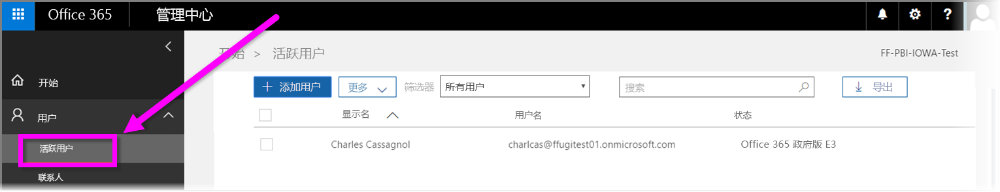

# 在 Power BI 服务中注册你的美国政府组织
**Power BI 服务**有一个可供美国政府客户使用的版本，作为 **Office 365 美国政府社区**订阅的一部分。 本文中讨论的 **Power BI 服务**版本是为美国政府客户专门设计的，独立且不同于 **Power BI 服务**的商业版本。

有关适用于美国政府的 **Power BI 服务**的更多信息（包括其功能和限制），请查看[适用于美国政府客户的 Power BI - 概述](service-govus-overview.md)。

> [!NOTE]
> 本文适用于有权为其美国政府组织注册 Power BI 的管理员。 如果你是最终用户，请与你的管理员联系以获取适用于美国政府的 Power BI 订阅。
> 
> 

## 为你的美国政府组织选择正确的注册流程
你的美国政府组织可能是 **Office 政府云**的新用户，也可能已经拥有订阅。 以下部分详细介绍了基于你使用 Office 政府云和 Power BI 的位置的注册步骤，并且与基于你的现有订阅的注册步骤不同。

注册 Power BI 美国政府版后，某些功能可能无法使用，除非你的销售人员或支持代表完成了载入流程。 若要查找这些功能，请参阅[适用于美国政府客户的 Power BI - 概述](service-govus-overview.md)。 若要完成载入流程以启用这些功能，请联系你的销售人员或支持代表。

### 作为 Office 云新客户的美国政府组织
如果你的组织是新 **Office 政府云**客户，请按照下列步骤进行操作：

> [!NOTE]
> 这些步骤应由门户管理员执行。
>

1. 转到 [https://products.office.com/en-us/government/office-365-web-services-for-government](https://products.office.com/en-us/government/office-365-web-services-for-government)。

>[!NOTE]
>如果暂时不想注册 Office 政府云，请联系销售代表。
>

2. 选择 Office G3 并完成 Office 试用版的表单
3. 成为 Office 云客户后，继续执行以下“现有 Office 政府云客户”的步骤

### 现有 Office 政府云客户
如果你的组织是现有 **Office 政府云**客户，但你没有 **Power BI** 订阅（免费或以其他方式），请按照下列步骤进行操作：

> [!NOTE]
> 这些步骤应由门户管理员执行。
> 
> 

1. 登录到你的现有 Office 政府云帐户并转到管理员门户
2. 选择“**计费**”。
3. 选择“**购买服务**”。
4. 选择“Power BI Pro 政府版”选项并在“**试用**”和“**立即购买**”之间进行选择
5. 完成你的订单
6. 将用户分配到该帐户。
   
   
7. 通过 [https://app.powerbigov.us](https://app.powerbigov.us) 登录到适用于美国政府客户的 **Power BI 服务**

## 其他注册信息
以下是有关在各种许可迁移情况下注册“Power BI 美国政府版”的更多信息。

### 将 Power BI 试用版定向到 Pro 客户载入
* 单击并依次转到“计费”>“购买服务”>“Power BI Pro 政府版”，并选择“购买”而不是“试用”
* 填写所需信息并获取许可证
* 删除 Power BI Pro 试用版或删除旧版许可证，然后将新的许可证分配给用户
* 登录到 [https://app.powerbigov.us](https://app.powerbigov.us)

### 将经销商 Power BI 试用版定向到 Pro 客户载入
转到“计费”>“订阅”，然后选择“Power BI Pro 政府版订阅”。 将看到以下信息：

* 可用
* 已分配
* 分配到用户链接
* 如果你仍有已分配的试用版，可执行以下操作：
  * 单击“试用版订阅”下方的“已分配”并删除要添加至付费订阅的用户
  * 转到“付费订阅”并分配这些用户

### 列入允许列表说明
“列入允许列表”是 Power BI 工程团队将客户从商业版云环境移动到安全的政府版云环境的过程。 这可以保证美国政府版云中提供的功能按预期方式工作。 所有首次购买美国政府版“Power BI”服务的现有（或新）美国政府客户均“必须”启动以下允许列表过程。 该过程必须在安装或迁移到美国政府版“Power BI”服务之前完成。 

若要将租户列入美国政府云的允许列表，请单击以下链接填写支持票证，从而发出请求。 请注意，只有管理员才能发出此请求：

* [*列入允许列表*联机支持请求](https://powerbi.microsoft.com/clouds/)
* 请务必将要 *列入允许列表* 的域及在此过程中与你协作的 Microsoft 代表的电子邮件包含在内。

*列入允许列表* 的过程大约需要三个星期，在此期间，Power BI 工程团队将作出适当更改以确保你的租户可在美国政府版云中正常运行。

从 Power BI **免费版**许可证迁移到 **Power BI 美国政府版**（以及根据定义，迁移到本文前面所述的相关 **Pro** 许可证功能）的客户将遇到本文下一部分所述的问题，直至 Power BI 工程团队将其租户*列入允许列表*。

### 免费版和美国政府版租户中的 Pro 许可证的组合
如果租户中同时有免费版和美国政府 Pro 许可证，则免费和（美国政府）Pro 许可证将继续存在，但是其中的一个许可证类型将无法正常运行。 如果租户成功完成*列入允许列表*过程，则会出现以下情况：

* 所有免费版许可证用户将无法再使用 **Power BI Desktop** 登录到 Power BI，并且将遇到下一部分中所述的功能缺陷。
* 分配到美国政府 Pro 许可证的所有客户端将按照预期方式运行，包括使用网关、Power BI Desktop 和移动应用。

使用免费版和美国政府版租户中的 Pro 许可证的组合并完成 *列入允许列表* 过程后，预计将出现以下情况：

**在*列入允许列表之前***：

* 具有免费版许可证的用户在商业云中运行
* 门户中显示 Pro 美国政府版许可证，并且管理员可以将这些许可证分配给用户。 管理员分配美国政府 Pro 许可证后，Pro 美国政府版用户将不会丢失其免费版许可证中的数据。 分配有许可证的用户可以访问适用于美国政府版客户的 Power BI Pro 功能，但是将存在下列项目符号列表功能缺陷，直至成功将租户*列入允许列表*：
  
  * 网关、移动应用和 Power BI Desktop 无法进行身份验证
  * 无法访问 Azure 商业数据源
  * 必须从商业版 Power BI 服务手动上传 PBIX 文件
  * Power BI 移动应用不可用

**在*列入允许列表之后***：

* 在商业版 Power BI 服务中运行的免费版用户可以继续运行，但是它将按预期方式停止进行身份验证。
* 美国政府版云中运行的 Pro 用户可以按预期方式使用**适用于美国政府版客户的 Power BI** 服务。

若要标识租户中运行 Power BI 免费版许可证的用户，管理员可以运行授权报告，在此之后，免费版许可证用户将以 **Power BI Standard** 身份出现。

## 后续步骤
你可以使用 Power BI 执行各种操作。 有关更多信息和学习资料（包括介绍如何注册服务的文章），请查看以下资源：

* [适用于美国政府的 Power BI 的概述](service-govus-overview.md)
* [Power BI 的引导学习](guided-learning/gettingstarted.yml#step-1)
* [Power BI 服务入门](service-get-started.md)
* [Power BI Desktop 入门](desktop-getting-started.md)

