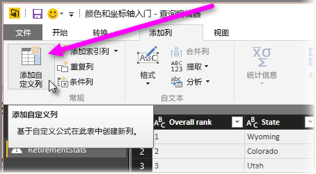

# 直方图
有多种方法可以在 Power BI 中生成直方图。 我们将从最简单的方法开始。

## 简单的直方图
若要开始，请确定哪个查询具有你想要在其中生成直方图的字段。  对查询使用 *参考* 选项来创建一个新查询，并将其命名 *FieldName 直方图* 。 使用**转换**功能区上的**分组依据**选项，然后选择**计行数**聚合。 确保数据类型是所得聚合列的编号。 然后你可以在该报表页上使此数据可视化。 这是生成直方图的快速且简便的方法，但如果你有多个数据点，并且不允许跨视觉对象进行笔刷绘制，这种方法则不适用。

## 定义存储桶以生成直方图
确定哪个查询具有你想要在其中生成直方图的字段。 对查询使用 *参考* 选项来创建一个新查询，并将其命名 *FieldName* 。  现在，使用规则定义存储桶。 使用**添加列**功能区上的**添加自定义列**选项，并生成自定义规则。

确保数据类型是所得聚合列的编号。 现在，你可以通过**简单的直方图**（本文前文所述）中介绍的技术来使用组生成直方图。 此选项将处理多个数据点，但仍不支持“笔刷绘制”功能。

## 定义支持“笔刷绘制”功能的直方图
笔刷绘制就是当视觉对象链接在一起的情况，以便当用户选择一个视觉对象中的数据点时，报表页上的其他视觉对象将突出显示或筛选与所选的数据点相关的数据点。  因为我们将在查询时间操作数据，因此我们需要创建表格之间的关系，并确保了解与直方图中的存储桶相关的详细信息项，反之亦然。

通过使用查询（具有想要在其上生成直方图的字段）上的 *参考* 选项开始此过程。  将新查询命名为 *存储桶* 。  对于此示例，我们将原始查询称作 *详细信息* 。  接下来，删除所有列，将用作直方图存储桶的列除外。  现在，使用查询中的 *删除重复项* 功能，当你选择该列后，此功能位于右键菜单中，这样剩下的值便是列中的唯一值。 如果有十进制数字，你可以先使用定义存储桶的提示来生成直方图，从而获得一组更易于管理的存储段。  现在，检查查询预览中显示的数据。 如果看到空白值或 Null，则需要在创建关系之前对它们进行修复。 请参阅“在数据具有 Null 值或空白值时创建关系”。 由于排序需要，使用此方法可能会产生问题。 若要获取存储桶以进行正确排序，请参阅“排列顺序：按所需顺序显示分类”。 

> [!NOTE]
> 最好在生成视觉对象之前考虑排序顺序。   
> 
> 

本过程中的下一步是在存储桶列上定义 *存储桶* 和 *详细信息* 查询之间的关系。  在 *Power BI Desktop* 中，选择功能区中的 *管理关系* 。  创建关系，其中 *存储桶* 位于左表，而 *详细信息* 位于右表，然后选择将用于直方图的字段。 

最后一步是创建直方图。 从 *存储桶* 表拖动存储桶字段。 删除生成的柱形图中的默认字段。  现在将直方图字段从 *详细信息* 表拖到相同的视觉对象中。 在字段框，将默认聚合更改为“计数”。 然后将生成直方图。 如果从详细信息表创建了类似树状图的其他视觉对象，则在树状图中选择一个数据点以查看直方图突出显示，并显示与整个数据集的趋势相关的所选数据点的直方图。

