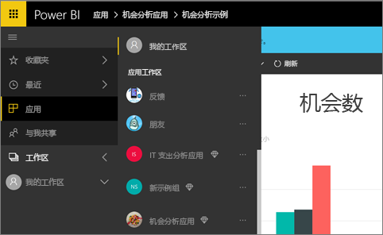
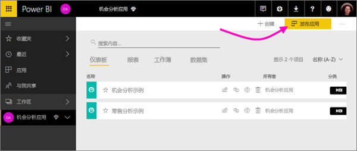

# 应如何在 Power BI 中开展协作并进行共享？

你已创建仪表板和报表。 可能也会和同事协作处理它们。 这样就需要其他人有权限访问它们。 分发的最好方式是什么？

在本文中，我们将对比 Power BI 中这些用于协作和共享选项： 

* 在应用工作区中与同事进行协作，创建有价值的报表和仪表板。
* 将这些仪表板和报表打包为应用，并将其发布到到更大的组或整个组织。
* 在服务或 Power BI 移动应用中与几位用户共享仪表板或报表。
- 打印报告。
* 发布到公共网站，全球任何人都可以在其中查看并与之交互。

无论选择了哪个选项，要共享仪表板，都需要 [Power BI Pro 许可证](service-free-vs-pro.md)，或者该内容需要位于[高级容量](service-premium.md)中。 许可证要求因查看仪表板的同事而各不相同，具体取决于所选择的选项。 以下各节将进行详细说明。 

Power BI 服务中的应用

## 在应用工作区中与同事协作

当团队协同工作时，他们需要访问相同的文档，以便快速协作。 Power BI 中的应用工作区提供了一个位置，供团队一同在其中共享重要仪表板、报表、数据集以及工作簿的所有权和管理。 Power BI 用户组有时根据组织结构组织其工作区，而在其他时候为特定项目创建工作区。 仍有一些组织使用多个工作区来存储所用报表或仪表板的不同版本。 

应用工作区提供的角色可确定同事拥有的权限。 可使用这些角色来确定可以管理整个工作区或只可向其中提供内容的人员。

某些用户自然而然地将内容放在“我的工作区”中，并与外部共享。应用工作区比“我的工作区”更适于协作，因为前者提供内容的共同所有权。 用户和整个团队可以轻松进行更新或为其他人授予访问权限。 “我的工作区”最适合个人用于一次性或个人内容。

假设需要与同事共享已完成的仪表板。 为他们提供仪表板访问权限的最佳方法是什么？ 答案取决于多种因素。 如果特定同事需要拥有仪表板并使其保持最新，或需要访问应用工作区中的所有内容，则最好将其添加到工作区。 如果同事只需要查看该仪表板而不是工作区中的所有内容，则可以再次从一组备选方案中进行选择。 如果仪表板是需要分发给许多同事的众多内容的一部分，那么发布应用可能是最好的选择。 但是，如果同事只需要一个仪表板，那么共享仪表板可能是最佳方法。 

详细了解如何[创建应用工作区](service-create-workspaces.md)。

**你知道吗？** Power BI 正在提供新工作区体验预览。 阅读[创建新工作区（预览）](service-create-the-new-workspaces.md)，查看工作区将来如何更改。 

## 通过创建应用分发数据和见解

假设你想要将仪表板分发给广泛的受众。 你和同事创建了一个应用工作区，然后在此应用工作区中创建并优化了仪表板、报表和数据集。 现在选择所需的仪表板和报表，并将其作为应用发布 - 发布到组或整个组织。 

可以在 Power BI 服务 ([https://powerbi.com](https://powerbi.com)) 中轻松找到应用并进行安装。 可以向业务用户发送应用的直接链接，或者他们可以在 AppSource 中搜索此应用。 如果 Power BI 管理员已授予你权限，则可以将应用自动安装到同事的 Power BI 帐户中。 阅读有关[发布应用](service-create-distribute-apps.md)的详细信息。 

安装应用后，他们可以在浏览器或移动设备中查看应用。

对于查看你的应用的用户，他们同样需要拥有 Power BI Pro 许可证，或者应用需要存储在 Power BI 高级容量中。 请阅读[什么是 Power BI Premium？](service-premium.md)了解详细信息。

也可以将应用发布给组织外部的人员。 他们可以查看应用内容并与之交互，但无法与他人共享。

## 共享仪表板和报表
假设已在自己的“我的工作区”或应用工作区中完成仪表板和报表，并且希望某些其他人有权访问它。 一种用于访问的方法是共享它。 

需要 Power BI Pro 许可证才能共享内容，你与之共享的人员也需要许可证才能共享，或者该内容需要位于[高级容量](service-premium.md)中的工作区内。 共享仪表板或报表时，收件人可以查看仪表板并与其交互，但无法对其进行编辑。 除非将行级别安全性 (RLS) 应用到基础数据集，否则他们会看到你在仪表板和报表中看到的相同数据。 如果你允许，与之共享的同事可以与其他同事共享。 

也可以与组织外的用户共享。 他们可以查看仪表板或报表并与之交互，但无法进行共享。 

有关从 Power BI 服务[共享仪表板和报表](service-share-dashboards.md)的详细信息。 此外，还可以向链接添加筛选器并[共享报表的筛选视图](service-share-reports.md)。

## 从 Power BI 移动应用添加批注并共享
在适用于 iOS 和 Android 设备的 Power BI 移动应用中，可以为磁贴、报表或视觉对象添加批注，并通过电子邮件与任何人共享。 

在共享磁贴、报表或视觉对象快照时，收件人看到的与你发送邮件时的内容完全一致。 邮件还包含仪表板或报表的链接。 如果他们有 Power BI Pro 许可证，或者该内容位于[高级容量](service-premium.md)中，并且你已与他们共享对象，则他们可以打开此对象。 可以向任何人（不仅仅是同一电子邮件域的同事）发送磁贴的快照。

有关从 iOS 和 Android 移动应用[添加注释并共享磁贴、报表和视觉对象](consumer/mobile/mobile-annotate-and-share-a-tile-from-the-mobile-apps.md)的详细信息。

还可以通过适用于 Windows 10 设备的 Power BI 应用[共享磁贴快照](consumer/mobile/mobile-windows-10-phone-app-get-started.md)。

## 打印或另存为 PDF 或其他静态文件
可以在 Power BI 服务中打印整个仪表板、仪表板磁贴、报表页或可视化效果，或将其另存为 PDF（或其他静态文件格式）。 一次只能打印一页报表，而不能一次打印整个报表。 有关[打印或另存为静态文件](service-print.md)的详细信息。

## 发布到 Web

> [!WARNING]
> 使用“发布到 Web”只用于公开共享内容，而不用于内部共享。

可以通过在任意设备上将交互式视觉对象嵌入到博客文章、网站、社交媒体以及其他联机交流媒介，将 Power BI 报表发布到整个 Internet。 Internet 上的任何人都可以查看你的报表，并且你无法控制谁可以查看已发布的内容。 他们不需要 Power BI 许可证。 只能将可以编辑的报表发布到 Web。 如果是与你共享的报表或者报表位于应用内部，则无法将其发布到 Web。 有关[发布到 Web](service-publish-to-web.md) 的详细信息。

## 后续步骤
* [与同事和他人共享仪表板](service-share-dashboards.md)
* [在 Power BI 中构建和发布应用](service-create-distribute-apps.md)
* 想提供反馈？ 请转到 [Power BI 社区站点](https://community.powerbi.com/)提出你的建议。
* 更多问题？ [尝试参与 Power BI 社区](http://community.powerbi.com/)。

