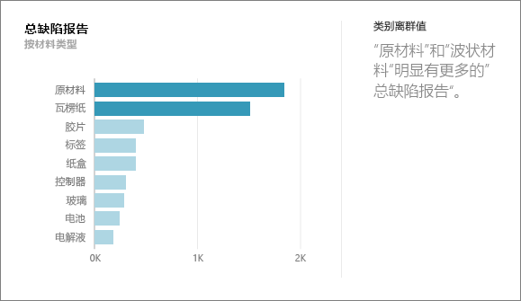
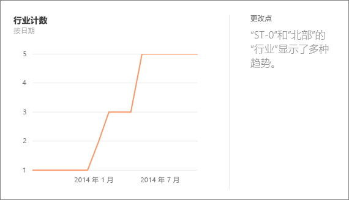
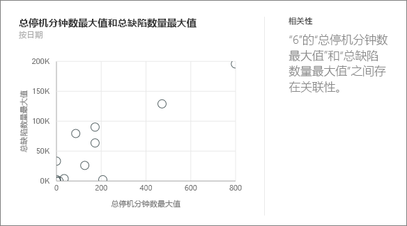
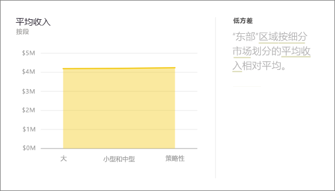
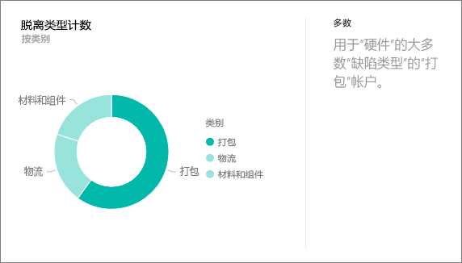
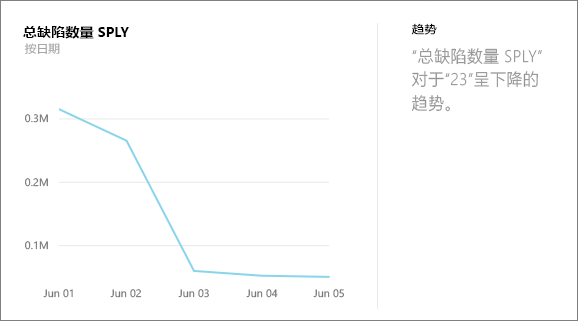
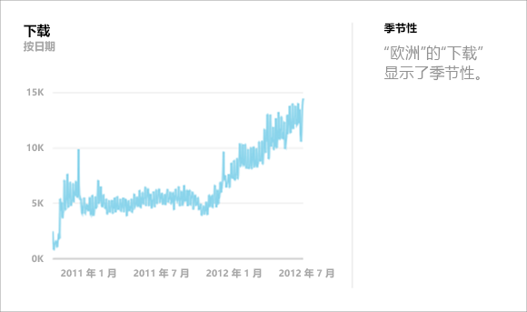
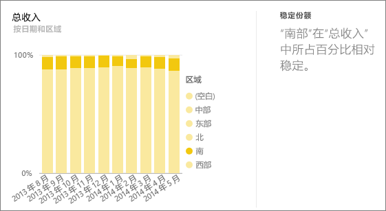
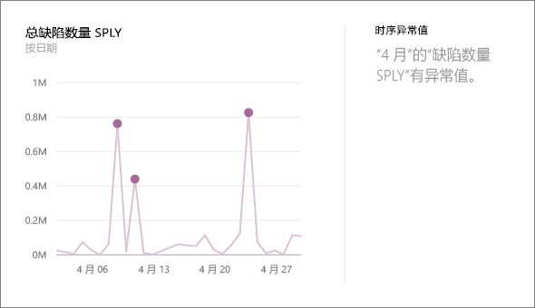

# Power BI 支持的见解类型
## 见解的工作原理
Power BI 可快速搜索数据集的不同子集，同时应用一组复杂的算法来发现潜在相关的见解。 Power BI 会在预定时间内扫描数据集中尽可能多的内容。

可以针对数据集或仪表板磁贴运行见解。   

## 我们可以发现哪些类型的见解？
以下是我们所使用的一些算法：

## 类别离群值（上/下）
针对模型中的度量值，突出显示维度的一或两个成员值远大于维度的其他成员值的情况。  

## 更改时序中的点
突出显示数据时序中的趋势明显变化的情况。

## 关联
检测当根据数据集中的某个维度绘制多个度量值时，多个度量值彼此之间显示关联的情况。

## 低方差
检测数据点不偏离平均值的情况。

## 多数（主要因素）
查找当总值由另一个维度分解时，其多数可能归因于单一因素的情况。  

## 时序中的整体趋势
检测时序数据中的向上或向下趋势。

## 时序中的季节性
查找时序数据中的周期模式，例如每周、每月或每年的季节性。

## 稳定份额
突出显示子值的份额相对于跨连续变量的整体父值有父子关联的情况。

## 时序离群值
针对跨时序的数据，检测特定日期或时间值明显不同于其他日期/时间值的情况。

## 后续步骤
[Power BI 见解](service-insights.md)

如果你拥有一个数据集，可[对其进行优化以生成见解](service-insights-optimize.md)

更多问题？ [尝试参与 Power BI 社区](http://community.powerbi.com/)

