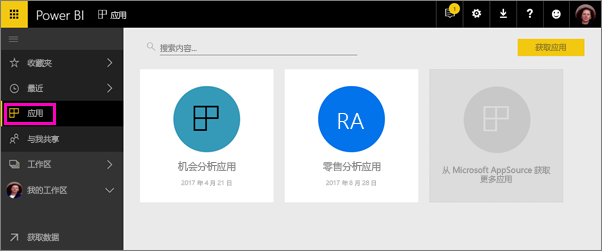
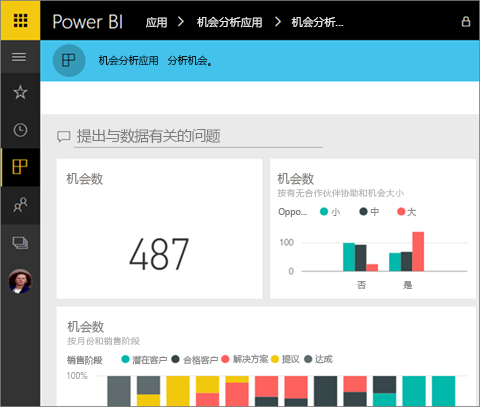
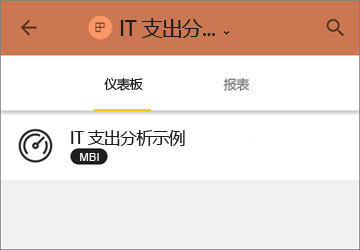
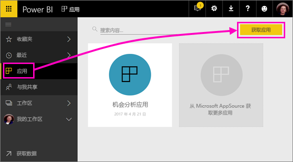
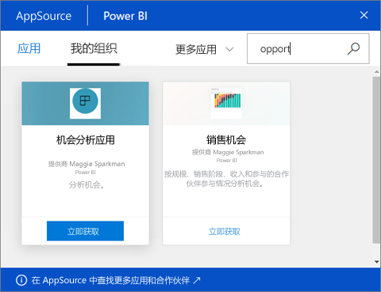
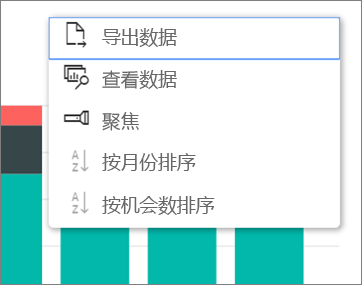

# 在 Power BI 中安装和使用包含仪表板和报表的应用
在 Power BI 中，应用将相关仪表板和报表汇总到一处。 组织中的人员可以创建并分发包含关键业务信息的应用。 可能已使用的[外部服务](service-connect-to-services.md)（如 Google Analytics 和 Microsoft Dynamics CRM）也提供 Power BI 应用。 

可以在 Power BI 服务 ([https://powerbi.com](https://powerbi.com)) 和移动设备上轻松找到并安装应用。 安装应用后，无需记住许多不同仪表板的名称，因为它们已全部汇总到应用、浏览器或移动设备中。

借助应用，只要应用作者发布更新，就会自动看到变化。 作者还可以控制数据的计划刷新频率，这样就不必担心要不断更新了。 

计划创作应用？ 有关详细信息，请参阅[在 Power BI 中创建和发布应用](service-create-distribute-apps.md)。

## 获取新的应用
可以通过多种不同的方式获取应用。 应用作者可以在 Power BI 帐户中自动安装应用或向你发送应用的直接链接，或者，你也可以在 AppSource 中进行搜索，在其中可以看到所有可以访问的应用。 在移动设备上的 Power BI 中，只能通过直接链接（而不是 AppSource）安装应用。 如果应用作者自动安装应用，将能够在你的应用列表中看到它。

### 通过直接链接安装应用
自行安装新应用的最简单方法是从应用作者处获取直接链接。 Power BI 创建安装链接，作者可以发送此链接。

**在计算机上** 

单击电子邮件中的链接后，将在浏览器中打开 Power BI 服务 ([https://powerbi.com](https://powerbi.com))。 确认要安装应用后，它会打开应用登陆页面。

**在 iOS 或 Android 移动设备上** 

在移动设备上单击电子邮件中的链接后，应用会自动安装，并打开应用内容列表。 

### 从 Microsoft AppSource 获取应用
此外，还可以查找并安装有权通过 Microsoft AppSource 访问的任何应用。 

1. 依次选择“应用” > “获取应用”。 
   
     
2. 在 AppSource 的“我的组织”下，可以进行搜索以缩小结果范围，并查找所需的应用。
   
     
3. 选择“立即获取”将其添加到你的应用页。 

## 与应用中的仪表板和报表进行交互
现在你可以浏览仪表板中的数据和应用中的报表。 有权执行所有标准 Power BI 交互，如筛选、突出显示、排序和向下钻取。 阅读如何[与 Power BI 中的报表进行交互](service-reading-view-and-editing-view.md)。 

无法保存所做的更改，但始终可以从表或报表中的其他视觉对象[将数据导出到 Excel](power-bi-visualization-export-data.md)。

## 后续步骤
* [在 Power BI 中构建和发布应用](service-create-distribute-apps.md)
* [适用于外部服务的 Power BI 应用](service-connect-to-services.md)
* 是否有任何问题？ [尝试咨询 Power BI 社区](http://community.powerbi.com/)

