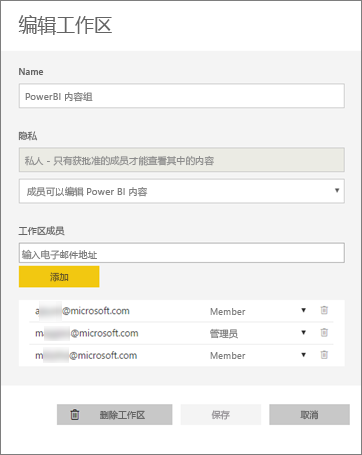
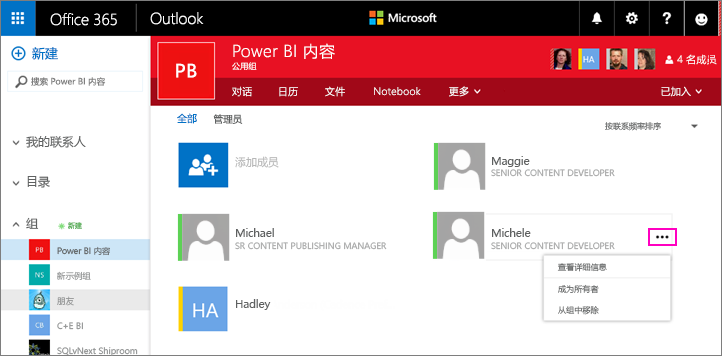
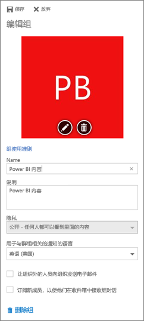

# 管理 Power BI 和 Office 365 中的应用工作区
作为 [Power BI 或 Office 365 中应用工作区](service-install-use-apps.md)的创建者或管理员，可以在 Power BI 中管理工作区的某些方面。 你在 Office 365 中管理的其他方面。 

**在 Power BI 中**，你可以：

* 添加或删除应用工作区成员，包括使某个工作区成员成为管理员。
* 编辑应用工作区名称。
* 删除应用工作区。

**在 Office 365**中，你可以：

* 添加或删除应用工作区的组成员，包括将成员设为管理员。
* 编辑组名称、图像、说明和其他设置。
* 查看组电子邮件地址。
* 删除组。

要成为应用工作区的管理员或成员，需要具有 [Power BI Pro](service-free-vs-pro.md) 许可证。 除非应用工作区位于 Power BI Premium 容量中，否则应用用户也需要具有 Power BI Pro 许可证。 业务用户可以改为通过 Power BI 免费许可证访问应用。 请阅读[什么是 Power BI Premium？](service-premium.md)了解详细信息。

## 编辑 Power BI 中的应用工作区
1. 在 Power BI 服务中，选择“工作区”旁边的箭头，然后选择工作区名称旁边的省略号（“…”），接下来选择“编辑工作区”。 
   
   
   
   > [!NOTE]
   > 如果你是应用工作区管理员，则只能看到“编辑工作区”。
   > 
   > 
2. 可以在此处重命名、添加或删除成员，或删除应用工作区。 
   
   
3. 选择**保存**或**取消**。

## 在 Office 365 中编辑 Power BI 应用工作区属性
1. 在 Power BI 服务中，选择“工作区”旁边的箭头，然后选择工作区名称旁边的省略号（“…”），接下来选择“成员”。 
   
   
   
   这将打开应用工作区的 Outlook for Office 365 组视图。
   
   可能需要登录到你的公司帐户。
2. 单击某个成员名旁边的省略号（“…”），使该成员成为管理员或从应用工作区中删除该成员。 
   
   

## 在 Office 365 组中添加图像并设置其他工作区属性
从应用工作区分发应用时，在此处添加的图像将成为应用的图像。 请参阅[在 Power BI 中创建和分发应用](service-create-distribute-apps.md)文章的[将图像添加到应用](service-create-distribute-apps.md#add-an-image-to-your-app-optional)部分。

1. 在应用工作区的 Outlook for Office 365 视图中，选择组图像以编辑组工作区属性。
   
   
2. 可以在此处编辑名称、说明和语言，添加图像并设置其他属性。
   
   
3. 选择**保存**或**放弃**。

## 后续步骤
* [Power BI 中的应用有哪些？](service-install-use-apps.md)
* [在 Power BI 中创建应用和应用工作区](service-create-distribute-apps.md)
* 更多问题？ [尝试参与 Power BI 社区](http://community.powerbi.com/)

