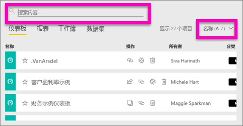
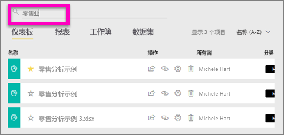
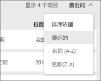
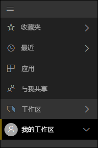
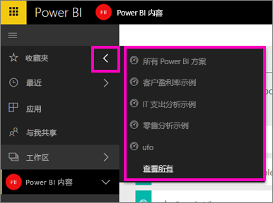

# 导航：在 Power BI 服务中搜索、查找和排序内容
可通过多种方法在 Power BI 服务中导航内容。 工作区中的内容已按类型进行组织：仪表板、报表、工作簿和数据集。  此外，内容已按使用情况进行组织：收藏夹、最近、应用、与我共享和特色。 通过这些不同的内容浏览途径可以在 Power BI 服务中快速找到所需的内容。  

>[!NOTE] 
>本文适用于 Power BI 服务 (app.powerbi.com)，不适用于 Power BI Desktop。

## 在工作区中导航

Power BI 服务按类型区分工作区内容：仪表板、报表、工作簿和数据集。 选择工作区时，可以看到这种组织形式。 在此示例中，应用工作区名为“销售和市场营销应用示例”，其中它包含 2 个仪表板、6 个报表、1 个工作簿和 5 个数据集。

________________________________________

## 在工作区中进行搜索和排序
工作区包含四个内容选项卡：仪表板、报表、工作簿和数据集。  每个选项卡都包含搜索字段和一个排序按钮。  刚开始使用 Power BI 服务时，可能不易发现它们的用途，因为每个选项卡只有一两个项。但是，随着时间的推移，最终你可能会获得较长的内容列表。  使用搜索和排序可以轻松地查找你需要的内容。

* 输入搜索词在当前屏幕上查找匹配项
  
   
* 选择排序按钮可显示当前页的选项。 这些选项可按名称或所有者进行排序。
  
   

## 使用左侧导航栏导航
左侧导航窗格对内容进行分类，方便你快捷地找到所需的内容。  

创建供自己使用的内容位于**“我的工作区”**中，所创建的和与组共享的内容位于 **“应用工作区”**中，与你共享的内容位于**“与我共享的内容”**中，而最近访问的内容则显示在**“最近访问”**中。

此外，你可以标记作为内容[收藏](service-dashboard-favorite.md)和[特色](service-dashboard-featured.md)。 选取一个你希望经常查看的仪表板，并将其设置为特色仪表板。 每次打开 Power BI 服务时，这将是首先显示的仪表板。 你是否有大量经常访问的仪表板和应用？ 通过将它们设置为收藏项，可以始终通过左侧导航栏进行访问。

。

## 注意事项和疑难解答
* 对于数据集，所有者无法使用**排序依据**。

## 后续步骤
[Power BI - 基本概念](service-basic-concepts.md)

更多问题？ [尝试参与 Power BI 社区](http://community.powerbi.com/)