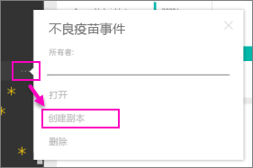

# 组织内容包：复制、刷新和获取访问权限
> [!NOTE]
> 你知道新 *应用* 吗？ 应用是在 Power BI 中将内容分发给大型受众的新方法。 可在应用工作区中创建应用，它们将代替组和组工作区。 建议使用应用，而不使用组织内容包或只读工作区。 了解有关[应用的详细信息](service-install-use-apps.md)。
> 
> 

组织内容包发布后，所有收件人都会看到相同的仪表板、报表、Excel 工作簿、数据集和数据（SQL Server Analysis Services (SSAS) 数据源除外）。  [只有内容包创建者可以编辑和重新发布](service-organizational-content-pack-manage-update-delete.md)内容包。  但是，所有收件人均可保存内容包的副本，该副本可与原始内容包并存。

创建内容包不同于共享仪表板，也不同于在组中针对这些包开展协作。 阅读[应如何针对仪表板及报表开展协作并进行共享？](service-how-to-collaborate-distribute-dashboards-reports.md)以决定具体情况的最佳选项。

## 创建组织内容包的副本
创建内容包的专属副本，并对其他用户不可见。

1. 选择内容包仪表板旁边的省略号 (...) >“创建副本”。
   
    
2. 选择**保存**。  

现在，你有一个可以更改的副本。 其他所有人都看不到你做出的更改。

## 帮助！  我再也无法访问该内容包
这可能是多种原因引起的：

* **成员身份更改**：内容包将发布到电子邮件通讯组、安全组，以及[基于 Office 365 的 Power BI 组](https://support.office.com/article/Create-a-group-in-Office-365-7124dc4c-1de9-40d4-b096-e8add19209e9)。  如果已将你从组中删除，则你不能再访问该内容包。
* **通讯组更改**：内容包创建者更改了通讯组。 例如，如果内容包最初发布到整个组织，但之后创建者将其重新发布到较少的受众，则你可能不再包含于其中。
* **安全设置更改**：如果仪表板和报表连接到本地 SSAS 数据源，并且对安全设置进行了更改，则可能会撤销你对该服务器的权限。

## 如何刷新组织内容包？
创建内容包时，数据集会继承刷新设置。  如果你复制内容包，新版本会保留指向原始数据集及其刷新计划的链接。 

请参阅[管理、更新和删除组织内容包](service-organizational-content-pack-manage-update-delete.md)。

## 后续步骤
* [组织内容包简介](service-organizational-content-pack-introduction.md)
* [在 Power BI 中创建组](service-create-distribute-apps.md)
* 更多问题？ [尝试参与 Power BI 社区](http://community.powerbi.com/)

