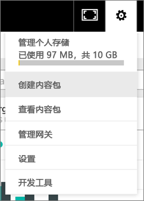
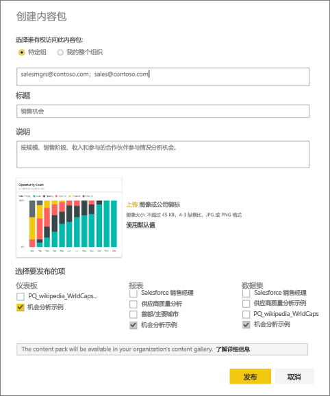
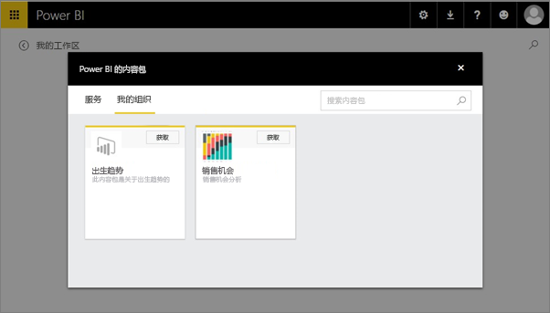

# 创建和发布 Power BI 组织内容包（教程）

本教程介绍了如何创建组织内容包，授予对特定组的访问权限，并将组织内容包发布到你在 Power BI 上的组织内容包库。

创建内容包不同于共享仪表板，也不同于在组中针对这些包开展协作。 阅读[应如何针对仪表板及报表开展协作并进行共享？](service-how-to-collaborate-distribute-dashboards-reports.md)以决定具体情况的最佳选项。

你和你的同事需要具有 [Power BI Pro 帐户](https://powerbi.microsoft.com/pricing)才能创建组织内容包。 

> [!NOTE]
> 无法在新工作区体验预览中创建或安装组织内容包。 现在正是将内容包升级到应用的最佳时机（如果尚未升级）。 详细了解[新工作区体验](service-create-the-new-workspaces.md)。
> 

假设你是 Contoso 的发布经理，准备推出新产品。  你通过报表创建了仪表板，想要与其他管理发布的员工共享。 你想要对仪表板和报表进行打包的方法，使其作为你的同事使用的解决方案。 

想要跟着做吗？ 在 [Power BI 服务](https://powerbi.com)中，依次转到 **“获取数据”>“示例”>“机会分析示例”** > “**连接**”，获取自己的副本。 

1. 在左侧导航窗格中选择**机会分析示例**仪表板。
2. 从顶部导航栏中，选择齿轮图标  > “**创建内容包**”。    
   
3. 在**创建内容包**窗口中，输入以下信息。  
   
   请记住，你组织的内容包库最终可能会得到数百个为组织或组发布的内容包。 花点时间为内容包指定有意义的名称、添加合理的说明并选择合适的受众。  使用的单词要使你的内容包可通过搜索轻松查找。
   
   1. 选择**特定组**，输入个人、[Office 365 组](https://support.office.com/article/Create-a-group-in-Office-365-7124dc4c-1de9-40d4-b096-e8add19209e9)、通讯组或安全组的完整电子邮件地址。 例如：
      
        salesmgrs@contoso.com; sales@contoso.com
      
      针对本教程，尝试使用自己或组的电子邮件地址。
   
   2. 将内容包命名为**销售机会**。
   
      > [!TIP]
      > 请考虑将仪表板名称包含在内容包名称中。 这样一来，你的同事连接到你的内容包后将更轻松地找到仪表板。
      > 
      > 
   
   3. 推荐：添加**说明**。 这有助于同事更轻松地找到所需的内容包。 除了说明外，还请添加你的同事在搜索此内容包时可能输入的关键字。 添加联系人信息，方便同事有疑问或需要帮助时使用。
   
   4. **上载图像或徽标**，方便组成员更轻松地查找内容包，因为浏览图像比浏览文本更快。 在下面的屏幕截图中，我们使用了机会计数百分比堆积柱形图磁贴的图像。
   
   5. 选择**机会分析示例**仪表板，将其添加到内容包。  Power BI 会自动添加相关联的报表和数据集。 可以根据需要添加其他内容。
   
      > [!NOTE]
      >  只列出了可编辑的仪表板、报表、数据集和工作簿。 因此，与你共享的任何内容未在列表中。
      > 
      > 
   
       
   
   6. 如果你有 Excel 工作簿，可在“报表”下查看它们，带有 Excel 图标。 也可将它们添加到内容包。
   
      
   
      > [!NOTE]
      > 如果组成员不能查看 Excel 工作簿，可能需要[在 OneDrive for Business 中共享工作簿](https://support.office.com/en-us/article/Share-documents-or-folders-in-Office-365-1fe37332-0f9a-4719-970e-d2578da4941c)。
      > 
      > 
4. 选择**发布**将该内容包添加到组的组织内容包库。  
   
   如果成功地发布，你将看到一条成功消息。 
5. 当组成员转到**获取数据 > 我的组织**时，在搜索框中点击并键入“销售机会”。
   
    
6. 他们将看到你的内容包。  
    
   
   > [!TIP]
   > 你的浏览器中显示的 URL 是此内容包的唯一地址。  想要告诉同事有关此新内容包的信息？  将 URL 粘贴到电子邮件中。
   > 
   > 
7. 他们选择**连接**，现在则可[查看和使用你的内容包](service-organizational-content-pack-copy-refresh-access.md)。 

### 后续步骤
* [组织内容包简介](service-organizational-content-pack-introduction.md)  
* [管理、更新和删除组织内容包](service-organizational-content-pack-manage-update-delete.md)  
* [在 Power BI 中创建组](service-create-distribute-apps.md)  
* [什么是 OneDrive for Business？](https://support.office.com/en-us/article/What-is-OneDrive-for-Business-187f90af-056f-47c0-9656-cc0ddca7fdc2)
* 更多问题？ [尝试参与 Power BI 社区](http://community.powerbi.com/)

