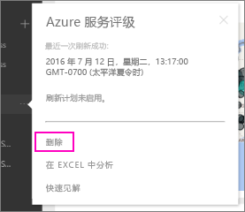

# 删除与 Power BI 组织内容包的连接
一名同事已创建一个内容包。 你在 AppSource 中发现了此包，并将它添加到了 Power BI 工作区中。 现在你不再需要它。  如何删除它？

要删除内容包，可以删除其数据集。  

* 在左侧导航窗格中，选择该数据集右侧的省略号，然后选择“删除”\>“是”。  
  
  

删除数据集还会删除所有关联的报表和仪表板。 不过，断开与内容包的连接不会从组织的 AppSource 中删除内容包。  随时都可以返回到 AppSource，并将内容包重新添加到工作区中。 只有内容包创建者才能[从 AppSource 中删除内容包](service-organizational-content-pack-manage-update-delete.md)。

## 后续步骤
* [组织内容包简介](service-organizational-content-pack-introduction.md) 
* [在 Power BI 中构建和分发应用](service-create-distribute-apps.md) 
* [Power BI 基本概念](service-basic-concepts.md)  
* 更多问题？ [尝试参与 Power BI 社区](http://community.powerbi.com/)

