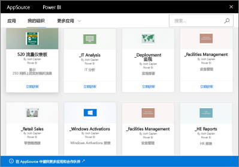

# Power BI 中的组织内容包简介
> [!NOTE]
> 你知道新应用吗？  应用是在 Power BI 中将内容分发给大型受众的新方法。 建议使用应用，而不使用组织内容包或只读工作区。 了解有关[应用的详细信息](service-install-use-apps.md)。
> 
> 

你是否通过电子邮件向团队成员定期分发报表？ 改为试试下面这种做法：打包仪表板、报表、Excel 工作簿和数据集，以 *组织内容包* 的形式将它们发布到团队。 你的团队可以轻松找到你创建的内容包，因为它们都位于 AppSource 中。 因为它们是 Power BI 的一部分，所以它们将利用 Power BI 的所有功能，包括交互式数据浏览、新增视觉对象、问答、与其他数据源集成、数据刷新等。

创建内容包不同于共享仪表板，也不同于在应用工作区中协作处理内容包。 阅读[应如何针对仪表板及报表开展协作并进行共享？](service-how-to-collaborate-distribute-dashboards-reports.md)以决定具体情况的最佳选项。 

在 AppSource 中，可以浏览或搜索已发布到整个组织、通讯组/安全组和[所属 Office 365 组](https://support.office.com/article/Create-a-group-in-Office-365-7124dc4c-1de9-40d4-b096-e8add19209e9)的内容包。 如果你不是特定组的成员，则你不会看到与该组共享的内容包。 组的所有成员拥有对内容包数据、报表、工作簿和仪表板相同的只读访问权限（SQL Server Analysis Services (SSAS) 数据源除外，在这种情况下，将从数据源继承权限）。

虽然仪表板、报表和 Excel 工作簿是只读的，但可以复制仪表板和报表，然后从它们入手开始创建你自己的个性化内容包。

> [!NOTE]
> 仅当你和同事已安装 [Power BI Pro](service-free-vs-pro.md) 后，才能使用组织内容包。
> 
> 

## 什么是 AppSource？
发布组织内容包会将它添加到 AppSource 中。  通过此集中存储库，各成员可以轻松浏览和发现为其发布的仪表板、报表和数据集。  

* 若要查看 AppSource，请依次选择“获取数据” > “我的组织” > “获取”。

阅读有关[查找和打开组织内容包](service-organizational-content-pack-find-and-open.md)的详细信息。

## 组织内容包的生命周期
任何 Power BI Pro 用户都可以创建、发布和访问组织内容包。 只有内容包创建者才能修改工作簿和数据集、安排刷新以及删除内容包。

生命周期如下所示：

1. 在 Power BI Pro 中，Nate 创建了内容包，并将它发布到“市场营销”通讯组。 数据集将继承刷新设置，只能由 Nate 修改这些设置。
   
   > [!NOTE]
   > 如果 Nate 是在自己所属的 [Power BI 应用工作区](service-create-distribute-apps.md)内创建内容包，那么即使他离开此工作区，Power BI 工作区中的其他人也仍可接管所有权。
   > 
   > 
2. Nate 向通讯组发送邮件，告知通讯组成员有关新内容包的信息。
3. 在 Power BI Pro 中，“市场营销”通讯组的成员 Jane 搜索并连接 AppSource 中的这个内容包。 她现在具有只读副本。  她知道它是只读的，因为在左侧导航窗格中，仪表板名称和报表名称左侧显示了共享图标。 而当她选择仪表板时，锁形图标让 Jane 知道她正在查看内容包仪表板。 
4. 假设她决定对其进行自定义。 她现在具有自己的仪表板和报表副本。 她执行的操作不会影响源、原始内容包或其他通讯组成员。 她现在对其自己的仪表板和报表副本进行处理。
5. Nate 对仪表板进行更新，并在更新就绪后发布内容包的新版本。
   
   * 另一名通讯组成员 Julio 没有自定义原始内容包。 新增更改将自动应用于其内容包版本。  
   * Jane 对内容包进行了自定义。 她将收到通知，告知有新版本。  她可以转到 AppSource，并获取更新后的内容包，而不会丢失个性化版本。 她现将具有两个版本：她的个性化版本和更新的内容包。
6. 假设 Nate 更改了安全设置。 Julio 和 Jane 不再有权访问该内容。 或假设从“市场营销”通讯组中删除了这二人。
   
   * Julio 没有自定义原始内容包，因此将自动删除内容。 
   * Jane 对内容包进行了自定义。 她下次打开仪表板时，原始内容包中的所有磁贴都将消失，但仍将显示她从（她仍有权使用的）其他报表固定的磁贴。 关联的报表和数据集将不再可用（且不会显示在其左侧导航窗格中）。
7. 或者 Nate 删除了内容包。
   
   * Julio 没有自定义原始内容包，因此将自动删除内容。 
   * Jane 对内容包进行了自定义。 她下次打开仪表板时，原始内容包中的所有磁贴都将消失，但仍将显示她从其他报表固定的磁贴。 关联的报表和数据集将不再可用（且不会显示在其左侧导航窗格中）。

## 数据安全性
所有通讯组成员的数据权限与内容包创建者一样。 SQL Server Analysis Services (SSAS) 本地表格数据集是一个例外。 由于报表和仪表板实时连接到本地 SSAS 模型，因此将使用各个通讯组成员的凭据确定其可以访问的数据。

## 后续步骤
* [创建和发布组织内容包](service-organizational-content-pack-create-and-publish.md)
* [在 Power BI 中构建和分发应用](service-create-distribute-apps.md) 
* [Power BI - 基本概念](service-basic-concepts.md)
* 更多问题？ [尝试参与 Power BI 社区](http://community.powerbi.com/)

