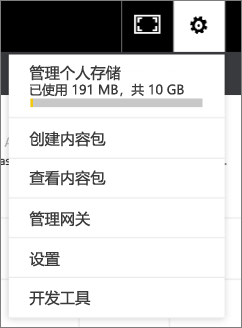

# 管理、更新和删除组织内容包
> [!NOTE]
> 你知道新*应用*吗？ 应用是在 Power BI 中将内容分发给大型受众的新方法。 我们计划在不久后弃用组织内容包，因此建议你使用应用。 了解有关[应用的详细信息](service-install-use-apps.md)。
> 
> 

可以将仪表板、报表、Excel 工作簿和数据集打包为[组织内容包](service-organizational-content-pack-introduction.md)，并与你的同事共享。 你的同事可以按原样使用它们，也可以创建其自己的副本。

创建内容包不同于共享仪表板，也不同于在组中针对这些包开展协作。 阅读[应如何针对仪表板及报表开展协作并进行共享？](service-how-to-collaborate-distribute-dashboards-reports.md)以决定具体情况的最佳选项。

只有内容包创建者才能执行下面这些组织内容包任务：

* 重新发布。
* 限制或扩展内容包访问权限。
* 设置和更改计划的刷新。
* 删除内容包。

## 修改和重新发布组织内容包
如果对原始内容包仪表板、报表或 Excel 工作簿进行更改，Power BI 将提示你重新发布。 此外，作为内容包创建者，你可以更新创建原始内容的包时在“创建内容包”窗口中选定的任意选项。 

## 与新内容一起重新发布
对内容包中的仪表板进行更改并保存更改时，Power BI 会提醒你更新，以便其他人可以看到相应更改。 例如，如果你固定新磁贴或仅更改仪表板的名称，都将发出提醒。

1. 选择消息中的“**查看内容包**”。
   
   
2. 或选择右上角的齿轮图标 ，然后选择**查看内容包**。
   
   
   
   注意警告图标 。  该图标表示你已以某种方式修改内容包，使其不再与已发布的内容包相同。
3. 选择**编辑**。  
4. 在**更新内容包**窗口中进行任何所需更改，然后选择**更新**。 将显示**成功**消息。
   
   * 对于未自定义内容包的组成员，将自动应用更新。
   * 已自定义内容包的组成员将收到有新版本的通知。  他们可以转到 AppSource，并获取更新后的内容包，而不会丢失个性化版本。  他们现将具有 2 个版本：个性化版本和更新的内容包。  在个性化版本中，来自原始内容包的所有磁贴将消失。  但仍将呈现固定自其他报表的磁贴。 然而，一旦内容包所有者删除内容包所基于的数据集，则整个报表将消失。  

## 更新受众：扩展或限制访问权限
内容包创建者可进行另一种修改，即扩展和限制对内容包的访问权限。  也许你将内容包发布到了广泛的受众，又决定将访问权限限制于一个较小的组。  

1. 选择齿轮图标 ，然后选择**查看内容包**。
2. 选择**编辑**。 
3. 在**更新内容包**窗口中进行任何所需更改，然后选择**更新**。 例如，删除**特定组**字段中的原始通讯组，并将其替换为（成员较少的）其他通讯组。
   
   将显示“成功”消息。
   
   对于不属于新别名的任何同事：
   
   * 对于未自定义内容包的组成员，与该内容包相关联的仪表板和报表将不再可用，且导航窗格中不会显示该内容包。
   * 对于已自定义内容包的组成员，他们下次打开自定义仪表板时，将不再显示来自原始内容包的所有磁贴。  但仍将呈现固定自其他报表的磁贴。 原始内容包报表和数据集将不再可用，且导航窗格中不会显示该内容包。   

## 刷新组织内容包
作为内容包创建者，你可以[计划数据集的刷新](refresh-data.md)。  当你创建并上传内容包时，该刷新计划将于数据集一起上传。 如果更改刷新计划，你需要重新发布内容包（见上文）。

## 从 AppSource 中删除组织内容包
只有内容包创建者才能从 AppSource 中删除内容包。 如果已在应用工作区中创建组织内容包，又决定删除该工作区，请务必先删除内容包。 如果在未先删除内容包的情况下删除工作区，你将失去对这些内容包的全部访问权限，需要联系 Microsoft 支持部门以获取帮助。 

> [!TIP]
> 如果不是内容包创建者，可以[断开与内容包的连接](service-organizational-content-pack-disconnect.md)。 此操作不会从 AppSource 中删除内容包。
> 
> 

1. 若要从 AppSource 中删除内容包，请转到在其中创建内容包的应用工作区，再依次选择齿轮图标  和“查看内容包”。
2. 依次选择“删除”\>“删除”。 
   
   * 对于未自定义内容包的组成员，将自动删除与该内容包相关联的仪表板和报表。 这些内容将不再可用，且导航窗格中不会显示该内容包。
   * 对于已自定义内容包的组成员，他们下次打开自定义仪表板时，将不再显示来自原始内容包的所有磁贴。  但仍将呈现固定自其他报表的磁贴。 原始内容包报表和数据集将不再可用，且导航窗格中不会显示该内容包。   

## 后续步骤
* [组织内容包简介](service-organizational-content-pack-introduction.md)
* [在 Power BI 中构建和分发应用](service-create-distribute-apps.md) 
* 更多问题？ [尝试参与 Power BI 社区](http://community.powerbi.com/)

