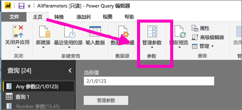
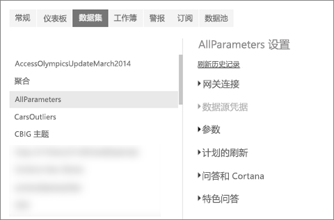
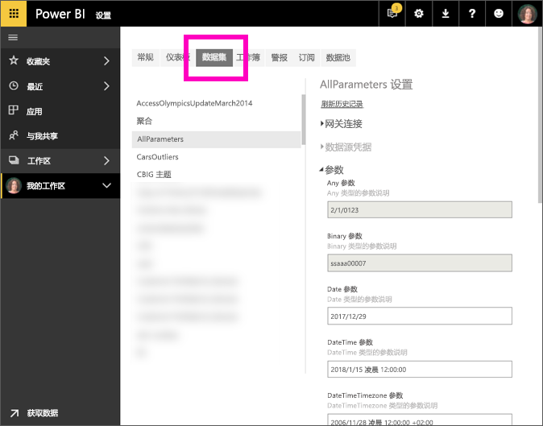

# 什么是查询参数？
查询参数是由报表创建者使用 Power BI Desktop 添加的。 报表创建者可使用参数根据一个或多个参数值将报表组成多个部分。 例如，报表创建者可创建参数将数据限制到单个国家/地区，或使用参数来限制字段（例如日期、时间和文本）可接受的格式。

## 使用 Power BI 服务查看和编辑参数

在 Desktop 中定义参数后，[将报表发布到 Power BI 服务](desktop-upload-desktop-files.md)时，参数设置和选择将随该报表一起移动。 可使用 Power BI 服务查看和编辑某些参数设置（例如定义和描述可接受值的参数），但限制可用数据的参数除外。

1. 在 Power BI 服务中，选择齿轮图标  打开“设置”。

2. 选择“数据集”选项卡并突出显示列表中的数据集。 
    
    

3. 展开参数。  如果所选数据集没有参数，则将看到一条消息，其中带有指向“了解有关查询参数的详细信息”的链接。 如果数据集具有参数，但展开参数标题会显示这些参数。 

    

    查看参数设置，并根据需要进行更改。 灰显字段是不可编辑的内容。 

## 后续步骤
添加简单参数的一个特别方法是[修改 URL](service-url-filters.md)。