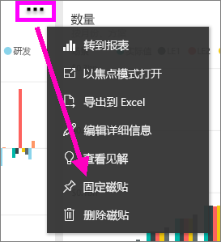
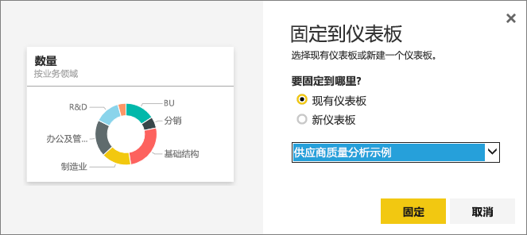

# 将某个仪表板中的磁贴固定到另一个仪表板
添加新的[仪表板磁贴](service-dashboard-tiles.md)的一种方法是从另一个仪表板中复制它。 每个磁贴在单击后都是一个返回到磁贴创建位置的链接 -- 在问答或报表中。 

> [!NOTE]
> 你无法固定共享的仪表板中的磁贴。

## 将磁贴固定到另一个仪表板
1. [获取数据](service-get-data.md)。 本示例使用 [IT 支出分析示例](sample-it-spend.md)。
2. 打开[仪表板](service-dashboards.md)。
3. 将鼠标悬停在想要固定的磁贴上方，选择省略号 (...) 并选择“固定磁贴”。  
   
   
4. 将磁贴固定到现有仪表板或新仪表板。 
   
   * **现有仪表板**：从下拉列表中选择仪表板的名称。
   * **新仪表板**：键入新仪表板的名称。
   
   
5. 选择“固定”。
   会显示一条成功消息（右上角附近），告知你可视化效果已作为磁贴添加到所选仪表板中。
   
   
6. 选择“转到仪表板”以查看固定的磁贴。 在此处可以对已固定的可视化效果进行[重命名、重设大小、添加链接和移动](service-dashboard-edit-tile.md)。

## 后续步骤
[Power BI 中的磁贴](service-dashboard-tiles.md)  
[Power BI 中的仪表板](service-dashboards.md)  
更多问题？ [尝试参与 Power BI 社区](http://community.powerbi.com/)

