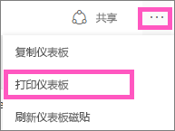
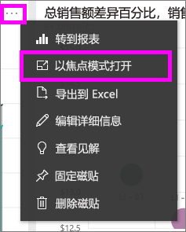
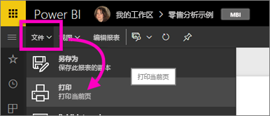

# 从 Power BI 服务打印
使用 Power BI 服务打印整个仪表板、仪表板磁贴、报表页或报表视觉对象。 一次只能打印一页报表，而不能一次打印整个报表。

> [!NOTE]
> 只有 Power BI 服务才提供打印，而不是 Power BI Desktop。
> 
> 

观看 Amanda 从她的仪表板和报表进行打印。 然后按照视频下面的分步说明来自己尝试一下。

<iframe width="560" height="315" src="https://www.youtube.com/embed/jtlLGRKBvXY" frameborder="0" allowfullscreen></iframe>

## 打印仪表板
1. 打开你想要打印的仪表板。
2. 在右上角，选择省略号 (...) 并选择打印仪表板。
   
    
3. 将打开浏览器的“打印”窗口。 选择设置和打印目标，然后选择“打印”。
   
   > [!NOTE]
   > 你看到的打印对话框将取决于所使用的浏览器。
   > 
   > 
   
    

## 打印仪表板磁贴
1. 通过选择省略号，然后选择焦点图标  [在焦点模式下打开该磁贴](service-focus-mode.md)。
   
    
2. 通过选择顶部导航栏的全屏图标 ，可以在[全屏幕模式](service-fullscreen-mode.md)下打开磁贴。
3. 将鼠标悬停在该磁贴以显示“选项”菜单。
   
    
4. 选择“打印”图标 。     
   
   > [!NOTE]
   > 你看到的打印对话框将取决于所使用的浏览器。
   > 
   > 

## 打印报表页
报表可以一次打印一个页面。

1. 在“阅读视图”或“编辑视图”中打开报表。
2. 选择“文件” > “打印”以打印当前报表页。
   
    
3. 将打开浏览器的“打印”窗口。
   
   > [!NOTE]
   > 你看到的打印对话框将取决于所使用的浏览器。
   > 
   > 

## 打印报表视觉对象
1. 通过将鼠标悬停在磁贴上方并选择右上角的“焦点”图标  可以[在焦点模式下打开视觉对象](service-focus-mode.md)。
2. 在以上“打印报表页”之下执行步骤 2-3。

## 注意事项和疑难解答
* 问：找不到“打印”按钮。    
* 答：如果使用的是 Power BI Desktop，则不支持打印功能。  打印仅适用于 Power BI 服务。
* 问：一次无法打印所有报表页。    
* 答：这是正确的。 一次只能打印一页报表页。
* 问：无法打印为 PDF。    
* 答：只有已在你的浏览器中配置 PDF 驱动程序时，才会看到此选项。    
* 问：选择“打印”时所显示的内容与此处显示的内容不匹配。    
* 答：打印屏幕因浏览器和软件的版本而有所不同。
* 问：打印输出缩放不正确。  仪表板不适合页面。 其他缩放比例和方向的问题。    
* 答：我们无法保证打印的副本与 Power BI 服务中所显示的效果完全相同。 类似缩放、边距、视觉对象详细信息、方向和大小等不受 Power BI 控制。 有关此类问题的帮助，请参阅你的特定浏览器文档。      

## 后续步骤
[与同事和其他人共享仪表板和报表](service-share-dashboards.md)

更多问题？ [尝试参与 Power BI 社区](http://community.powerbi.com/)

