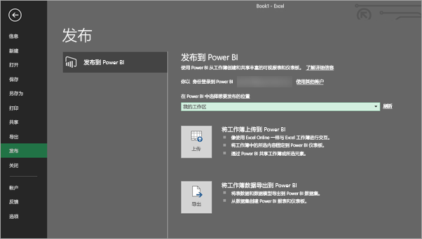
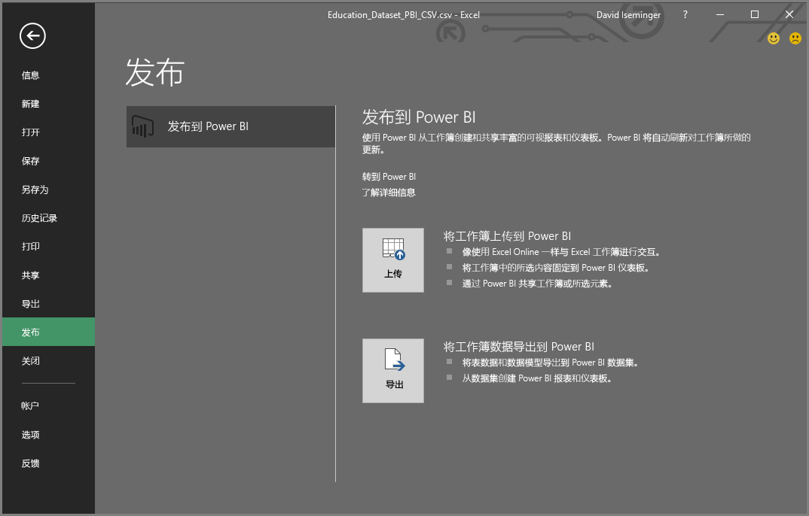

# 从 Excel 2016 发布到 Power BI
使用 Excel 2016，你可以将 Excel 工作簿直接发布到你的 [Power BI](https://powerbi.microsoft.com) 站点，你可以基于工作簿的数据在其中创建高度交互的报表和仪表板。 然后你可以与组织中的其他人共享你的见解。

在继续之前，有几个事项需要记住：

* 必须先将工作簿保存到 OneDrive for Business，才能发布到 Power BI。
* 登录到 Office、OneDrive for Business 和 Power BI 所用的帐户必须是同一个帐户。
* 不能发布空工作簿或者不具有任何 Power BI 支持的内容的工作簿。
* 不能发布加密或受密码保护的工作簿，或具有信息保护管理的工作簿。
* 发布到 Power BI 需要启用新式验证（默认）。 如果禁用，“文件”菜单中将不会出现“发布”选项。

## 发布你的 Excel 工作簿
在 Excel 中，依次选择“**文件**” > “**发布**”。

### 本地文件发布
自 2017 年 2 月更新发布开始，Excel 2016 支持发布本地 Excel 文件。 不需要将文件保存到 OneDrive for Business 或 SharePoint Online。

> [!IMPORTANT]
> 只有拥有 Office 365 订阅的 Excel 2016 才支持发布本地文件。 Excel 2016 独立安装仍要求将 Excel 工作簿保存到 OneDrive for Business 或 SharePoint Online 才能进行“发布”。
> 
> 

选择“**发布**”时，可以选择要将文件发布到哪个工作区。 可以选择有权访问的个人或组工作区。

有两个用于将工作簿导入 Power BI 的选项。

发布后，它便会作为副本保存在 Power BI 中（与本地文件分开）。 若要更新 Power BI 中的文件，需要重新发布更新后的版本。 可以刷新数据，并能为 Power BI 中的工作簿或数据集设置定期刷新。

### 从 Excel 独立安装发布
如果你的工作簿尚未保存到 OneDrive，你需要先将其保存到那里。 选择“保存到云”，然后选择 OneDrive for Business 中的一个位置。

将工作簿保存到 OneDrive 后，选择“**发布**”便会看到两个用于将工作簿导入 Power BI 的选项。

#### 将工作簿上传到 Power BI
当你选择此选项时，你的工作簿将显示在 Power BI 中，就像在 Excel Online 中那样。 但与 Excel Online 不同，你会获得一些出色的功能，可帮助你将元素从工作表固定到仪表板。

无法编辑在 Power BI 中打开的工作簿，但如果需要进行一些更改，可以选择“**编辑**”，然后选择是在 Excel Online 中编辑工作簿，还是在计算机上的 Excel 中打开工作簿。 你所作的任何更改都会保存到 OneDrive 上的工作簿中。

在上传时，Power BI 中未创建任何数据集。 你的工作簿将显示在工作区导航窗格的“报表”中。 上传到 Power BI 的工作簿具有特殊的 Excel 图标，该图标将其标识为已上传的 Excel 工作簿。

如果你的工作表中仅有数据，或者你想要在 Power BI 中看到数据透视表和图表，请选择此选项。
在 Excel 中使用“发布到 Power BI”中的“上载”与在浏览器中使用“获取数据”>“文件”>“OneDrive for Business”>“在 Power BI 中连接、管理和查看 Excel”大致相同。

#### 将工作簿数据导出到 Power BI
当你选择此选项时，表和/或数据模型中任何受支持的数据将导入到 Power BI 中的新数据集中。 如果你有任何 Power View 工作表，这些工作表将作为报表在 Power BI 中重新创建。

你可以继续编辑工作簿。 保存所做的更改后，它们将与 Power BI 中的数据集同步（通常大约在一小时之内）。 如果需要更即时地满足需求，只需再次选择“发布”，而所做的更改便会立即导出。 同样，也会更新报表和仪表板中的任何可视化效果。

如果你已使用“获取并转换数据”或 Power Pivot 将数据加载到数据模型中，或者如果你的工作簿的 Power View 表中包含你想要在 Power BI 中查看的可视化对象，请选择此选项。

在 Excel 中使用“发布到 Power BI”中的“导出”与在浏览器中使用“获取数据”>“文件”>“OneDrive for Business”>“将 Excel 数据导出到 Power BI”大致相同。

## 发布
当你选择任一选项时，Excel 将使用当前帐户登录到 Power BI，然后将你的工作簿发布到 Power BI 站点。 请密切关注 Excel 中的状态栏。 它显示了事情的进展状况。

完成后，你可以直接从 Excel 转到 Power BI。

## 后续步骤
[Power BI 中的 Excel 数据](service-excel-workbook-files.md)  
更多问题？ [尝试参与 Power BI 社区](http://community.powerbi.com/)

