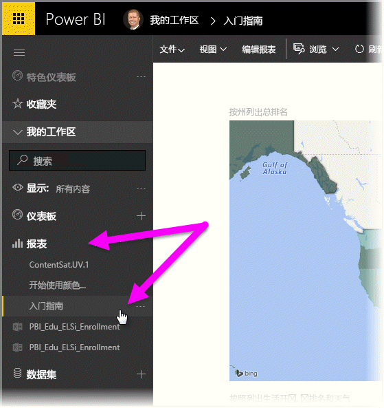
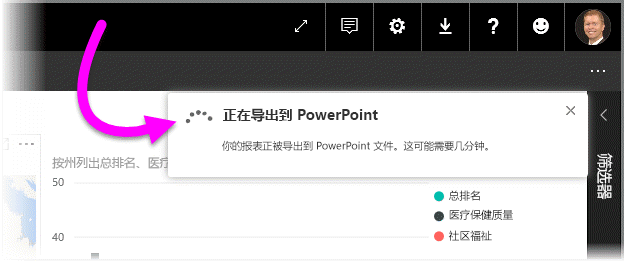
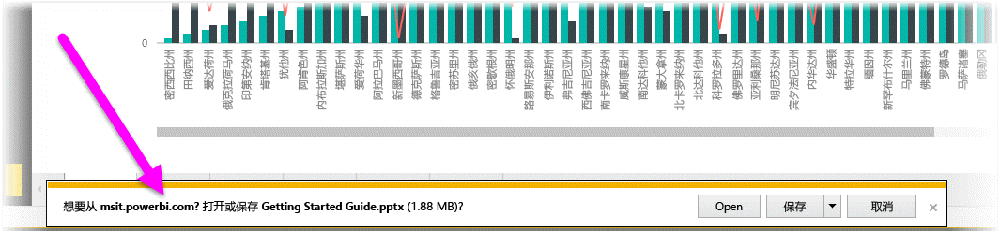
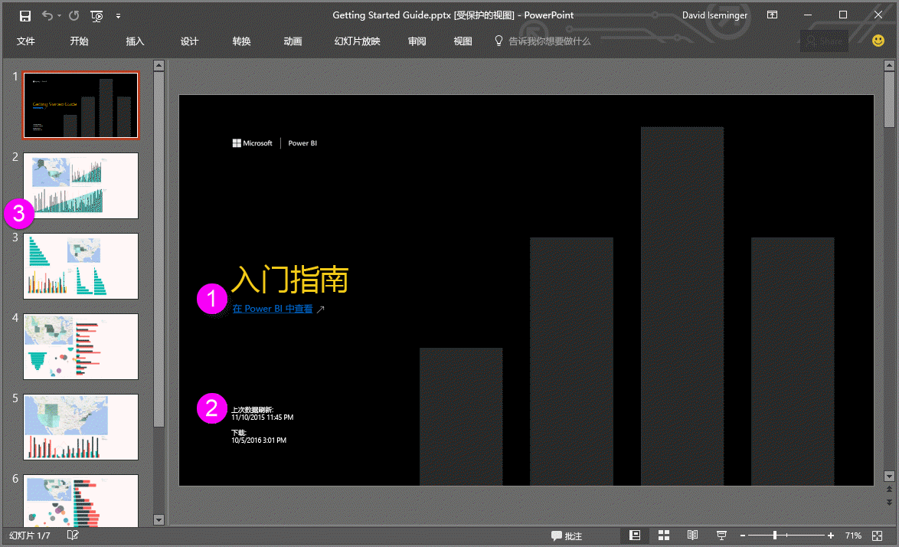

# 将报表从 Power BI 导出到 PowerPoint（预览版）
借助 Power BI，现在可将报表发布到 **Microsoft PowerPoint**，并根据 Power BI 报表轻松地创建幻灯片平台。 **导出到 PowerPoint** 时，会发生以下情况：

* Power BI 报表中的每个页面成为 PowerPoint 中单独的幻灯片
* Power BI 报表中的每个页面导出为 PowerPoint 中的单张高分辨率图像
* Power BI 报表中的文本框成为 PowerPoint 中可编辑的文本框
* 会在 PowerPoint 中创建链接到 Power BI 报表的链接

将 **Power BI 报表**导出到 **PowerPoint** 非常容易。 只需按照下一部分中所述的步骤操作。

## 如何将 Power BI 报表导出到 PowerPoint
在 Power BI 服务中，选择左侧导航窗格中的“**报表**”部分以展开该部分，然后选择报表以将其显示在画布上。 还可以从“**我的工作区**”部分或“**收藏夹**”中选择报表（如果报表位于这两个位置之一）。

想要导出到 PowerPoint 的报表显示在画布上时，在 Power BI 服务的菜单栏中选择“**文件 > 导出到 PowerPoint（预览版）**”，如下图所示。

将看到 Power BI 服务浏览器窗口右上角的通知横幅，显示报表正在导入到 PowerPoint。 这可能需要几分钟的时间。在导出报表的同时，可以在 Power BI 中继续进行操作。

导入完成后，通知横幅会发生变化以通知你 Power BI 服务已完成导出过程。

在浏览器显示下载文件的位置，文件是可用的。 在下图中，它显示为浏览器窗口底部的下载横幅。

以上是其中包含的全部内容。 可以下载该文件，使用 PowerPoint 将其打开，然后像对任何其他 PowerPoint 系列幻灯片一样对其进行修改或增强。

## 检查已导出的 PowerPoint 文件
打开 Power BI 导出的 PowerPoint 文件时，会发现几个很酷且很有用的元素。 看一看下图，然后查看下面描述一些很酷功能的编号元素。

1. 幻灯片平台的第一页包括报表名称和链接，以便能**在 Power BI 中查看**幻灯片平台所基于的报表。
2. 还可以获取有关报表的一些有用信息，包括导出的报表所基于的 *上次数据刷新时间* *下载* 时间和日期，这是 Power BI 报表导出为 PowerPoint 文件的时间和日期。
3. 每个报表页面都是单独的幻灯片，如左侧导航窗格所示。
4. 已发布的报表根据 Power BI 设置或者根据你所用浏览器的区域设置以相应的语言呈现。 若要查看或设置语言首选项，请选择齿轮图标  >“设置”>“常规”>“语言”。 有关区域设置信息，请参阅 [Power BI 支持的语言和国家/地区](supported-languages-countries-regions.md)。
5. PowerPoint 演示文稿包括封面幻灯片，其中包含以正确的时区显示的导出时间。

转到各个幻灯片时，将会发现每个报表页都是独立图像。

>[!NOTE]
> 为每个报表页提供单个视觉对象是新行为。 为每个视觉对象提供独立图像的旧行为将不再实现。 
 

如何处理 PowerPoint 系列幻灯片或任何一张高分辨率图像，这取决于你自己！

## 限制
在使用**导出到 PowerPoint** 功能时，有几个注意事项和限制需要牢记。

* 目前不支持 R 视觉对象。 任何此类视觉对象都将作为空白图像导出到 PowerPoint 中，并显示一条错误消息，指示不支持该视觉对象。
* 支持已取得认证的自定义视觉对象。 有关已取得认证的自定义视觉对象的详细信息（包括如何完成自定义视觉对象认证），请参阅[获取自定义视觉对象认证](power-bi-custom-visuals-certified.md)。 不支持未取得认证的自定义视觉对象，任何此类视觉对象都会作为空白图像导出到 PowerPoint 中，并显示一条错误消息，指示不支持该视觉对象。
* 支持**已认证的自定义视觉对象**。 已认证的自定义视觉对象已批准用于 Power BI，满足特定的代码要求并通过严格的安全测试。 可以[详细了解已认证的自定义视觉对象](power-bi-custom-visuals-certified.md)。
* 目前不能导出包含 15 个以上报表页面的报表。
* 将报表导出到 PowerPoint 的过程可能需要几分钟才能完成，请耐心等待。 影响所需时间的因素包括报表的结构和 Power BI 服务的当前负载。
* 如果**导出到 PowerPoint（预览版）**菜单项在 Power BI 服务中不可用，这很可能是因为租户管理员已禁用该功能。 有关详细信息，请联系租户管理员。
* 会根据图表的边界区域裁剪背景图像。 强烈建议在导出到 PowerPoint 之前删除背景图像。
* 导出到 PowerPoint 时，尚不支持**会话内交互性**，例如突出显示和筛选、向下钻取等功能。 已导出的 PowerPoint 显示原始视觉对象，因为它们已保存在报表中。
* PowerPoint 页始终以标准的 9:16 尺寸创建，无论 Power BI 报表页的原大小或原尺寸如何。
* Power BI 租户域之外的用户拥有的报表（如组织外部人员拥有且与你共享的报表）无法发布到 PowerPoint。
* 如果与组织外部人员（即位于 Power BI 租户之外的用户）共享仪表板，此用户将无法把共享仪表板的关联报表导出到 PowerPoint。 例如，如果你是 aaron@contoso.com，虽然可以与 david@cohowinery.com 共享内容，但 david@cohowinery.com 无法将关联报表导出到 PowerPoint。
* 如上所述，每个报表页导出为 PowerPoint 文件中的单张图像。
* Power BI 服务将你的 Power BI 语言设置用作 Power BI 导出的语言。 若要查看或设置语言首选项，请选择齿轮图标  >“设置”>“常规”>“语言”。
* 导出的 PowerPoint 文件的封面幻灯片上的下载时间被设置为导出时计算机的时区。

## 后续步骤
[在 Excel 中分析](service-analyze-in-excel.md)

[Power BI 中的 Excel 数据](service-excel-workbook-files.md)

[让自定义视觉对象取得认证](power-bi-custom-visuals-certified.md)

