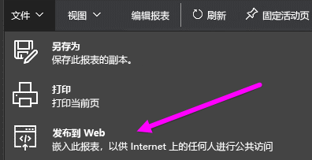
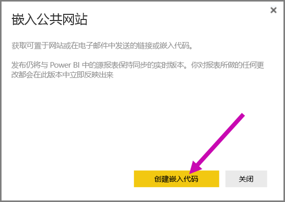
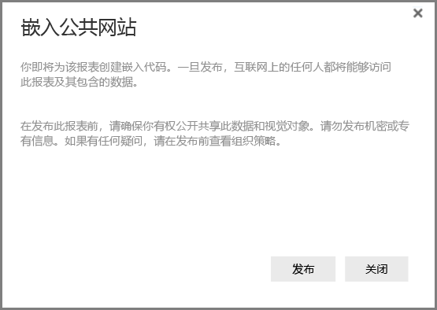
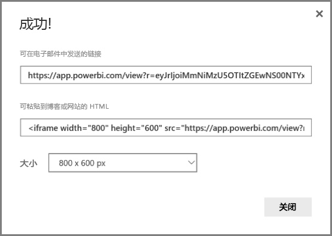
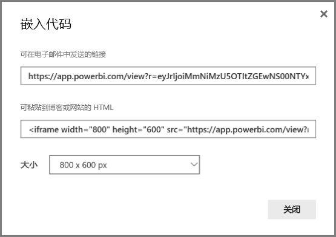
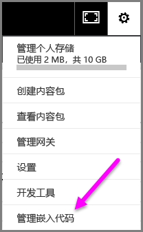
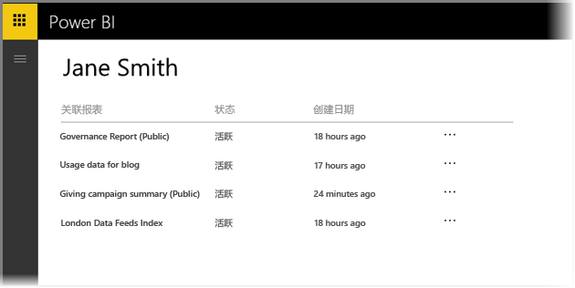

# 从 Power BI 发布到 Web

借助 Power BI **发布到 Web**，可在任何设备上通过电子邮件或社交媒体，轻松地将交互式 Power BI 可视化效果在线嵌入博客帖子、网站等处。

可以方便地编辑、更新、刷新或取消共享已发布的视觉对象。

> [!WARNING]
> 当使用“**发布到 Web**”时，发布的报表或视觉对象可被 Internet 上的所有人查看。 查看这些报表时没有使用身份验证。 仅对可供 Internet 上所有人（未经身份验证的公共成员）查看的报表和数据使用“发布到 Web”。 这包括在报表中聚合的详细级别数据。 在发布此报表前，请确保你有权公开共享此数据和视觉对象。 请勿发布机密或专有信息。 如果有任何疑问，请在发布前查看组织策略。

## 如何使用发布到 Web

可编辑的个人或组工作区中的报表上提供“发布到 Web” 功能。  无法对与你共享的报表或依赖于行级别安全性来保护数据的报表使用“发布到 Web”。 请参阅以下“限制”部分有关不支持“发布到 Web”的案例的完整列表。 使用“发布到 Web”前请查看本文之前所述的**警告**部分。

可在下面*简短视频*中观看此功能的工作方式。 然后，按照以下步骤亲自尝试。

<iframe width="560" height="315" src="https://www.youtube.com/embed/UF9QtqE7s4Y" frameborder="0" allowfullscreen></iframe>

以下步骤介绍如何使用**发布到 Web**。

1. 在可编辑的工作区中的报表上，选择**文件 > 发布到 Web**。
   
   

2. 查看对话框上的内容，然后选择**创建嵌入代码**，如以下对话框中所示。
   
   

3. 查看显示在以下对话框中的警告，并确认数据是否准备好嵌入到公共网站。 如果是这样，则选择**发布**。
   
   

4. 将出现一个对话框，提供一个可通过电子邮件发送、嵌入在代码（如 iFrame）中的链接，或者你可以直接粘贴到网页或博客中的链接。
   
   

5. 如果之前已创建报表的嵌入代码，则将快速显示嵌入代码。 每个报表只能创建一个嵌入代码。
   
   

## 视图模式的提示和技巧

在博客帖子中嵌入内容时，通常需要调整以适合屏幕的特定大小。  还可根据需要调整 iFrame 标记中的高度和宽度，但可能还需要确保报表适合 iFrame 给定区域，因此还需在编辑报表时设置适当的视图模式。

下表提供有关视图模式及其嵌入时外观的指导。

| 视图模式 | 嵌入时外观 |
| --- | --- |
|  |**适应页面**将考虑报表的页面高度和宽度。 如果你将页面设置为“动态”比率，如 16:9 或 4:3，你的内容将在你提供的 iFrame 范围内缩放至合适的大小。 当嵌入在 iFrame 中时，使用“适应页面”可能会导致“宽屏”，内容在 iFrame 中调整至合适大小后，灰色背景会显示在 iFrame 的区域中。 为了尽量减少宽屏幕，请正确设置 iFrame 的高度/宽度。 |
|  |**实际大小**将确保报表保持其在报表页上设置的大小。 这可能导致 iFrame 中显示滚动条。 设置 iFrame 高度和宽度，以避免滚动条。 |
|  |**适应宽度**可确保内容适合 iFrame 的水平区域。 仍会显示一个边框，但内容进行缩放，以便利用所有可用的水平空间。 |

## iFrame 高度和宽度的提示和技巧

发布到 Web 后你收到的嵌入代码将如下所示：

你可以手动编辑宽度和高度，确保它正如你所希望的方式适应你正将其嵌入到的页面。

若要实现更多最佳选择，你可以尝试向 iFrame 的高度维度添加 56 像素。 这将调整底部栏的当前大小。 如果你的报表页使用动态尺寸，下表提供了一些可用于实现适应页面而不会造成宽屏的尺寸。

| 比率 | 尺寸 | 维度（宽 x 高） |
| --- | --- | --- |
| 16:9 |小 |640 x 416 px |
| 16:9 |中 |800 x 506 px |
| 16:9 |大 |960 x 596 px |
| 4:3 |小 |640 x 536 px |
| 4:3 |中 |800 x 656 px |
| 4:3 |大 |960 x 776 px |

## 管理嵌入代码

一旦创建**发布到 Web** 嵌入代码，即可从 Power BI 服务的**设置**菜单管理创建的代码。 管理嵌入代码包括，能够删除代码的目标视觉对象或报表（使嵌入代码不可用），或再次获取嵌入代码。

1. 若要管理你的**发布到 Web** 嵌入代码，打开**设置**齿轮，然后选择**管理嵌入代码**。
   
   

2. 将显示已创建的嵌入代码的列表，如下图所示。
   
   

3. 对于列表中每个**发布到 Web** 嵌入代码，你可以检索嵌入代码，或删除嵌入代码，因此使得指向该报表或视觉对象的任何链接不再起作用。
   
   

4. 如果你选择“删除”，系统会询问你是否确实要删除嵌入代码。
   
   

## 报表更新和数据刷新

在你创建**发布到 Web** 嵌入代码并将其共享后，将使用进行的所有更改对报表进行更新。 但是，务必要了解你的用户可能需要一段时间才能看到更新。 报表或视觉对象更新大约需要一小时才会反映在发布到 Web 嵌入代码中。

当你最初使用**发布到 Web** 获取嵌入代码时，嵌入代码链接立即处于活动状态，且任何打开该链接的人均可查看。  在初始发布到 Web 操作后，发布到 Web 链接指向的报表或视觉对象的更新大约需要一小时才可供你的用户查看。

若要了解详细信息，请参阅本文后面**工作方式**部分。 如果你需要更新以便立即可用，可以删除嵌入代码并创建一个新的代码。

## 数据刷新

数据刷新自动反映在嵌入的报表或视觉对象中。 大约需要 1 小时才可从嵌入代码中看到刷新的数据。 选择报表所用数据集计划上的**不刷新**可以禁用自动刷新。  

## 自定义视觉对象

自定义视觉对象在**发布到 Web** 中受到支持。 当使用发布到 Web 时，共享你的已发布视觉对象的用户不需要启用自定义视觉对象来查看报表。

## 限制

“发布到 Web”支持用于 Power BI 服务中绝大部分数据源和报表，但以下内容目前不受支持或不可用于“发布到 Web”：

1. 使用行级别安全性的报表。
2. 使用任何实时连接数据源的报表，包括在本地托管的 Analysis Services 表格、Analysis Services Multidimensional 以及 Azure Analysis Services。
3. 直接或通过组织内容包共享的报表。
4. 你不是编辑成员的组中的报表。
5. “发布到 Web”报表中当前不支持“R”视觉对象。
6. 从已发布到 Web 的报表中的视觉对象中导出数据
7. ArcGIS Maps for Power BI 视觉对象
8. 包含报表级别 DAX 度量值的报表
9. [保护机密或专有信息](#publish-to-web-from-power-bi)

## 租户设置

Power BI 管理员可以启用或禁用“发布到 Web”功能。 他们还可以限制对特定组的访问。 可以基于此设置创建嵌入代码更改。

|功能 |为整个组织启用 |为整个组织禁用 |特定的安全组   |
|---------|---------|---------|---------|
|报表“文件”菜单下的“发布到 Web”。|为所有对象启用|向所有对象隐藏|仅向已授权的用户或组显示。|
|“设置”下的“管理嵌入代码”|为所有对象启用|为所有对象启用|为所有对象启用  仅向已授权的用户或组显示“删除”选项。*  为所有对象启用“获取代码”。* |
|管理门户中的“嵌入代码”|“状态”将反映以下状态之一： * 活动 * 不支持 * 已阻止|状态将显示“已禁用”|“状态”将反映以下状态之一： * 活动 * 不支持 * 已阻止  如果未根据租户设置为某个用户授权，状态将显示为“侵权”。|
|现有的已发布报表|全部已启用|全部已禁用|继续向所有对象呈现报表。|

## 了解嵌入代码状态列

当查看你的**发布到 Web** 嵌入代码的**管理嵌入代码** 页时，将提供一个状态列。 默认情况下，嵌入代码处于活动状态，但是你可能会遇到下面列出的状态。

| 状态 | 说明 |
| --- | --- |
| **活动** |该报表可供 Internet 用户查看并进行交互。 |
| **被阻止** |报表的内容违反了 [Power BI 服务条款](https://powerbi.microsoft.com/terms-of-service)。 它已被 Microsoft 阻止。 如果你认为内容被错误阻止，请与支持部门联系。 |
| **不支持** |报表的数据集正在使用行级别安全性或另一个不受支持的配置。 请参阅“限制”部分中的完整列表。 |
| **侵权** |嵌入代码在定义的租户策略外部。 如果在创建嵌入代码后更改“发布到 Web”租户设置以排除拥有该嵌入代码的用户，则通常会发生此情况。 如果租户设置已禁用，或者不再允许用户创建嵌入代码，则现有嵌入代码将显示“侵权”状态。 |

## 如何报告有关发布到 Web 内容的问题

若要报告与嵌入到网页或博客中的**发布到 Web** 内容相关的问题，请使用底部栏中的**标志**图标，如下图所示。 你将需要向 Microsoft 发送一封电子邮件，解释该问题。 Microsoft 将基于 Power BI 服务条款评估该内容，并采取相应的措施。

若要报告问题，请选择所见发布到 Web 报表的底部栏中的**标志**图标。

## 授权和定价

你需要成为 Microsoft Power BI 用户才能使用**发布到 Web**。 你的报表（读取器、查看器）的使用者不需要是 Power BI 用户。

## 工作方式（技术详细信息）

当你使用**发布到 Web** 创建嵌入代码时，报表对 Internet 上的用户均可见。 它是公开提供的，因此你可以期望将来查看者能够轻松地通过社交媒体共享报表。 用户查看报表，或者通过打开直接公共 URL，或者在嵌入到的网页或博客中查看，Power BI 将缓存报表定义和查看报表所需的查询结果。 此方法确保报表可供成千上万的并发用户查看，且不会对性能产生任何影响。

缓存持续很长时间，因此如果你更新报表定义（例如更改其视图模式）或刷新报表数据，大约需要一小时才能在用户查看的报表版本中反映更改。 因此建议你提前暂存工作，并仅当你对设置满意时创建**发布到 Web** 嵌入代码。

更多问题？ [尝试参与 Power BI 社区](http://community.powerbi.com/)
