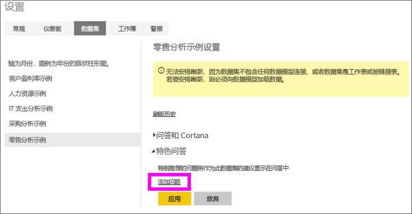
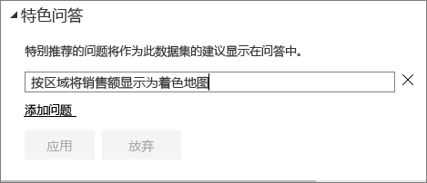
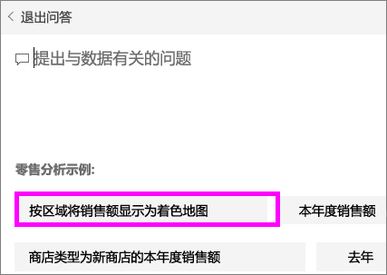
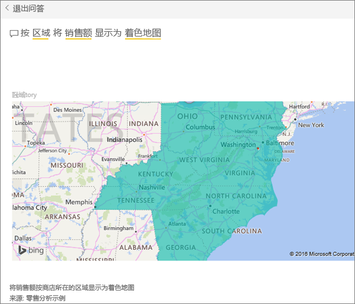

# 创建 Power BI 问答的精选问题
如果你拥有一个数据集，你可以向该数据集添加自己精选的问题。  Power BI 问答会向使用数据集的同事显示这些问题。  精选问题会让你的同事了解他们可以就数据集询问哪些类型的问题。 你添加的精选问题都由你决定 -- 可以添加常见问题、显示有趣结果的问题，或可能会很难组织描述的问题。

请观看 Will 将向 Power BI 问答添加一些精选问题，然后使用这些精选问题来浏览他的数据集。 然后按照视频下面的分步说明来自己尝试一下。

<iframe width="560" height="315" src="https://www.youtube.com/embed/E1mIAyEXuF4" frameborder="0" allowfullscreen></iframe>

> [!NOTE]
> [iPad、iPhone 和 iPod Touch 设备上的 iOS 版 Microsoft Power BI 应用](mobile-apps-ios-qna.md)和 Power BI Desktop 问答预览版中提供了问答精选问题。 但只能在 Power BI 服务 (app.powerbi.com) 中创建问题。
> 

本文使用[“零售分析销售额”示例](sample-datasets.md)。

1. 在仪表板上，选择“问答”问题框。   请注意，通过显示数据集中的术语列表，“问答”已很有帮助。
2. 若要添加到此列表，请选择 Power BI 右上角的齿轮图标。  
   
3. 选择**设置** &gt; **数据集** &gt; **零售分析示例** &gt; **精选问答问题**。  
4. 选择**添加问题**。
   
   
5. 在文本框中键入你的问题，并选择**应用**。   （可选）通过选择**添加问题**添加另一个问题。  
   
6. 向后导航到零售分析示例的 Power BI 仪表板，然后将光标置于问答问题框中。   
   
7. 新的精选问题（**以地图形式显示地区销售额**）显示于列表之首。 请选择它。  
8. 以着色地图可视化效果显示答案。  
   

### 后续步骤
[Power BI 中的“问答”](power-bi-q-and-a.md)  
[教程：Power BI 问答简介](power-bi-visualization-introduction-to-q-and-a.md)  
[Power BI - 基本概念](service-basic-concepts.md)  
更多问题？ [尝试参与 Power BI 社区](http://community.powerbi.com/)

