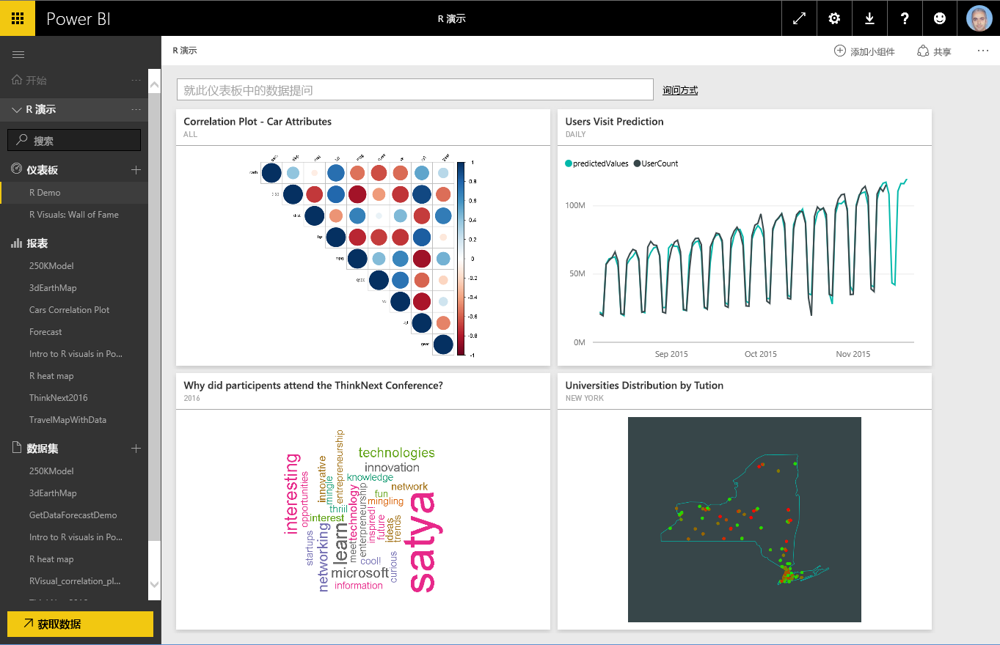
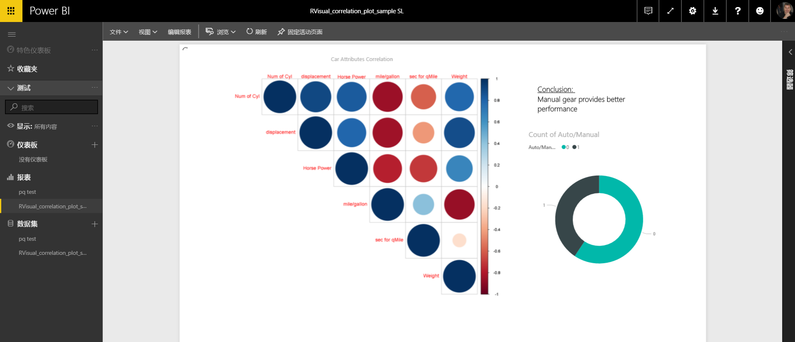
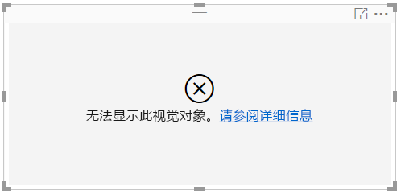
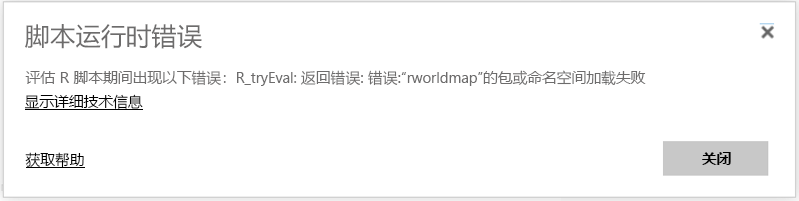
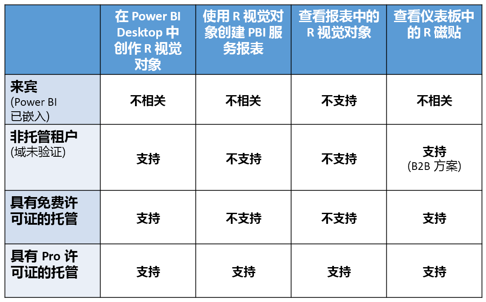

# 在 Power BI 服务中创建 R 视觉对象
Power BI 服务支持查看使用 R 脚本创建的视觉对象并与之交互。 使用 R 脚本创建的视觉对象通常称为  *R 视觉对象* ，它可以借助 R 丰富的分析和可视化功能来显示高级数据成型和分析（如预测）。

> [!NOTE]
> [R 编程语言](https://www.r-project.org/)是统计学家、数据科学家和业务分析师使用最广泛的一种编程语言。 R 语言有一个开放源代码社区，该社区提供超过 7000 个加载项包以及广泛使用的 [R 用户组](http://msdsug.microsoft.com/)。 Power BI 服务中部署的 R 版本为  *Revolution R Open 3.2.2* 。
> 
> 

下图显示了一个 Power BI 仪表板，其中包含一组用于高级分析的 R 视觉对象。

R 视觉对象在 [Power BI Desktop 报表](desktop-get-the-desktop.md)中创建，例如下图所示的报表。

在 **Power BI Desktop** 中生成报表后，便可将包含一个或多个 R 视觉对象的报表发布到 Power BI 服务。 R 视觉对象暂时只能在 **Power BI Desktop** 中创建，然后发布到 Power BI 服务。 有关创建 R 视觉对象的详细信息，请参阅[使用 R (Power BI Desktop) 创建 Power BI 视觉对象](desktop-r-visuals.md)。

请注意，该服务并不支持所有 R 程序包。 有关 Power BI 服务当前支持的程序包的列表，请参阅本文末尾的“支持的程序包”。

你可以下载这个包含数个 R 视觉对象的 [Power BI Desktop 示例文件](http://download.microsoft.com/download/D/9/A/D9A65269-D1FC-49F8-8EC3-1217E3A4390F/RVisual_correlation_plot_sample SL.pbix)（.pbix 文件），以了解其工作原理并进行试验。

对于在 **Power BI Desktop** 中创建，然后发布到 Power BI 服务的 R 视觉对象，其行为很大程度上与 Power BI 服务中的其他任何视觉对象类似；你可以与之进行交互，对其进行筛选和切分，还可以将其固定到仪表板，或与他人共享。 有关共享仪表板和视觉对象的详细信息，请参阅[与同事和其他人共享仪表板](service-share-dashboards.md)。 与其他视觉对象的不同之处在于，R 视觉对象不能显示工具提示，并且不能用于筛选其他视觉对象。

如下图所示，无论是在仪表板还是报表中，Power BI 服务中的 R 视觉对象的外观和行为很大程度上都与任何其他视觉对象类似，用户无需了解创建该视觉对象的基础 R 脚本。

## R 脚本安全性
R 视觉对象是根据 R 脚本创建的，其中可能包含具有安全风险或隐私风险的代码。

当脚本作者在其自己的计算机上运行脚本时，这些风险主要存在于创作阶段。

Power BI 服务应用了 *沙盒* 技术，可使用户和服务远离安全风险。

这种 *沙盒* 方法会对 Power BI 服务中运行的 R 脚本施加一些限制，例如不能访问 Internet，或者不能访问创建 R 视觉对象时无需使用的其他资源。

## R 脚本错误体验
如果 R 脚本发生错误，则不会绘制 R 视觉对象，并且将显示一条错误消息。 若要查看该错误的详细信息，请从画布上的 R 视觉对象错误中选择“查看详细信息”，如下图所示。

再举一个例子，下图显示的是当 R 脚本因为在 Azure 中缺少某个 R 程序包而无法正常运行时出现的错误消息。

## 许可
R 视觉对象需要 [Power BI Pro](service-self-service-signup-for-power-bi.md) 许可证，才能在报表中呈现、刷新、筛选和交叉筛选。 有关 Power BI Pro 许可证及其与免费许可证的区别的详细信息，请参阅 [Power BI Pro 内容 — 它是什么？](service-premium.md)

Power BI 的免费用户只能使用共享给他们的磁贴。 有关详细信息，请参阅[购买 Power BI Pro](service-admin-purchasing-power-bi-pro.md)。

下表介绍了基于授权的 R 视觉对象功能。

## 已知限制
Power BI 服务中的 R 视觉对象有几个限制：

* R 视觉对象支持仅适用于以下页面 <make this a link to the supported packages page per my excel> 上标识的程序包。 目前不提供对自定义程序包的支持。
* 数据大小限制 - R 视觉对象用于绘制的数据仅限 150,000 行。 如果选择了 150,000 行以上，则只会使用前 150,000 行，且在图像上显示一条消息。
* 计算时间限制 — 如果 R 视觉对象计算时间超过 60 秒，则脚本将超时，从而导致错误。
* R 视觉对象在数据更新、筛选和突出显示时进行刷新。 但是，图像本身不可交互，并且不支持工具提示。
* R 视觉对象响应突出显示的其他视觉对象，但你不能单击 R 视觉对象中的元素以进行其他元素的交叉筛选。
* R 视觉对象目前不支持 *时间* 数据类型。 请改为使用日期/时间。
* 使用“发布到 Web”时，不会显示 R 视觉对象。
* R 视觉对象目前不会随仪表板和报表一起打印
* Analysis Services 的 DirectQuery 模式目前不支持 R 视觉对象
* 中文、日语和朝鲜语字体需要执行以下所有附加步骤才能在 Power BI 服务中正常工作：
  
  * 首先，安装 R 程序包 *showtext* 及其所有依赖项。 可以运行以下脚本来执行此操作：
    
        *install.packages("showtext")*
  * 接下来，在 R 脚本的开头添加以下行：
    
        powerbi_rEnableShowTextForCJKLanguages =  1

## R 程序包概述
R 程序包是以定义明确的格式组合的 R 函数、数据和已编译代码的集合。 安装 R 后，会生成标准的程序包集，其他程序包可供下载和安装。 安装后，必须将 R 程序包加载到要使用的会话中。 免费 R 程序包的主要源是 CRAN，即 [Comprehensive R Archive Network](https://cran.r-project.org/web/packages/available_packages_by_name.html)。

**Power BI Desktop** 可以使用任意类型的 R 程序包，且没有任何限制。 可以自行安装 R 程序包用于 **Power BI Desktop**（例如，使用 [RStudio IDE](https://www.rstudio.com/)）。

[本文](service-r-packages-support.md)中介绍的“**支持的程序包**”部分中的程序包支持“**Power BI 服务**”中的 R 视觉对象。 如果在支持的程序包列表中未找到所需的程序包，可以请求获得所需程序包的支持。 请参阅 [Power BI 服务中的 R 程序包](service-r-packages-support.md)，了解有关如何请求支持的信息。

### R 程序包要求和限制
R 程序包存在大量要求和限制：

* Power BI 服务主要支持带有免费和开源软件许可证（例如 GPL-2、GPL-3、MIT+R 等）的 R 程序包.
* Power BI 服务支持已在 CRAN 发布的程序包。 此服务不支持专用或自定义 R 程序包。 我们鼓励用户请求在 Power BI 服务中公开发布其专用程序包前，先将程序包在 CRAN 上公开发布。
* **Power BI Desktop** 具有两种 R 程序包变体：
  
  * 对于 R 视觉对象，可以安装任意程序包，包括自定义 R 程序包
  * 对于自定义 R 视觉对象，仅支持公用 CRAN 程序包进行程序包自动安装
* 出于安全和隐私考虑，服务当前不支持通过万维网提供客户端到服务器查询的 R 程序包（例如 RgoogleMaps）。 系统会阻止联网进行此类尝试。 请参阅 [Power BI 服务中的 R 程序包](service-r-packages-support.md)，了解有关受支持和不受支持的 R 程序包的列表。
* 纳入新的 R 程序包的审核流程具有一系列的依赖项；需要在服务中安装的某些依赖项不受支持。

### 支持的程序包：
对于受支持的 R 程序包的长列表（以及不受支持的程序包的短列表），请参阅以下文章：

* [Power BI 服务中的 R 程序包](service-r-packages-support.md)

