# Power BI 中的实时流式处理
通过 Power BI 实时流式处理，可以流式处理数据并实时更新仪表板。 可以在 Power BI 中创建的任何视觉对象或仪表板也可以创建为显示和更新实时数据和视觉对象。 流式处理数据的设备和源可以是工厂传感器、社交媒体源、服务使用情况指标和其他可从其收集或传输时间敏感数据的任何设备。

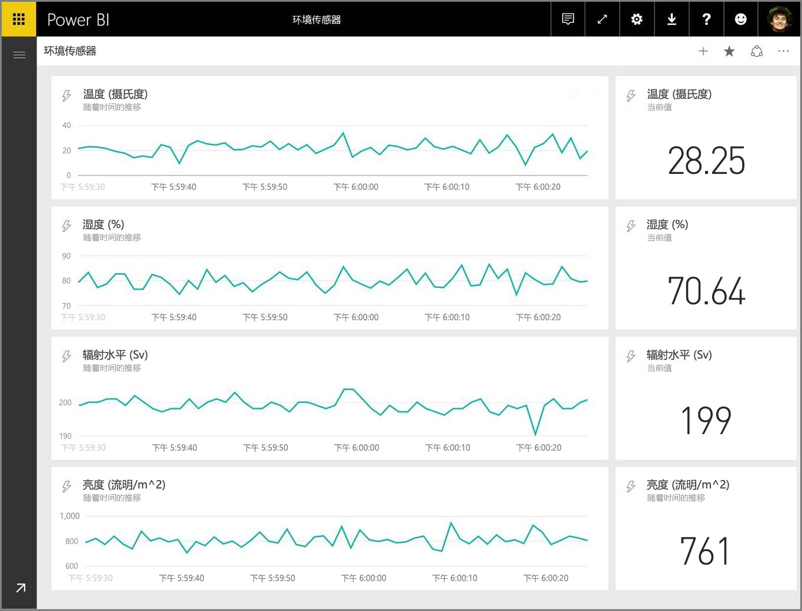

本文介绍如何在 Power BI 中设置实时流式处理数据集。 但在我们开始之前，务必了解设计为在磁贴（和仪表板）中显示的实时数据集的类型以及这些数据集的不同之处。

## 实时数据集的类型
有三种类型的实时数据集设计用于在实时仪表板上显示：

* 推送数据集
* 流式处理数据集
* PubNub 流式处理数据集

首先让我们来了解这些数据集之间的区别（本节），然后讨论如何将数据推送到各个数据集中。

### 推送数据集
使用**推送数据集**，数据将推送到 Power BI 服务中。 创建数据集后，Power BI 服务会在服务中自动创建一个新数据库以存储数据。 由于有一个基础数据库在不断存储传入的数据，因此可以使用数据创建报表。 这些报表及其视觉对象就像任何其他报表视觉对象一样，这意味着你可以使用 Power BI 的所有报表生成功能来创建视觉对象，包括自定义视觉对象、数据警报、固定的仪表板磁贴等。

使用推送数据集创建报表后，其任何视觉对象都可以固定到仪表板。 在该仪表板上，每当数据更新时，视觉对象就会实时更新。 在服务中，仪表板每次接收新数据时都会触发磁贴刷新。

关于推送数据集中的固定磁贴，有以下两点注意事项：

* 使用“固定活动页”选项固定整个报表**不会**导致数据自动更新。
* 将视觉对象固定到仪表板后，你可以使用**问答**以自然语言询问推送数据集的问题。 在进行**问答**查询后，你可以将生成的视觉对象再次固定到仪表板，并且该仪表板还会实时更新。

### 流式处理数据集
使用**流式处理数据集**，数据也会推送到 Power BI 服务中，但有一个重要区别：Power BI 仅将数据存储到临时缓存中，该缓存很快就会过期。 临时缓存仅用于显示具有一些暂时性历史感的视觉对象，例如具有一小时的时间窗口的折线图。

使用**流式处理数据集**时，没有基础数据库，因此不能使用从流中流入的数据生成报表视觉对象。 因此，你不能使用报表功能，例如筛选、自定义视觉对象和其他报表功能。

可视化流式处理数据集的唯一方法是添加磁贴，并将流式处理数据集用作**自定义流式处理数据**的数据源。 基于**流式处理数据集**的自定义流式处理磁贴被优化用于快速显示实时数据。 在将数据推送到 Power BI 服务中时和更新视觉对象时，两者之间存在非常小的延迟，因为不需要将数据输入到数据库中或从数据库中读取数据。

在实践中，流式处理数据集及其伴随的流式处理视觉对象最适用于最小化数据推送和可视化之间的延迟的关键情况。 此外，最佳做法是以可以直观显示的格式推送数据，而无需任何其他聚合。 准备好的数据的示例包括温度和预计算的平均值。

### PubNub 流式处理数据集
使用 **PubNub** 流式处理数据集，Power BI Web 客户端使用 PubNub SDK 读取现有的 PubNub 数据流，Power BI 服务不存储任何数据。

与使用**流式处理数据集**一样，使用 **PubNub 流式处理数据集**时，Power BI 中没有基础数据库，因此你无法针对流入的数据生成报表视觉对象，也无法利用报表功能，如筛选、自定义视觉对象等。 因此，**PubNub 流式处理数据集**也只能通过向仪表板添加磁贴并将 PubNub 数据流配置为源来进行可视化。

对基于 **PubNub 流式处理数据集**的磁贴进行优化，用于快速显示实时数据。 由于 Power BI 直接连接到 PubNub 数据流，因此在将数据推送到 Power BI 服务和更新视觉对象之间只有很少的延迟。

### 流式处理数据集矩阵
下表（或者你喜欢称之为矩阵）描述了用于实时流式处理的三种类型的数据集，并列出了每种数据集的能力和限制。

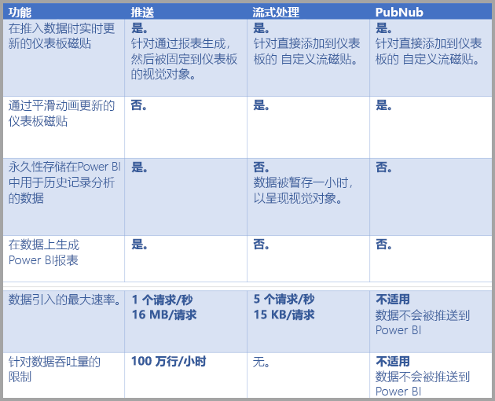

> [!NOTE]
> 有关推送限制可推入数据量的信息，请参阅[此 MSDN 文章](https://msdn.microsoft.com/library/dn950053.aspx)。
> 
> 

## 将数据推送到数据集
上一节描述了可以在实时流式处理中使用的三种主要类型的实时数据集，以及它们之间的区别。 本节介绍如何创建数据并将数据推送到这些数据集。

将数据推送到数据集主要有三种方法：

* 使用 Power BI REST API
* 使用流式处理数据集 UI
* 使用 Azure 流分析

让我们依次来看看这些方法。

### 使用 Power BI REST API 推送数据
**Power BI REST API** 可用于创建数据并将数据发送到**推送**数据集和**流式处理**数据集。 使用 Power BI REST API 创建数据集时，*defaultMode* 标志指定是推送还是流式处理数据集。 如果未设置 *defaultMode* 标志，则数据集默认为**推送**数据集。

如果 *defaultMode* 值设置为 pushStreaming，则数据集为**推送**和**流式处理**数据集，从而提供这两种数据集类型的优势。 用于[**创建数据集**的 REST API文章](https://msdn.microsoft.com/library/mt203562.aspx)演示了如何创建流式处理数据集，并在操作中显示 defaultMode 标志。

> [!NOTE]
> 使用 defaultMode 标志设置为 pushStreaming 的数据集时，如果请求超过流式处理数据集的 15Kb 大小限制，但是小于推送数据集的 16MB 大小限制，则该请求将成功，并且数据将在推送数据集中更新。 但是，任何流式处理磁贴都会暂时失败。
> 
> 

创建数据集后，使用 REST API 通过[**添加行** API](https://msdn.microsoft.com/library/mt203561.aspx)推送数据（如[本文中所示](https://msdn.microsoft.com/library/mt203561.aspx)）。

所有 REST API 请求都使用 **Azure AD OAuth** 加以保护。

### 使用流式处理数据集 UI 推送数据
在 Power BI 服务中，你可以通过选择 **API** 方法创建数据集，如下图所示。

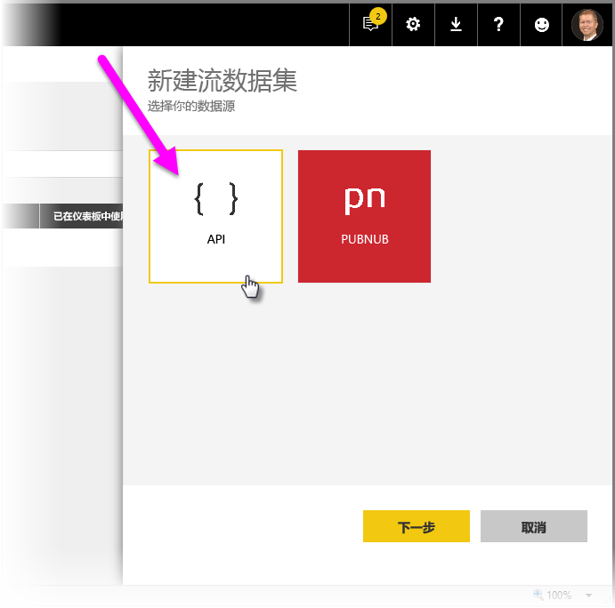

在创建新的流式处理数据集时，你可以选择启用**历史数据分析**（如下所示），这将产生重大影响。

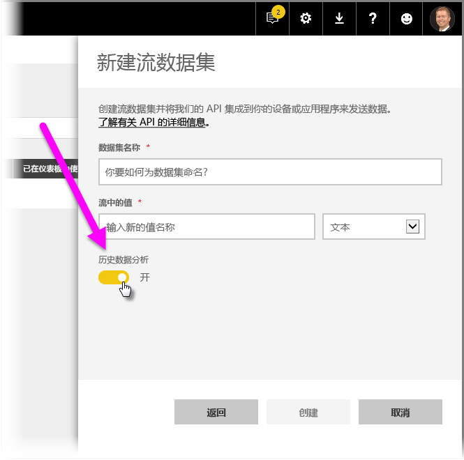

禁用**历史数据分析**时（默认情况下禁用），你将创建一个**流式处理数据集**，如本文前面所述。 启用**历史数据分析**时，创建的数据集将成为**流式处理数据集**和**推送数据集**。 这相当于使用 Power BI REST API 创建其 *defaultMode* 设置为 *pushStreaming* 的数据集，如本文前面所述。

> [!NOTE]
> 对于使用 Power BI 服务 UI 创建的流式处理数据集（如上一段所述），不需要 Azure AD 身份验证。 在此类数据集中，数据集所有者接收具有 rowkey 的 URL，该 rowkey 授权请求者无需使用 Azure AD OAuth 持有者令牌即可将数据推送到数据集中。 不过，现在采用 Azure AD (AAD) 方法仍可将数据推送到数据集中。
> 
> 

### 使用 Azure 流分析推送数据
你可以在 **Azure 流分析** (ASA) 中将 Power BI 添加为输出，然后实时可视化 Power BI 服务中的这些数据流。 本节介绍有关此过程发生的技术详细信息。

Azure 流分析使用 Power BI REST API 创建其到 Power BI 的输出数据流，且 defaultMode 设置为 pushStreaming （有关 defaultMode 的信息，请参阅本文前面的部分），这会导致产生可以利用**推送**和**流式处理**的数据集。 在数据集创建期间，Azure 流分析还会将“retentionPolicy”*标志设为“basicFIFO”；这样设置后，支持其推送数据集的数据库可存储 200,000 行，并且在达到上限后，按照先进先出 (FIFO) 的方式删除行。

> [!CAUTION]
> 如果 Azure 流分析查询对 Power BI 产生非常快速的输出（例如，每秒一次或两次），则 Azure 流分析会开始将这些输出批处理到单个请求中。 这可能会导致请求大小超过流式处理磁贴限制。 在这种情况下，如前面各部分所述，流式处理磁贴将无法呈现。 在此类情况下，最佳做法是减慢数据输出到 Power BI 的速率；例如将其设置为超过 10 秒的最大值，而不是每秒的最大值。
> 
> 

## 在Power BI 中设置实时流式处理数据集
现在我们已经介绍了用于实时流式处理的三种主要类型的数据集，以及可以将数据推送到数据集的三种主要方式，使你的实时流式处理数据集在 Power BI 中正常工作。

若要开始使用实时流式处理，需要选择可以在 Power BI 中使用流式处理数据的两种方法中的一种：

* 附带流式处理数据中的视觉对象的**磁贴**
* 从 Power BI 中持续存在的流式处理数据中创建的**数据集**

无论采用哪个选项，都需要在 Power BI 中设置**流式处理数据**。 若要执行此操作，请在仪表板（现有仪表板或新仪表板）中选择“添加磁贴”，然后选择“自定义流式处理数据”。

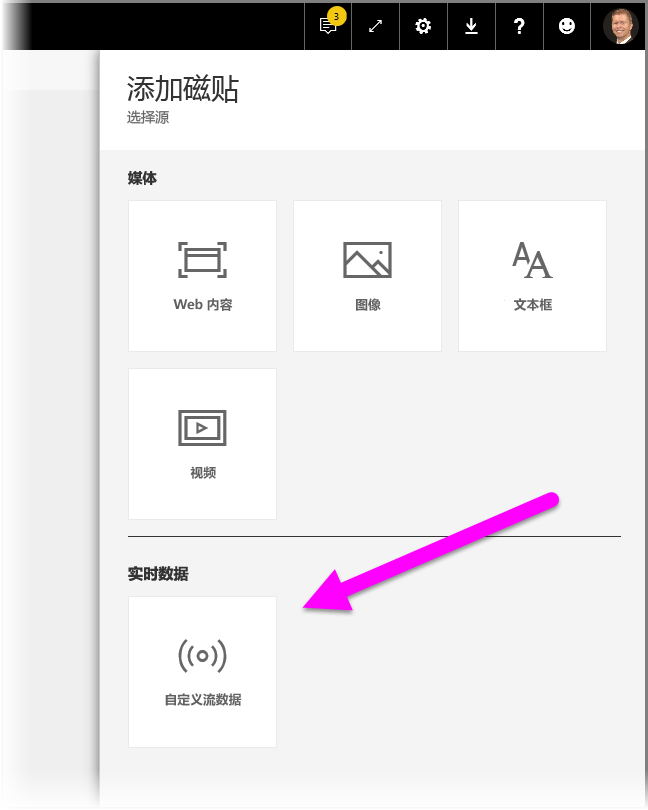

如果尚未设置流式处理数据，别担心 - 可以从选择“管理数据”开始使用。

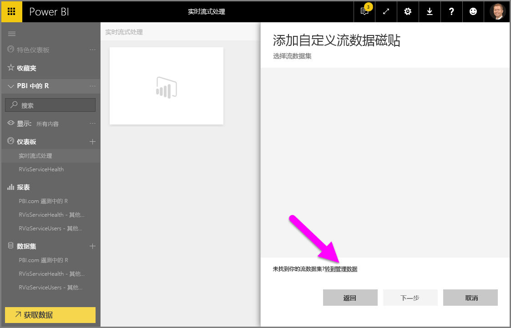

如果已经创建了流式处理数据集，可以在此页（文本框中）输入流式处理数据集的终结点。 如果还没有流式处理数据集，请选择右上角的加号图标 (**+**) 查看创建流式处理数据集的可用选项。

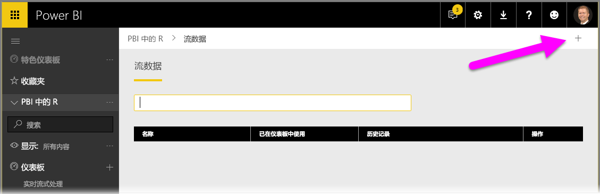

单击 **+** 图标时，将看到两个选项：

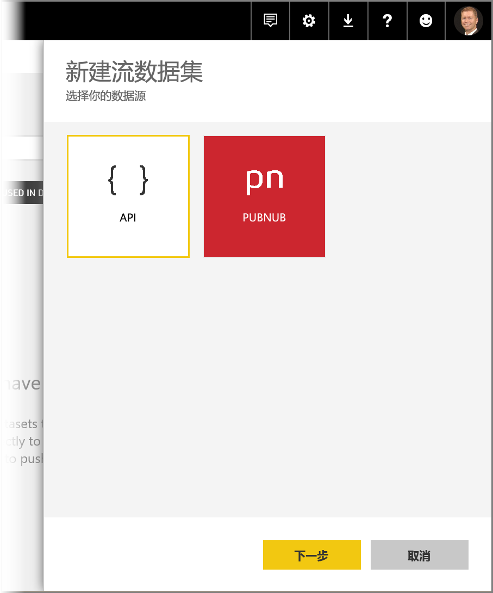

下一节介绍了这些选项，并更为详细地介绍了如何创建流式处理**磁贴**或如何从流式处理数据源创建**数据集**，以便用于以后生成报表。

## 用最喜欢的选项创建流式处理数据集
有两种方法可以创建 Power BI 可使用和可视化的实时流式处理数据馈送：

* 使用实时流式处理终结点的 **Power BI REST API**
* **PubNub**

以下各节依次说明各选项。

### 使用 POWER BI REST API
**Power BI REST API** - Power BI REST API 的最新改进旨在使开发人员更容易使用实时流式处理。 当你从“新建流式处理数据集”窗口选择“API”时，将看到 Power BI 要连接到和使用终结点的项：

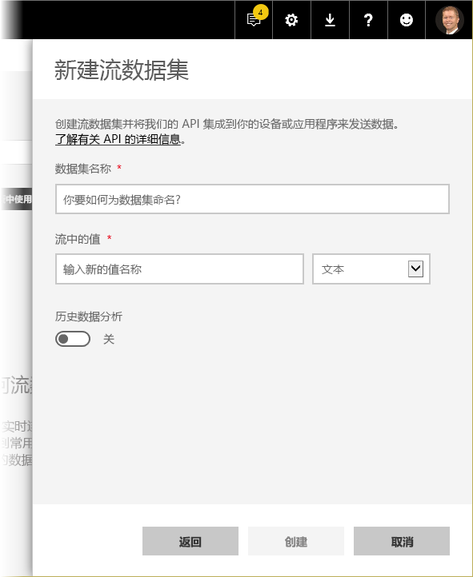

如果希望 Power BI 存储通过此数据流发送的数据，请启用“历史数据分析”，然后你可以对收集的数据流进行报告和分析。 也可以[了解有关 API 的详细信息](https://msdn.microsoft.com/library/dn877544.aspx)。

成功创建数据流后，将为你提供 REST API URL 终结点，应用程序可以通过使用 *POST* 请求调用该终结点，将数据推送到你创建的 Power BI **流式处理数据**数据集中。

发出 *POST* 请求时，应确保请求正文与 Power BI 用户界面提供的示例 JSON 相匹配。 例如，将 JSON 对象包装在一个数组中。

### 使用 PubNub
通过 Power BI 进行 **PubNub** 流式处理集成，可以使用低延迟 **PubNub** 数据流（或创建新的数据流）并在 Power BI 中使用它们。 选择“PubNub”后，选择“下一步”，你将看到以下窗口：

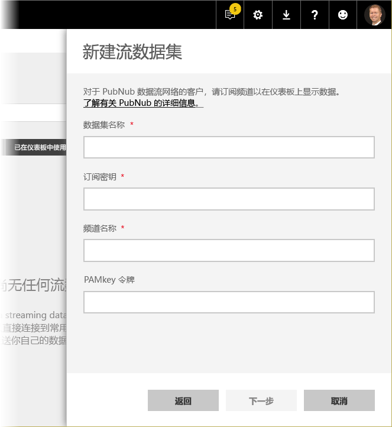

> [!WARNING]
> 可以使用 PubNub Access Manager (PAM) 身份验证密钥保护 PubNub 通道。 将与有权访问仪表板的所有用户共享此密钥。 可以[详细了解 PubNub 访问控制](https://www.pubnub.com/docs/web-javascript/pam-security)。
> 
> 

**PubNub** 数据流通常数量很大，而且并不总是适合以其原始形式进行存储和历史分析。 若要使用 Power BI 对 PubNub 数据进行历史分析，必须聚合原始 PubNub 流，并将其发送到 Power BI。 实现此操作的方法之一是使用 [Azure 流分析](https://azure.microsoft.com/services/stream-analytics/)。

## 在 Power BI 中使用实时流式处理的示例
以下是实时流式处理在 Power BI 中的工作原理的简单示例。 你可以遵循此示例查看自己的实时流式处理的值。

在此示例中，我们使用 **PubNub** 中公开提供的流。 步骤如下：

1. 在“Power BI 服务”中选择仪表板（或创建新仪表板），然后选择“添加磁贴” > “自定义流式处理数据”，然后选择“下一步”按钮。
   
   
2. 如果没有流式处理数据源，请选择“管理数据”链接（位于“下一步”按钮上方），然后从窗口右上角中的链接中选择“+ 添加流式处理数据”。 选择“PubNub”，然后选择“下一步”。
3. 为数据集创建名称，然后将以下值粘贴到出现的窗口中，然后选择“下一步”：
   
   订阅密钥：
   
       sub-c-5f1b7c8e-fbee-11e3-aa40-02ee2ddab7fe
   通道：
   
       pubnub-sensor-network
   
   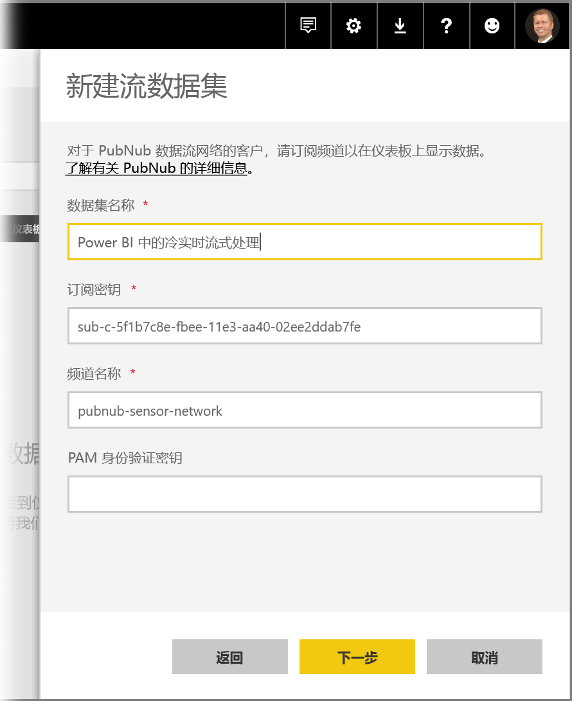
4. 在下面的窗口中，选择默认值（会自动填充），然后选择“创建”。
   
   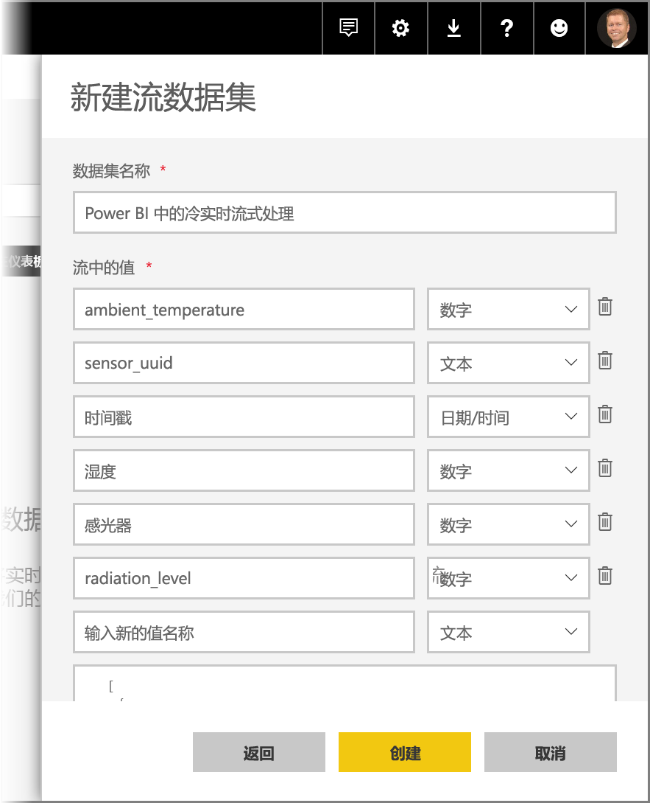
5. 返回 Power BI 工作区，新建仪表板，然后添加磁贴（如有需要，请参阅上述步骤）。 这次在创建磁贴并选择“自定义流式处理数据”时，你将拥有可使用的流式处理数据集。 继续使用它。 将“数字”字段添加到折线图中，然后添加其他磁贴，可以获得如下所示的实时仪表板：
   
   

请试尝试并使用示例数据集。 然后创建你自己的数据集，并向 Power BI 流式传输活动数据。

## 问题与解答
以下是关于 Power BI 中的实时流式处理的一些常见问题与解答。

#### 我可以对推送数据集使用筛选器吗？ 流式处理数据集呢？
很遗憾，流式处理数据集不支持筛选。 对于推送数据集，你可以创建报表、筛选报表，然后将筛选的视觉对象固定到仪表板。 然而，没有办法更改仪表板上视觉对象的筛选器。

另外，你可以将活动报表磁贴固定到仪表板，在这种情况下，你可以更改筛选器。 但是，活动报表磁贴不会在数据推入时实时更新；你将需要使用“**更多**”菜单中的“刷新仪表板磁贴”选项手动更新视觉对象。

当使用“日期/时间”字段以毫秒精度将筛选器应用到推送数据集时，不支持“等于”运算符。 但是，大于 (>) 或小于 (<) 等运算符可以正常运行。

#### 如何查看推送数据集的最新值？ 流式处理数据集呢？
流式处理数据集设计用于显示最新数据。 你可以使用**卡片图**流式处理视觉对象，轻松查看最新的数值。 遗憾的是，该卡片图不支持日期时间或文本类型的数据。
对于推送数据集，假设你在架构中有一个时间戳，则可以尝试使用最后一个 N 筛选器创建报表视觉对象。

#### 我可以连接到 Power BI Desktop 中的推送或流式处理数据集吗？
暂不提供此功能。

#### 鉴于上述问题，如何对实时数据集进行任何建模？
由于数据不会永久存储，因此不能对流式处理数据集进行建模。 对于推送数据集，你可以使用更新数据集/表 REST API 添加度量值和关系。 你可以从[更新表架构文章](https://msdn.microsoft.com/library/mt203560.aspx)和[数据集属性文章](https://msdn.microsoft.com/library/mt742155.aspx)中获取更多信息。

#### 如何清除推送数据集上的所有值？ 流式处理数据集呢？
在推送数据集上，你可以使用删除行 REST API 调用。 另外，你还可以使用一个方便的工具，它是围绕 REST API 的包装器。 目前没有办法从流式处理数据集中清除数据，但数据将在一个小时后自行清除。

#### 我设置了到 Power BI 的 Azure 流分析输出，但没有看到它出现在 Power BI 中，这是怎么回事？
以下是你可以用于解决问题的清单：

1. 重启 Azure 流分析作业（在流式处理 GA 版本之前创建的作业将需要重启）
2. 尝试在 Azure 流分析中重新授权 Power BI 连接
3. 你在 Azure 流分析输出中指定了哪个工作区？ 在 Power BI 服务中，你是否正在签入该（同一）工作区？
4. Azure 流分析查询是否显式输出到 Power BI 输出？ （使用 INTO 关键字）
5. 是否有数据流流经 Azure 流分析作业？ 只有在有数据传输时，才会创建数据集。
6. 是否可以查看 Azure 流分析日志，以了解是否存在任何警告或错误？

## 后续步骤
以下是在 Power BI 中使用实时流式处理时可能有用的几个链接：

* [具有实时数据的 Power BI REST API 概述](https://msdn.microsoft.com/library/dn877544.aspx)
* [Power BI REST API 限制](https://msdn.microsoft.com/library/dn950053.aspx)
* [**创建数据集**的 REST API 文章](https://msdn.microsoft.com/library/mt203562.aspx)
* [**添加行** Power BI REST API](https://msdn.microsoft.com/library/mt203561.aspx)
* [Azure 流分析](https://azure.microsoft.com/services/stream-analytics/)

