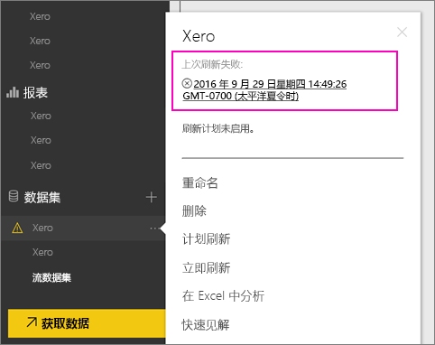
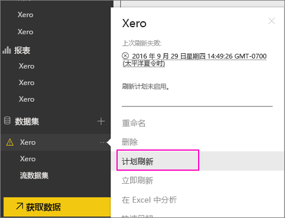
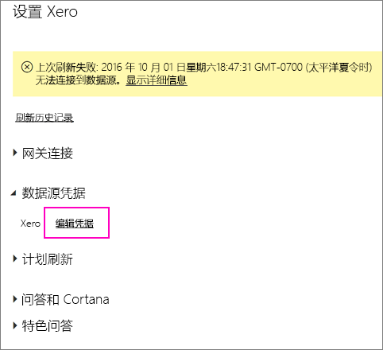
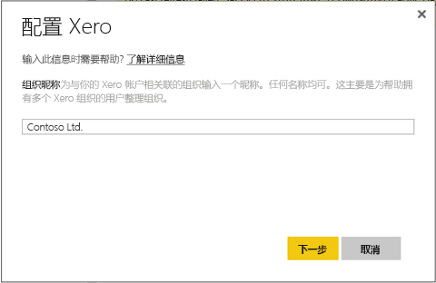
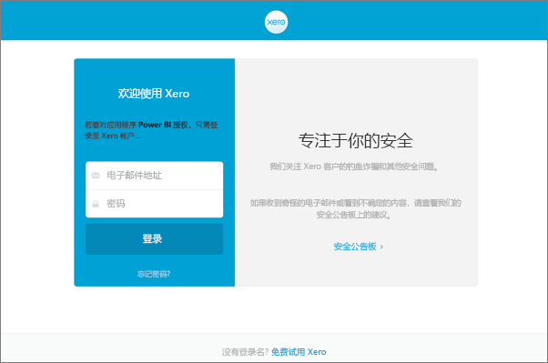
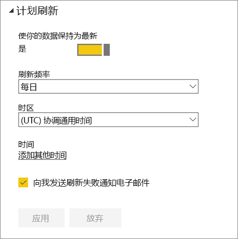
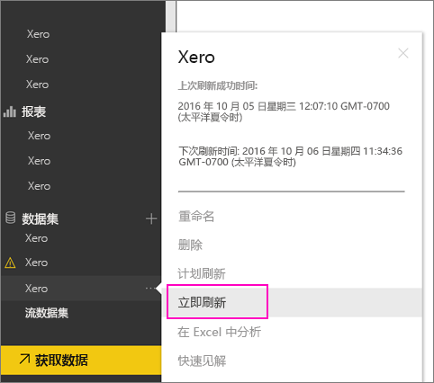

# 刷新失败时，如何刷新 Xero 内容包证书
如果使用 Xero Power BI 内容包，由于最近的 Power BI 服务事件，你可能遇到了一些内容包的每日刷新问题。

可以通过检查 Xero 数据集的最后刷新状态看到内容包是否已成功刷新，如下面的屏幕截图中所示。

如果看到如上所示的刷新失败，请按照以下步骤续订内容包凭据。

1. 单击 Xero 数据集旁边的省略号 (...)，然后单击“**计划刷新**”。 这将打开 Xero 内容包的设置页。
   
    
2. 在“**Xero 设置**”页，选择“**数据源凭据**” > “**编辑凭据**”。
   
    
3. 输入你的组织名称 > **下一步**。
   
    
4. 使用 Xero 帐户登录。
   
    
5. 现在凭据已更新，我们必须确保刷新计划设置为每天运行一次。 单击 Xero 数据集旁边的省略号 (...)，然后再次单击“**计划刷新**”以进行检查。
   
    
6. 还可以选择立即刷新数据集。 单击 Xero 数据集旁边的省略号 (...)，然后单击“**现在刷新**”。
   
    

如果仍然有刷新问题，请随时与我们联系 [http://support.powerbi.com](http://support.powerbi.com) 

若要了解更多有关 Power BI Xero 内容包的详细信息，请访问 [Xero 内容包帮助页](service-connect-to-xero.md)。

### 后续步骤
* 更多问题？ [尝试参与 Power BI 社区](http://community.powerbi.com/)

