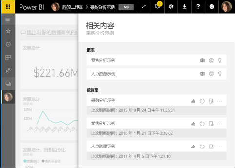
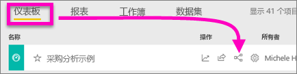
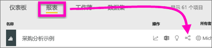
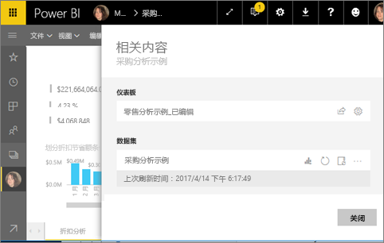
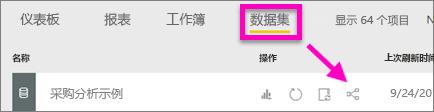
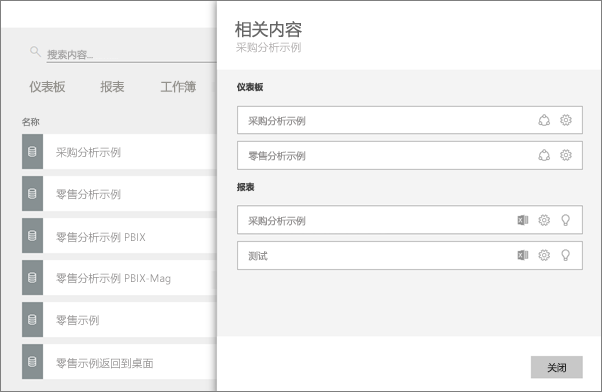

# 查看 Power BI 服务中的相关内容
“相关内容”窗格显示了 Power BI 服务内容（仪表板、报表和数据集）的互连方式。  此窗格经过优化，可以在其中执行刷新、重命名、生成见解等常见任务。 选择相关的报表或仪表板即可在 Power BI 工作区中打开。   

你可能已经注意到，报表是在数据集的基础之上生成，报表可视化效果固定到仪表板中，仪表板视觉对象可以链接回报表。 不过，如何知道哪些仪表板在托管“市场营销”报表中的可视化效果？ 如何查找这些仪表板？ “采购”仪表板是否在使用多个数据集中的可视化效果？ 如果是，这些数据集的名称是什么？该如何打开并编辑这些数据集？ “人力资源”数据集是否用于任何报表或仪表板？能否移动此数据集，而又不断开任何链接？ 所有这些问题全都可以在“相关内容”窗格中找到答案。  在此窗格中，不仅可以查看相关内容，还可以对内容执行操作，并轻松地在相关内容之间进行导航。

> [!NOTE]
> “相关内容”功能不适用于流数据集。
> 
> 

## 查看仪表板的相关内容
观看 Will 查看仪表板的相关内容。 然后，按照视频下方的分步说明操作，用“采购分析”示例数据集自己尝试。

<iframe width="560" height="315" src="https://www.youtube.com/embed/B2vd4MQrz4M#t=3m05s" frameborder="0" allowfullscreen></iframe>

至少要拥有对仪表板的查看权限，才能打开“相关内容”窗格。 在此示例中，我们使用的是[“采购分析”示例](sample-procurement.md)。

方法 1

在工作区中，依次选择“仪表板”选项卡和“相关视图”图标。

 

方法 2

打开仪表板，从顶部菜单栏中选择    。

此时，“相关内容”窗格会打开。 其中显示了可视化效果固定到此仪表板的所有报表及其关联的数据集。 此仪表板固定了 3 个不同报表中的可视化效果，这些报表又以 3 个不同的数据集为依据。

在此窗格中，可以直接对相关内容执行操作。  例如，选择报表名称即可打开报表。  对于列出的报表，可以选择用于[在 Excel 中分析](service-analyze-in-excel.md)、[重命名](service-rename.md)或[获取见解](service-insights.md)的图标。 对于数据集，可以选择用于[新建报表](service-report-create-new.md)、[刷新](refresh-data.md)、重命名、[在 Excel 中分析](service-analyze-in-excel.md)、[获取见解](service-insights.md)的图标，也可以打开数据集的“设置”窗口。  

## 查看报表的相关内容
至少要拥有对报表的查看权限，才能打开“相关内容”窗格。 在此示例中，我们使用的是[“采购分析”示例](sample-procurement.md)。

方法 1

在工作区中，依次选择“报表”选项卡和“相关视图”图标。

 

方法 2

在[阅读视图](service-reading-view-and-editing-view.md)中打开报表，然后从顶部菜单栏选择 。

此时，“相关内容”窗格会打开。 其中显示了关联的数据集，以及至少有一个磁贴固定了此报表的可视化效果的所有仪表板。 此报表的可视化效果固定到 2 个不同的仪表板。

在此窗格中，可以直接对相关内容执行操作。  例如，选择仪表板名称即可打开仪表板。  对于列出的任何仪表板，可以选择用于[与其他用户共享仪表板](service-share-dashboards.md)的图标，也可以打开仪表板的“设置”窗口。 对于数据集，可以选择用于[新建报表](service-report-create-new.md)、[刷新](refresh-data.md)、重命名、[在 Excel 中分析](service-analyze-in-excel.md)、[获取见解](service-insights.md)的图标，也可以打开数据集的“设置”窗口。  

## 查看数据集的相关内容
至少要拥有对数据集的查看权限，才能打开“相关内容”窗格。 在此示例中，我们使用的是[“采购分析”示例](sample-procurement.md)。

在工作区中，选择“数据集”选项卡，然后找到“相关视图”图标 。

选择此图标，可以打开“相关内容”窗格。

在此窗格中，可以直接对相关内容执行操作。  例如，选择仪表板或报表名称即可打开仪表板或报表。  对于列出的任何仪表板，可以选择用于[与其他用户共享仪表板](service-share-dashboards.md)的图标，也可以打开仪表板的“设置”窗口。 对于报表，可以选择用于[在 Excel 中分析](service-analyze-in-excel.md)、[重命名](service-rename.md)或[获取见解](service-insights.md)的图标。  

## 限制和疑难解答
* 如果浏览器的空间不够，将看不到“相关视图”选项，但仍可以看到“相关视图”图标。 选择此图标，可以打开“相关内容”窗格。
* 必须在[阅读视图](service-reading-view-and-editing-view.md)中打开报表，才能打开“相关内容”窗格。
* Power BI Desktop 不支持“相关内容”功能。
* “相关内容”功能不适用于流数据集。

## 后续步骤
* [Power BI 服务入门](service-get-started.md)
* 更多问题？ [尝试参与 Power BI 社区](http://community.powerbi.com/)

