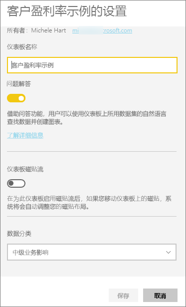
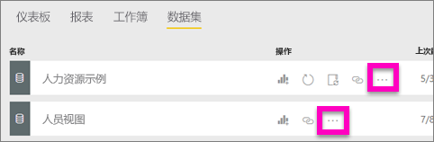
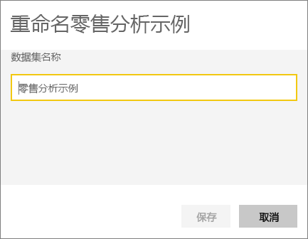
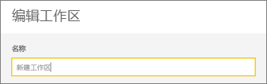

# 在 Power BI 服务中重命名几乎所有内容
本文介绍如何在 Power BI 服务中重命名仪表板、报表、报表页、工作簿、数据集、应用和工作区。

**可以更改名称吗？**

| 内容类型 | 我是作者或创建者 | 与我共享 |
| --- | --- | --- |
| 工作区中的仪表板 |是 |否 |
| 工作区中的报表 |是 |否 |
| 工作区中的工作簿 |是 |否 |
| 工作区中的数据集 |是 |否 |
| 应用工作区 |是的，如果你是所有者或具有管理员权限 |否 |
| 已发布的应用 |如果你具有管理员权限，可以不从应用屏幕而从应用工作区更改应用名称，并使用新名称重新发布 |否 |
| 应用内容（仪表板、报表、工作簿、数据集） |如果你具有管理员权限，可以不从应用屏幕而从应用工作区重命名应用内容，并使用新名称重新发布 |否 |
| **与我共享的内容**中的内容 |否 |否 |

## 重命名仪表板、报表或工作簿
1. 在工作区中，依次选择“仪表板”、“报表”或“工作簿”选项卡。将鼠标悬停在要重命名的项上，并选择齿轮图标 。 如果未显示齿轮图标，则表示你无权重命名。
   
   
2. 在“设置”页上，键入新名称，然后选择“保存”。
   
   

## 重命名数据集
1. 在工作区中，选择“数据集”选项卡。
   
   
2. 将鼠标悬停在要重命名的项上，选择省略号 (...)，并选择“重命名”。  
   
      
   
   > [!NOTE]
   > 下拉列表中的选项各不相同。
   > 
   > 
3. 在“设置”页上，键入一个新名称，然后选择“保存”。
   
     

## 重命名应用工作区
具有管理员权限的任何人都可以重命名应用工作区。

1. 在想要重命名的工作区中开始操作。
2. 在右上角，选择省略号 (...) 并选择“编辑工作区”。 如果未显示此选项，则表示你无权重命名此工作区。 
   
    
3. 键入一个新的工作区名称，然后选择“保存”。
   
   

## 重命名报表中的页
不喜欢 Power BI 报表中页面的名称？  只需单击鼠标就可重新命名。 可以在[报表编辑视图](service-interact-with-a-report-in-editing-view.md)中重命名页。

1. 在[编辑视图](service-reading-view-and-editing-view.md)中打开报表。
2. 找到位于 Power BI 窗口底部的报表页选项卡。
   
    
3. 通过选择选项卡打开你想要重命名的报表页。
4. 双击选项卡上的名称以突出显示它。  
   
    
5. 键入一个新的报表页名称，然后选择 ENTER。
   
    

## 注意事项和疑难解答
* 如果要重命名的项已与你共享，或属于内容包的一部分，那么你不会看到齿轮图标并且将无权访问“设置”。
* 如果在“数据集”选项卡上看不到省略号 (...)，请展开浏览器窗口。

更多问题？ [尝试参与 Power BI 社区](http://community.powerbi.com/)

