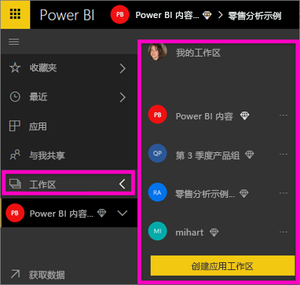
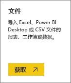
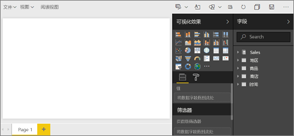
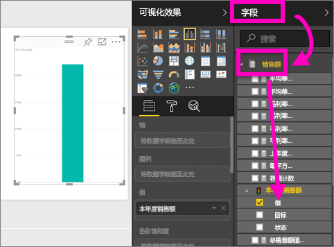
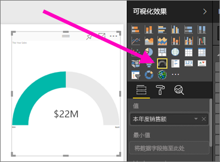
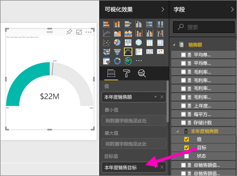
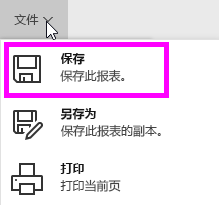
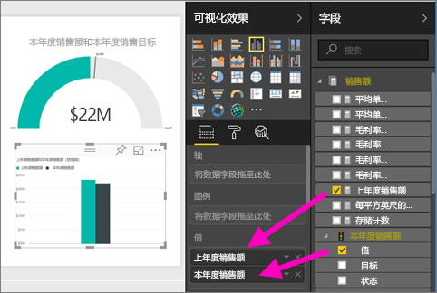
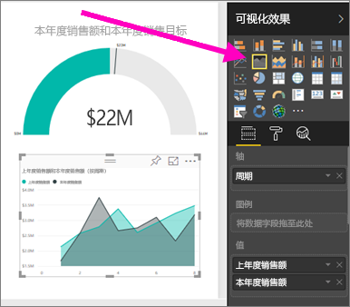
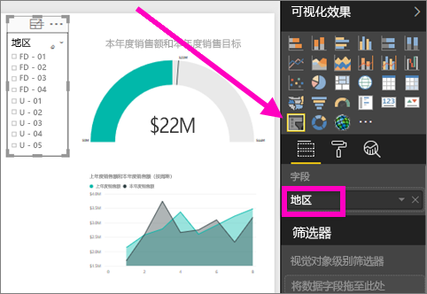

# 通过导入数据集在 Power BI 服务中创建新报表
你已经阅读了 [Power BI 中的报表](service-reports.md)，并且现在想要创建你自己的仪表板。 创建报表有许多不同的方式，在本文中，我们将通过使用 Power BI 服务从 Excel 数据集创建一个非常基本的报表开始。 了解创建报表的基础知识后，单击底部的**下一步**可转到更高级的报表主题。  

> **提示**：若要通过复制现有报表创建报表，请参阅[复制报表](power-bi-report-copy.md)
> 
> ### 先决条件
> - Power BI 服务（有关使用 Power BI Desktop 创建报表的信息，请参阅 [Desktop 报表视图](desktop-report-view.md)）  
> - 零售分析示例数据集

## 导入数据集
此创建报表方法从数据集和空白报表画布开始。 若要遵循此方法，请[下载零售分析示例 Excel 数据集](http://go.microsoft.com/fwlink/?LinkId=529778)并将其保存到 OneDrive for Business（首选）或进行本地保存。

1. 我们将在 Power BI 服务的工作区中创建报表，因此，请选择现有工作区或新建一个工作区。
   
   
2. 在左侧导航窗格底部选择“获取数据”。
   
   
3. 选择“文件”并导航到你保存零售分析示例的位置。
   
    
4. 对于此练习，请选择“导入”。
   
   
5. 在导入数据集后，选择“查看数据集”。
   
   
6. 查看数据集实际上将打开报表编辑器。  你将看到一个空白画布和报表编辑工具。
   
   

> **提示**：如果你不熟悉报表编辑画布，或需要刷新程序，则需要[了解报表编辑器](service-the-report-editor-take-a-tour.md)后才能继续。
> 
> 

## 向报表添加径向仪表
在导入数据集后，我们来回答一些问题。  我们的首席营销官 (CMO) 想要知道我们距离本年度的销售目标还有多远。 仪表是用于显示此类信息的一个[不错的可视化效果选择](visuals/power-bi-report-visualizations.md)。

1. 在“字段”窗格中，选择“销售额” > “本年度销售额” > “值”。
   
    
2. 从“可视化效果”窗格中，选择仪表模板 ，将视觉对象转换为仪表。
   
    
3. 将“销售额” > “本年度销售额” > “目标”拖动到“目标值”框。 似乎已经非常接近我们的目标。
   
    
4. 现在就可以[保存报表](service-report-save.md)了。
   
   

## 向报表添加区域图表和切片器
CMO 还需要我们回答一些其他问题。 她还希望了解本年度销售额与去年销售额的对比情况。 而且她希望按地区查看结果。

1. 首先，我们在画布上腾出一些空间。 选择仪表，并将它移动到右上角。 然后拖拽任一角并使其变小。
2. 取消选中仪表。 在“字段”窗格中，选择“销售额” > “本年度销售额” > “值”，然后选择“销售额” > “去年销售额”。
   
    
3. 从“可视化效果”窗格中，选择区域图表模板 ，将视觉对象转换为区域图表。
4. 选择“时间” > “时间段”以将其添加到“轴”框。
   
    
5. 若要对可视化效果按时间段排序，请选择省略号，然后选择“按时间段排序”。
6. 现在添加切片器。 选择画布上的空白区域，然后选择“切片器”。     模板。 将在画布上添加空的切片器。
   
        
7. 从“字段”窗格中，选择“地区” > 地区”。 移动切片器并重设切片器大小。
   
      
8. 使用切片器按地区查找模式和见解。
   
     

继续浏览数据并添加可视化效果。 当你发现尤为值得关注的见解时，[将它们固定到仪表板](service-dashboard-pin-tile-from-report.md)。

## 后续步骤
* [向报表添加新页面](power-bi-report-add-page.md)  
* 了解如何[将可视化效果固定到仪表板](service-dashboard-pin-tile-from-report.md)   
* 更多问题？ [尝试参与 Power BI 社区](http://community.powerbi.com/)

