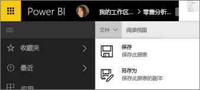
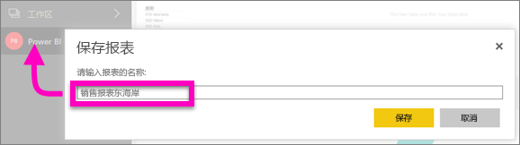

# 在 Power BI 服务和 Power BI Desktop 中保存报表
在 Power BI 中更改报表后，可以将其保存、保存为新名称，或将其关闭而不保存更改。 假设你打开报表、创建可视化效果，并将其固定到仪表板。 如果不保存更改而关闭，则将在仪表板上保留磁贴，但不会在报表中保存可视化效果。 在仪表板上单击该磁贴时，报表将打开，但可视化对象不存在于报表中。

> [!TIP]
> 请注意哪些工作区处于活动状态，以便可以找到保存的报表。 将报表保存到活动工作区。
> 
> 

### 保存报表：
1. 如果你尝试通过导航离开报表，并且报表有更改，则 Power BI 将显示一个提示。
   
   
2. 保存报表的另一种方法是选择“**文件**”\>“**保存**”或“**另存为**”。 如果你处于[阅读视图](service-reading-view-and-editing-view.md)中，则只能看到“另存为”选项。 
   
   
3. 如果这是一个新报表（保存）或现有报表的新版本（另存为），请为其提供一个描述性名称。  **报表将添加到活动工作区**。
   
    

### 后续步骤
了解有关 [Power BI 中的报表](service-reports.md)的详细信息

[Power BI - 基本概念](service-basic-concepts.md)

更多问题？ [尝试参与 Power BI 社区](http://community.powerbi.com/)

