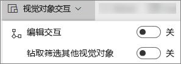
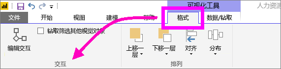
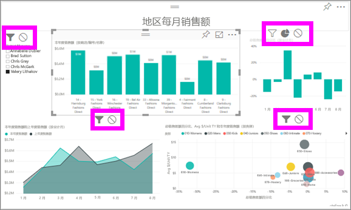

# Power BI 报表中的可视化交互
如果具有编辑报表的权限，则可以使用“视觉对象交互”，更改报表页上的可视化效果相互影响的方式。 

默认情况下，报表页上的可视化组件可用于交叉筛选和交叉突出显示页面上的其他可视化组件。
例如，在地图可视化组件上选择一个州会突出显示柱形图并筛选折线图以便仅显示适用于该州的数据。
请参阅[关于筛选和突出显示](power-bi-reports-filters-and-highlighting.md)。 如果具有支持[钻取](consumer/end-user-drill.md)的可视化效果，在默认情况下，钻取某个可视化效果不会对报表页上的其他可视化效果造成影响。 但可以同时覆盖这两种默认行为，并且可以对每个可视化效果设置交互。

本文演示如何在 Power BI 服务[编辑视图](service-interact-with-a-report-in-editing-view.md)和 Power BI Desktop 中使用“视觉对象交互”。 如果已与你共享了报表，你将无法更改视觉对象交互设置。

> [!NOTE]
> 词语“ *交叉筛选* ”和“ *交叉突出显示* ”用于区分本文描述的行为与使用“**筛选器**”窗格来筛选和突出显示可视化组件的效果。  
> 
> 

<iframe width="560" height="315" src="https://www.youtube.com/embed/N_xYsCbyHPw?list=PL1N57mwBHtN0JFoKSR0n-tBkUJHeMP2cP" frameborder="0" allowfullscreen></iframe>

1. 选择可视化组件并将其激活。  
2. 显示“视觉对象交互”选项。
    - 在 Power BI 服务中，从报表菜单栏中选择下拉列表。

       

    - 在 Desktop 中，选择“格式”>“交互”。

        

3. 要打开可视化效果交互控件，请选择“编辑交互”。 Power BI 将交叉筛选和交叉突出显示图标添加到报表页上的所有其他可视化效果中。
   
    
3. 确定所选的可视化组件需要对其他组件产生的作用。  然后，对报表页上的其他所有可视化效果重复执行此操作（可选）。
   
   * 如果应交叉筛选可视化效果，则选择“筛选”图标 。
   * 如果应交叉突出显示该可视化效果，则选择“突出显示”图标 。
   * 如果其无影响，则选择“无影响”图标 。

4. 要启用钻取控件，请选择“钻取筛选其他视觉对象”。  现在，在可视化效果中向下钻取（和向上钻取）时，报表页上的其他可视化效果将发生改变，以反映当前的钻取选择。 

   

