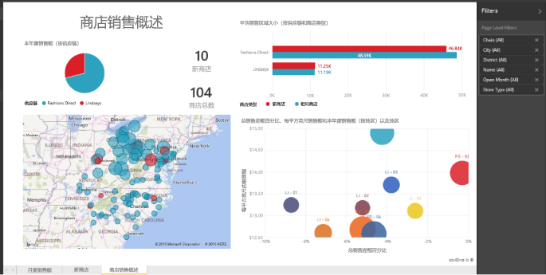

# Power BI 中的报表
## 什么是 Power BI 报表？
Power BI ***报表***是数据集的多角度视图，使用可视化效果表示数据集的各种结果和可以给予人的启发。  报表可包含单个可视化效果，也可包含充满可视化效果的多个页面。 根据你的作业角色，你可能是*创建*报表和/或*使用*报表的人。

此报表有 3 个页面（或选项卡），我们当前查看的是“商店销售额概述”页面。 此页面上有 6 个不同的可视化效果和一个页标题。 可视化效果可*固定*到仪表板，当固定的可视化效果被选中后，它将打开从其中固定它的报表。

如果你不熟悉 Power BI，可以通过阅读 [Power BI 基本概念](service-basic-concepts.md)详细了解基础知识

报表是 Power BI 服务和 Power BI Desktop 的一项功能。 使用报表的体验几乎相同。 在移动设备中无法创建报表，但可以[查看、共享报表并对其添加批注](mobile-reports-in-the-mobile-apps.md)。

## 报表的优点
报表以单个数据集为基础。 报表中的可视化效果分别表示信息的一个功能。 此外，可视化效果不是静态的；你可以添加和删除数据，更改可视化效果类型，并在深入探究数据时应用筛选器和切片器，从而发现见解并寻找答案。 报表类似于仪表板，但它更具有高度互动性和高度可定制性，并且可视化效果随着基础数据的更改而更新。

## 仪表板与报表
[仪表板](service-dashboards.md)经常与报表混淆，因为它们也是填充可视化效果的画布。 但它们存在一些主要差异。  

| **功能** | **仪表板** | **报表** |
| --- | --- | --- |
| 页面 |一个页面 |一个或多个页面 |
| 数据源 |每个仪表板的一个或多个报表和一个或多个数据集 |每个报表的单个数据集 |
| 可用于 Power BI Desktop |否 |是，可以在 Desktop 中创建和查看报表 |
| 固定 |只能将现有的可视化效果（磁贴）从当前仪表板固定到其他仪表板 |可以将可视化效果（作为磁贴）固定到任何仪表板。 可以将整个报表页面固定到任何仪表板。 |
| 订阅 |无法订阅仪表板 |可以订阅报表页面 |
| 筛选 |无法筛选或切片 |许多不同的方式来筛选、突出显示和切片 |
| 设置警报 |当满足某些条件时，可以创建警报以向你发送电子邮件 |否 |
| 功能 |可以将一个仪表板设置为“精选”仪表板 |无法创建精选报表 |
| 自然语言查询 |从仪表板可用 |从报表不可用 |
| 可以更改可视化效果类型 |不行。 事实上，如果报表所有者更改报表中的可视化效果类型，那么仪表板上的固定可视化效果不会更新 |是 |
| 可以看到基础数据集表和字段 |不行。 可以导出数据，但看不到仪表板本身的表和字段。 |是的。 可以查看数据集表和字段以及值。 |
| 可以创建可视化效果 |仅限于使用“添加磁贴”向仪表板添加小部件 |可以通过“编辑”权限创建许多不同类型的视觉对象、添加自定义视觉对象、编辑视觉对象等 |
| 自定义 |可以通过移动和排列、调整大小、添加链接、重命名、删除和显示全屏等可视化效果（磁贴）来进行自定义。 但是数据和可视化效果本身是只读的。 |在“阅读”视图中，你可以发布、嵌入、筛选、导出、下载为 .pbix，查看相关内容，生成 QR 码，在 Excel 中进行分析等。  在“编辑”视图中，你可以执行目前为止所提到的一切操作，甚至更多操作。 |

## 报表***创建者***和报表***使用者***
根据你的角色，你可能会创建报表供你自己使用或与同事共享。 你想了解如何创建和共享报表。 或者，你可能会从其他人那里接收报表。 你想要了解如何理解报表并与报表进行交互。

以下是一些按角色提供的主题，可帮助你入门。

### 如果你要创建和共享报表
* 通过 [Power BI 服务教程](service-basic-concepts.md)入门，这样便知道从哪里找到报表和报表工具。
* 简要了解[报表编辑器](service-the-report-editor-take-a-tour.md)。
* 了解如何[从数据集创建报表](service-report-create-new.md)。
* [了解如何使用可视化效果、页面和报表级筛选器](power-bi-how-to-report-filter.md)
* 发现你可以[与同事共享报表](service-share-dashboards.md)的所有不同方式。

### 如果你要接收和使用报表
* 通过 [Power BI 服务教程](service-basic-concepts.md)入门，这样便知道从哪里找到报表和报表工具。
* 了解如何[打开报表](service-report-open-in-reading-view.md)以及[阅读视图](service-dashboard-tiles.md)中所有可用的交互。
* 通过查看我们的任一[示例](sample-tutorial-connect-to-the-samples.md)轻松了解报表的使用。  
* 不再需要报表？ 可以将其[删除](service-delete.md)。
* 若要查看报表正在使用哪个数据集及哪个仪表板从报表固定磁贴，请[查看相关内容](service-related-content.md)。

> [!TIP]
> 如果在此处未找到你所查找的内容，请使用左侧的“目录”浏览所有的 *报表* 主题。
> 
> 

## 后续步骤
[Power BI 入门](service-get-started.md) 

[Power BI - 基本概念](service-basic-concepts.md)

更多问题？ [尝试参与 Power BI 社区](http://community.powerbi.com/)

