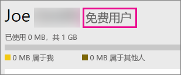

# 以个人身份注册 Power BI
了解如何注册 Power BI 并开始使用，以满足你个人的报表和可视化需求。

Power BI 既是你的个人报表和可视化工具，还可用作组项目、部门或整个企业背后的分析和决策引擎。

本文将介绍注册并开始使用 Power BI 服务的多种方式。 有关 Power BI 免费版和 Power BI Pro 之间差异的信息，请参阅 [Power BI 免费版与 Power BI Pro](service-free-vs-pro.md)。

## 有几种选择
作为个人身份，注册并开始使用 Power BI 有几种选择。 可以选择免费注册或购买 Power BI Pro 订阅。 如果注册免费帐户，则在进入服务后，可以选择加入 Power BI Pro 的 60 天免费试用。

如果你的组织当前使用 Office 365，你仍然可以注册免费帐户。 你的 IT 管理员在购买 Power BI Pro 并分配许可证方面也有多种选择。 有关 IT 管理员可用选择的详细信息，请参阅[购买 Power BI Pro](service-admin-purchasing-power-bi-pro.md)。

> [!NOTE]
> 如果你在组织中，个人注册可能会被禁用。 如果收到表示它已关闭的错误消息，请参阅[个人注册已关闭](#individual-sign-up-has-been-turned-off)以了解详细信息。
>

## 注册所需前提条件

要注册 Power BI，需要一个工作电子邮件地址。 尝试注册 Power BI 时，个人电子邮件地址将不起作用。

### 哪些电子邮件地址可用于 Power BI？
Power BI 要求使用工作或学校电子邮件地址才能注册。 不支持使用电信提供商或使用者电子邮件服务提供的电子邮件地址来注册 Power BI。 这包括 outlook.com、hotmail.com、gmail.com 和其他人。

如果你尝试使用个人电子邮件地址注册，则会收到一条指示要使用工作或学校电子邮件地址的消息。

> [!NOTE]
> 你可以使用 .gov 或 .mil 地址注册 Power BI。 相关信息，请查看[在 Power BI 服务中注册你的美国政府组织](https://docs.microsoft.com/en-us/power-bi/service-govus-signup)。
>

> [!NOTE]
> 注册之后，可以[邀请来宾用户](https://docs.microsoft.com/en-us/azure/active-directory/active-directory-b2b-what-is-azure-ad-b2b)使用包括个人帐户在内的任何电子邮件地址来查看你 Power BI 租户中的内容。
>

## 需要哪一种？
可以通过查看每种许可证类型的内容确定需要哪一种许可证。 除共享和协作功能外，免费用户可以使用服务的大部分功能。 Power BI Pro 用户可以使用服务中的所有功能，但不是免费使用。 如果不需要共享任何内容，则可能更适合使用免费版。 有关详细信息，请参阅 [Power BI 定价页](https://powerbi.microsoft.com//pricing/)。

本文的其余部分将介绍如何针对每个选择进行注册。

## 以个人身份注册 Power BI（免费）
注册 Power BI 的最快方式是注册 Power BI（免费）帐户。 此帐户不收费，且你可以使用该服务中提供的很多功能。

> [!NOTE]
> 如果你收到一条注明“我们已经认识你”的消息，请尝试导航到 https://app.powerbi.com 并登录。
> 
> 

若要注册 Power BI，你可以执行以下操作。

1. 浏览到 [powerbi.com](https://powerbi.microsoft.com)。
2. 选择“免费开始”或“免费注册”。
   
    
3. 在入门页，选择 Power BI 下的“免费试用 >”。
   
    
4. 输入注册使用的电子邮件地址，然后选择**注册**。 请确保你的电子邮件地址可用于进行注册。 有关可以使用的电子邮件地址的详细信息，请参阅[哪些电子邮件地址可用于 Power BI](#what-email-address-can-be-used-with-power-bi)。
   
    
5. 你将收到指示查看电子邮件的消息。
   
    
6. 选择电子邮件内的链接以确认你的电子邮件地址。 这将返回到注册流程。 你可能需要提供一些有关自己的其他信息。
7. 然后转到 https://app.powerbi.com，你可以作为免费用户开始使用 Power BI。

### 这在服务中显示的内容
处于服务中时，你可以通过转到**齿轮**图标并选择**管理个人存储**来验证是否具有免费帐户。

### 如果已是现有组织成员，情况又如何？
如果你的帐户属于现有组织，你将获得要求你使用该帐户登录的消息。 选择**继续**并使用 Office 365 登录名进行登录。

然后你将看到要求你选择“开始”的消息。

## 目前提供的 Power BI Pro 60 天试用版
注册了免费帐户之后，你可以根据需要选择免费试用 Power BI Pro 60 天。 在试用版的持续时间内，你有权访问所有 Pro 功能。 Power BI Pro 具有 Power BI 免费版本的所有功能，以及其他共享和协作功能。 有关详细信息，请参阅 [Power BI 定价](https://powerbi.microsoft.com/pricing)。 若要试用 Power BI Pro 的 60 天免费试用版，请登录 Power BI，然后尝试以下这些 Power BI Pro 功能之一：

* [创建应用工作区](service-create-distribute-apps.md)
* [共享仪表板](service-share-dashboards.md)

尝试其中任何功能时，系统都会提示你开始免费试用。 还可以通过转到齿轮图标并选择**管理个人存储**来选择使用它。 然后选择右侧的**免费试用 Pro**。

然后可以选择**开始试用**。

>[!NOTE]
>利用此产品内 Power BI Pro 试用版的用户不会在 Office 365 管理门户内显示为 Power BI Pro 试用版用户（他们显示为 Power BI 免费用户）。 但是，他们会在 Power BI 中**管理存储**页面上显示为 Power BI Pro 试用版用户。

>[!NOTE]
>如果你是 IT 管理员，并且希望获取 Power BI 试用版许可证并部署给组织中的多个用户，而无需让单独用户分别接受试用条款，则可以注册 [Power BI Pro 订阅试用版](https://portal.office.com/Signup/MainSignup15.aspx?OfferId=d59682f3-3e3b-4686-9c00-7c7c1c736085&dl=POWER_BI_PRO)。 你需要是 Office 365 全局或计帐管理员，或是创建新租户以注册管理员试用版。 有关详细信息，请参阅[购买 Power BI Pro](service-admin-purchasing-power-bi-pro.md)。
> 
> [!NOTE]
> 2017 年 6 月 1 日推出了 Power BI Premium 并发布了对 Power BI 免费版产品/服务的更改，因此你可能符合使用扩展的 Pro 试用版的条件。 有关详细信息，请参阅[延长 Power BI Pro 试用期激活](service-extended-pro-trial.md)。
> 
> 

### 这在服务中显示的内容
使用服务时，可以转到**齿轮*图标，然后选择“管理个人存储”，从而验证拥有的是否是 Pro 试用版帐户。

## 如果需要完整的 Power BI Pro，该怎么办？
个人身份不能获取 Power BI Pro 许可证。 你需要告知 IT 管理员，让其购买许可证并分配给你的帐户。 有关详细信息，请参阅[购买 Power BI Pro](service-admin-purchasing-power-bi-pro.md)。

## 故障排除
在许多情况下，通过下面列出的简易自助注册过程可以实现 Power BI 注册。 但是，也有几个导致你可能无法完成自助注册的原因。  下表总结了你可能无法完成注册的某些最常见的原因以及解决这些问题的方法。

| **症状/错误消息** | **原因和解决方法** |
| --- | --- |
| **个人电子邮件地址（例如，nancy@gmail.com）**在注册期间看到如下消息：    *你输入的是个人电子邮件地址：请输入你的工作电子邮件地址，以便我们可以安全地存储你公司的数据。*    或    *这看起来像个人电子邮件地址。请输入你的工作地址，以便我们可以将你和公司中的其他人相连接。请不必担心。我们不会向任何人分享你的地址。* |Power BI 不支持由使用者电子邮件服务或电信提供商提供的电子邮件地址。    若要完成注册，请使用你的工作单位或学校分配的电子邮件地址再试一次。    如果你仍无法注册并且愿意完成更高级的安装过程，则可以[注册新的 Office 365 试用版订阅并使用该电子邮件地址进行注册](service-admin-signing-up-for-power-bi-with-a-new-office-365-trial.md)。    以 [Azure B2B 来宾](https://docs.microsoft.com/en-us/azure/active-directory/active-directory-b2b-what-is-azure-ad-b2b)的形式邀请用户帐户。 |
| **自助注册已禁用**在注册期间，你会收到一条消息，如下所示：    *我们无法完成注册。你的 IT 部门已经关闭了注册 Microsoft Power BI。请与他们联系以完成注册。*    或    *这看起来像个人电子邮件地址。请输入你的工作地址，以便我们可以将你和公司中的其他人相连接。请不必担心。我们不会向任何人分享你的地址。* |你组织的 IT 管理员已禁用自助注册 Power BI。    若要完成注册，请与 IT 管理员联系，要求他们按照以下页面上的说明允许现有用户注册 Power BI，并允许新用户加入现有租户。    如果通过合作伙伴注册 Office 365，也可能会遇到此问题。 [了解详细信息](service-admin-syndication-partner.md)    [组织中的 Power BI](https://support.office.com/en-ca/article/Power-BI-in-your-Organization-d7941332-8aec-4e5e-87e8-92073ce73dc5#BKMK_HowCanIAllowO365Tenant) |
| **电子邮件地址不是 Office 365 ID**在注册期间，你会收到一条消息，如下所示：    *我们在 contoso.com 找不到你。你在工作或学校时使用其他 ID 吗？  请使用该 ID 尝试登录，如果不起作用，请与你的 IT 部门联系。* |你的组织使用不同于你的电子邮件地址的 ID 登录到 Office 365 和其他 Microsoft 服务。  例如，你的电子邮件地址可能是 Nancy.Smith@contoso.com，但你的 ID 是 nancys@contoso.com。    若要完成注册，请使用你的组织分配的用于登录到 Office 365 或其他 Microsoft 服务的 ID。  如果你不知道这是什么，请与你的 IT 管理员联系。    如果你仍无法注册并且能够完成更高级的安装过程，则可以[注册新的 Office 365 试用版订阅并使用该电子邮件地址进行注册](service-admin-signing-up-for-power-bi-with-a-new-office-365-trial.md)。 |

## 后续步骤
[组织中的 Power BI（免费）](service-admin-service-free-in-your-organization.md)  
[购买 Power BI Pro](service-admin-purchasing-power-bi-pro.md)  
[适用于个人用户的 Power BI 服务协议](https://powerbi.microsoft.com/terms-of-service/)  
[什么是 Power BI Premium？](service-premium.md)  
[Power BI Premium 白皮书](https://aka.ms/pbipremiumwhitepaper)  

更多问题？ [尝试咨询 Power BI 社区](http://community.powerbi.com/)

