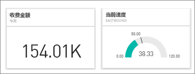
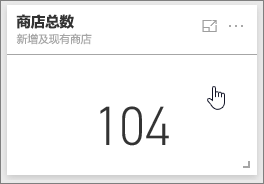
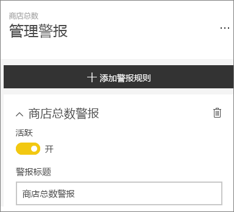
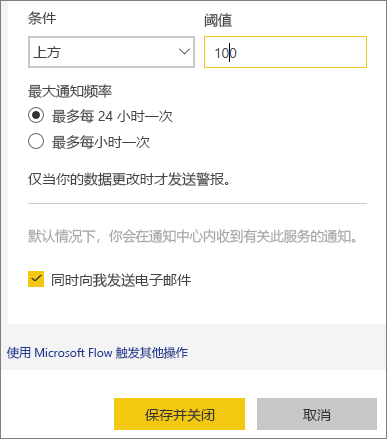
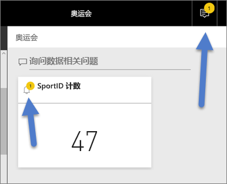
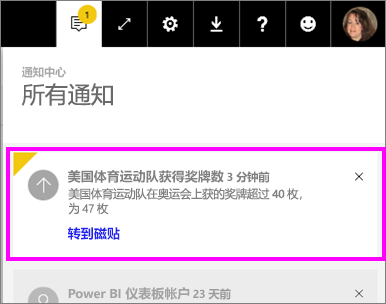
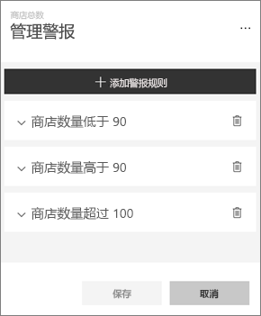
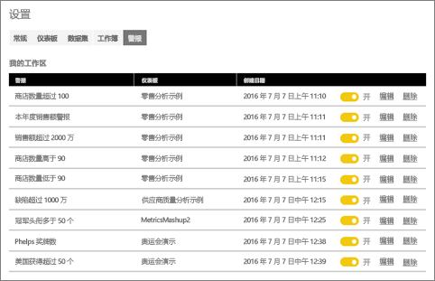

# Power BI 服务中的数据警报
设置警报，以便在仪表板中的数据更改超出你设置的限制时通知你。 

只能为报表视觉对象固定到的磁贴设置警报，而且只能为仪表、KPI 和卡片设置警报。 可以为从报表固定到仪表板的流数据集中创建的视觉对象设置警报，但无法直接在仪表板上使用“添加磁贴” > “自定义流数据”为创建的流磁贴设置警报。 

即使共享你的仪表板，也只有你可以看到自己设置的警报。 数据警报跨平台完全同步；可以在 [Power BI 移动应用](mobile-set-data-alerts-in-the-mobile-apps.md)和 Power BI 服务中设置和查看数据警报。 它们对 Power BI Desktop 不可用。 警报甚至可以是[与 Microsoft Flow 集成的自动警报](https://flow.microsoft.com) - [试试吧](service-flow-integration.md)。

> [!WARNING]
> 数据驱动的警报通知提供有关数据的信息。 如果你在移动设备上查看 Power BI 数据，而该设备之后被盗，我们建议使用 Power BI 服务来关闭所有数据驱动的警报规则。
> 
> 

## 在 Power BI 服务中设置数据警报
观看 Amanda 将一些警报添加到她的仪表板上的磁贴。 然后按照视频下面的分步说明来自己尝试一下。

<iframe width="560" height="315" src="https://www.youtube.com/embed/JbL2-HJ8clE" frameborder="0" allowfullscreen></iframe>

此示例使用零售分析示例仪表板中的卡片磁贴。

1. 启动仪表板。 在仪表板仪表、KPI 或卡磁贴中，选择省略号。
   
   
2. 选择钟形图标  为“总存储”添加一个或多个警报。
   
1. 若要开始，请选择“+ 添加警报规则”，并确保滑块已设置为“开启”，并为警报提供一个标题。 标题有助于轻松识别警报。
   
   
4. 向下滚动，输入警报的详细信息。  在此示例中，我们将创建一个在总存储数超过 100 时每天提醒一次的警报。 警报将出现在我们的通知中心。 并且，我们还将收到 Power BI 发送的电子邮件。
   
   
5. 选择**保存**。

## 接收警报
当被跟踪的数据到达一个你所设定的阈值时，将发生下列情况。 首先，Power BI 会检查自最后一个警报发出是否已超过 1 个小时或 24 个小时（具体取决于所选择的选项）。 只要数据超过阈值，你就会收到警报。

接下来，Power BI 将向通知中心发出警报（可选择以电子邮件形式发送）。 每个警报都包含数据的直接链接。 选择链接以查看可在其中浏览、共享和了解详细信息的相关磁贴。  

1. 如果你已设置警报向你发送电子邮件，则你将在收件箱中找到如下内容。
   
   
2. Power BI 会将消息添加到你的“通知中心”，并会向适用的磁贴添加新的警报图标。
   
   
3. 打开你的通知中心以查看警报详细信息。
   
    
   
   > [!NOTE]
   > 警报仅适用于刷新的数据。 数据刷新时，Power BI 会查看是否为该数据设置了警报。 如果数据已达到了警报的阈值，则会触发警报。
   > 
   > 

## 管理警报
可通过多种方法管理警报：从仪表板磁贴本身、从 Power BI 设置菜单，以及在 [iPhone 上的 Power BI 移动应用](mobile-set-data-alerts-in-the-mobile-apps.md)或[适用于 Windows 10 的 Power BI 移动应用](mobile-set-data-alerts-in-the-mobile-apps.md)中各个磁贴。

### 从磁贴本身
1. 如果需要更改或删除磁贴的警报，请通过选择钟形图标  重新打开“管理警报”窗口。 将显示已为该磁贴设置的所有警报。
   
    .
2. 若要修改警报，请选择警报名称左侧的箭头。
   
    .
3. 若要删除警报，请选择警报名称右侧的垃圾桶。
   
      

### 从 Power BI 设置菜单
1. 从 Power BI 菜单栏选择齿轮图标。
   
    .
2. 在“设置”下，选择“警报”。
   
    
3. 你可以从此处打开和关闭警报，打开“管理警报”窗口，以进行更改或删除警报。

## 提示和故障排除
* 警报当前不受 Bing 磁贴或带有日期/时间度量值的卡片磁贴支持。
* 警报仅适用于数字数据类型。
* 警报仅适用于刷新的数据。 它们不适用于静态数据。
* 如果生成 KPI/卡片/仪表报表视觉对象，然后将该视觉对象固定到仪表板，那么警报将仅适用于流数据集。

## 后续步骤
[创建集成了数据警报的 Microsoft Flow](service-flow-integration.md)    
[在移动设备上设置数据警报](mobile-set-data-alerts-in-the-mobile-apps.md)    
[Power BI 入门](service-get-started.md)    
更多问题？ [尝试咨询 Power BI 社区](http://community.powerbi.com/)

