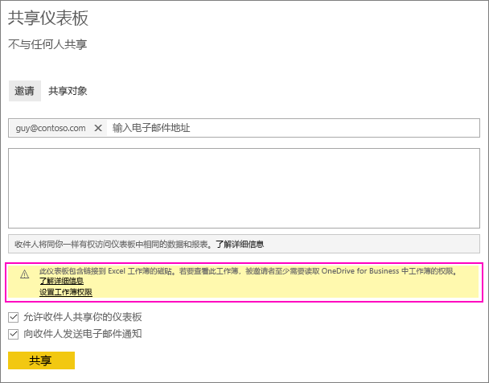
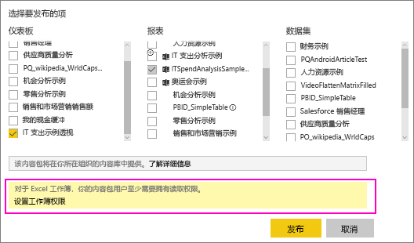
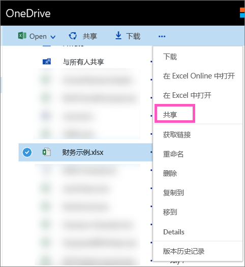

# 共享链接到 OneDrive 中 Excel 文件的 Power BI 仪表板
在 Power BI 中，你可以[连接到 OneDrive for Business 上的 Excel 工作簿](service-excel-workbook-files.md)并将该工作簿中的磁贴固定到仪表板。 共享该仪表板或创建包含该仪表板的内容包时：

* 你的同事无需工作簿本身的权限即可查看磁贴。 因此你可以创建内容包，并了解你的同事可以看到从 OneDrive 上的 Excel 工作簿创建的磁贴。
* 单击磁贴将在 Power BI 内打开该工作簿。 仅当你的同事至少具有 OneDrive for Business 上工作簿的[读取权限](https://support.office.com/en-us/article/Share-documents-or-folders-in-Office-365-1fe37332-0f9a-4719-970e-d2578da4941c)时，才会打开该工作簿。

## 共享包含工作簿磁贴的仪表板
要共享链接回 OneDrive for Business 上的 Excel 工作簿的仪表板，请参阅[共享仪表板](service-share-dashboards.md)。 不同之处在于，用户能够在共享之前选择修改链接的 Excel 工作簿的权限。

  

1. 输入同事的电子邮件地址。
2. 若要让你的同事能够从 Power BI 查看 Excel 工作簿，请选择**转到 OneDrive for Business 以设置工作簿权限**。
3. 在 OneDrive 上，根据需要[修改权限](https://support.office.com/en-US/article/Share-files-and-folders-and-change-permissions-9fcc2f7d-de0c-4cec-93b0-a82024800c07)。
4. 选择**共享**。

>[!NOTE]
>同事将无法固定此工作簿中的其他磁贴，并且不能在 Power BI 中更改 Excel 工作簿。
> 
> 

## 创建组织内容包（其中仪表板包含工作簿磁贴）
[发布内容包](service-organizational-content-pack-create-and-publish.md)时，对单个或成组的同事授予访问权限。 发布包含工作簿链接的内容包时，可以在发布前视情况修改链接的 Excel 工作簿的权限。

1. 在**创建内容包**屏幕中，输入电子邮件地址、为内容包提供标题和说明，并上传图像。
2. 选择链接到 OneDrive for Business 上的 Excel 工作簿的仪表板和/或报表。
   
    
3. 选择**转到 OneDrive for Business 以设置工作簿权限**。
4. 在 OneDrive 上，根据需要[修改权限](https://support.office.com/en-US/article/Share-files-and-folders-and-change-permissions-9fcc2f7d-de0c-4cec-93b0-a82024800c07)。
5. 选择**发布**。

## 从 Power BI 工作区共享仪表板
从 Power BI 工作区共享仪表板类似于从自己的工作区中共享仪表板，只不过文件位于 Office 365 工作区站点中而不是专用的 OneDrive for Business 中。 与工作区外人员共享仪表板之前修改 Excel 工作簿的权限。

## 后续步骤
* [从 Excel 将磁贴固定到 Power BI 仪表板](service-dashboard-pin-tile-from-excel.md)
* [Power BI 基本概念](service-basic-concepts.md)
* 更多问题？ [尝试参与 Power BI 社区](http://community.powerbi.com/)

