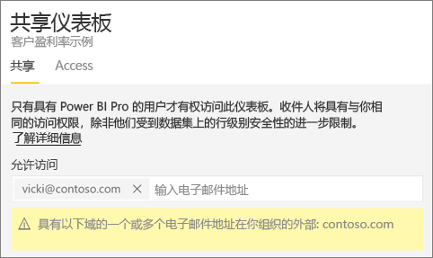
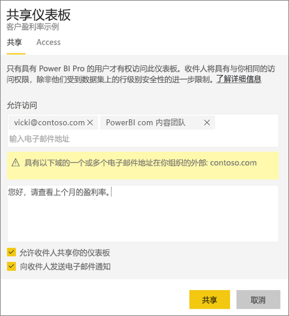
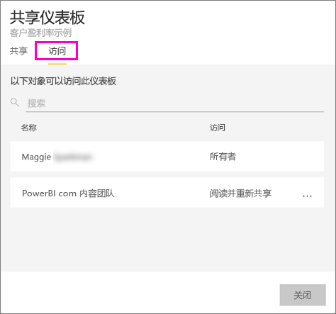
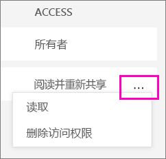

# 与同事和其他人共享 Power BI 仪表板
共享是一种使多人能够访问你的仪表板和报表的有效方式。 Power BI 提供了[多种开展协作和分发仪表板的方式](service-how-to-collaborate-distribute-dashboards-reports.md)，共享只是其中之一。

要进行共享，无论是在组织内还是在组织外共享内容，你和收件人都需要一个 [Power BI Pro 许可证](service-free-vs-pro.md)，或者内容需要位于[高级容量](service-premium.md)中。 建议？ Power BI 团队始终期待你的反馈，因此，请转到 [Power BI 社区站点](https://community.powerbi.com/)。

你可以从自己的“我的工作区”或应用工作区共享仪表板。 共享仪表板时，你与之共享的人员可查看并与其交互，但不能编辑它。 除非应用[行级别安全性 (RLS)](service-admin-rls.md)，否则他们会看到你在仪表板和报表中看到的相同数据。 如果你允许，与之共享的同事可以与其他同事共享仪表板。 组织外的人员也可以查看仪表板并与之交互，但不能共享它。 

你也可以[在任何 Power BI 移动应用中共享仪表板](mobile-share-dashboard-from-the-mobile-apps.md)。 可以从 Power BI 服务和 Power BI 移动应用（而非 Power BI Desktop）共享仪表板。

## 视频：共享仪表板
观看 Amanda 在她的公司内部和外部与同事共享她的仪表板。 然后按照视频下面的分步说明来自己尝试一下。

<iframe width="560" height="315" src="https://www.youtube.com/embed/0tUwn8DHo3s?list=PL1N57mwBHtN0JFoKSR0n-tBkUJHeMP2cP" frameborder="0" allowfullscreen></iframe>

## 共享仪表板
1. 在“我的工作区”或应用工作区中，打开仪表板，然后选择“共享” 。
2. 在顶部框中，输入个人、通讯组或安全组的完整电子邮件地址。 不能与动态通讯组列表共享。 
   
   你可以与地址在组织外部的人员进行共享，但会看到一条警告。
   
     
3. 如果需要，请添加一条消息。 可选。
4. 若要允许同事与他人共享你的仪表板，请勾选“允许收件人共享仪表板”。
   
   允许他人共享称为重新共享。 如果你允许，他们可以从 Power BI 服务和移动应用重新共享，或将电子邮件邀请转发给组织中的其他人。 该邀请将在一个月后过期。 你的组织外的用户无法重新共享。 作为仪表板的拥有者，你可以关闭重新共享，或逐个撤消重新共享（请参阅下面的[停止共享仪表板或阻止他人共享](service-share-dashboards.md#stop-sharing-a-dashboard-or-stop-others-from-sharing)）。
5. 选择**共享**。
   
     
   
   Power BI 将带有指向共享仪表板链接的电子邮件邀请发送给个人（而非组），并且你会看到成功通知。 
   
   当组织中的收件人单击该链接时，Power BI 会将仪表板添加到他们的“与我共享”列表页中。 他们可以选择你的名字来查看你已共享的所有仪表板。 
   
   
   
   当组织外部的收件人单击该链接时，他们会看到仪表板，但不是在常用的 Power BI 门户中。 请参阅下面的[与组织外部的人员共享仪表板](service-share-dashboards.md#share-a-dashboard-with-people-outside-your-organization)获取详细信息。

## 谁有权限访问我共享的仪表板？
有时，需要查看与之共享仪表板的人员，了解他们与哪些人共享了仪表板。

1. 在仪表板列表或仪表板中，选择“共享” 。 
2. 在“共享仪表板”对话框中，选择“访问权限”。
   
    
   
    组织外的人员都将作为**来宾**列出。

## 停止共享仪表板或阻止他人共享
只有仪表板所有者可以打开和关闭重新共享。

### 如果尚未发送共享邀请
* 请在发送之前，取消选中邀请底部的“允许收件人共享仪表板”复选框。

### 如果已共享仪表板
1. 在仪表板列表或仪表板中，选择“共享” 。 
2. 在“共享仪表板”对话框中，选择“访问权限”。
   
    
3. 选择“阅读并重新共享”旁边的省略号 (...) 并选择：
   
   
   
   * 阅读以防止该用户与其他人进行共享。
   * 删除访问权限以防止该用户查看仪表板。

## 与组织外部的人员共享仪表板
与组织外的人员共享时，他们会收到带有指向共享仪表板的链接的电子邮件，而且他们必须登录 Power BI 才能查看仪表板。 如果他们没有 Power BI Pro 许可证，则可以在单击链接后进行注册。

登录后，就可以在浏览器窗口（而不是常用的 Power BI 门户）中看到没有左侧导航窗格的仪表板。 他们需要将该链接保存为书签以便将来访问此仪表板。

组织外的用户不能编辑此仪表板或报表内的任何内容。 他们可以与报表（交叉突出显示）中的图表进行交互，并更改连接到仪表板的报表上的任何筛选器/切片器，但不能保存更改。

只有你的直接收件人才能看到共享仪表板。 例如，如果发送电子邮件至 Vicki@contoso.com，只有 Vicki 才能看到仪表板。 其他任何人都看不到该仪表板，即使他们有链接；并且 Vicki 必须使用相同的电子邮件地址来访问该仪表板。 如果她使用任何其他的电子邮件地址进行注册，她也将无权访问该仪表板。

如果角色级或行级安全性是通过本地 Analysis Services 表格模型实现的，组织外的人员将完全无法查看任何数据。

如果从 Power BI 移动应用向组织外部人员发送链接，外部人员单击链接后会在浏览器（而不是 Power BI 移动应用）中打开仪表板。

## 限制和注意事项
共享仪表板的注意事项：

* 通常，你和同事将在仪表板中会看到相同的数据。 因此，如果你有权限比他们查看更多的数据，他们将能够查看你仪表板中的所有数据。 但是，如果[行级别安全性 (RLS)](service-admin-rls.md) 应用于仪表板下面的数据集，则每个人的凭据将用于确定他们可以访问哪些数据。
* 与之共享的每个人都可以查看仪表板，并在[阅读视图](service-report-open-in-reading-view.md)中与报表交互。 他们不能创建报表或将更改保存到现有报表。
* 没有人可以查看或下载数据集。
* 每个人都可以手动[刷新仪表板数据](refresh-data.md)。
* 如果使用 Office 365 收发电子邮件，可以通过输入与通讯组关联的电子邮件地址，与通讯组成员进行共享。
* 电子邮件域与你相同的同事，以及域不同但在相同租户中注册的同事可以与他人共享仪表板。 例如，假设域 contoso.com 和 contoso2.com 是在同一租户中注册的。 如果你的电子邮件地址为 konrads@contoso.com，则 ravali@contoso.com 和 gustav@contoso2.com 均可以共享（只要你向它们授予了共享权限）。
* 如果你的同事已经有权访问特定仪表板，则当你在仪表板上时，可以通过复制 URL 发送指向该仪表板的直接链接。 例如：   
  
    https://powerbi.com/dashboards/g12466b5-a452-4e55-8634-xxxxxxxxxxxx
* 同样，如果你的同事已经有权访问特定仪表板，你可以[将直接链接发送到基础报表](service-share-reports.md)。 

## 后续步骤
* 想提供反馈？ 请转到 [Power BI 社区站点](https://community.powerbi.com/)提出你的建议。
* [应如何针对仪表板及报表开展协作并进行共享？](service-how-to-collaborate-distribute-dashboards-reports.md)
* [仅共享 Power BI 报表](service-share-reports.md)
* 是否有任何问题？ [尝试参与 Power BI 社区](http://community.powerbi.com/)。

