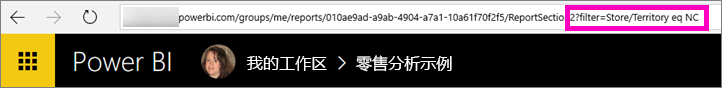
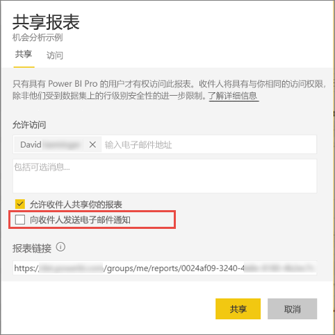

# 与同事共享筛选的 Power BI 报表
共享是一种使多人能够访问你的仪表板和报表的有效方式。 Power BI 还提供了[其他多种开展协作和分发报表的方式](service-how-to-collaborate-distribute-dashboards-reports.md)。

要进行共享，你和收件人都需要一个 [Power BI Pro 许可证](service-free-vs-pro.md)，或者内容需要位于[高级容量](service-premium.md)中。 建议？ Power BI 团队始终期待你的反馈，因此，请转到 [Power BI 社区站点](https://community.powerbi.com/)。

可以在同一电子邮件域中与同事共享报表（与在 Power BI 服务中的大多数位置一样）：收藏夹、最近浏览、与我共享（如果所有者允许该操作）、我的工作区或其他工作区。 共享报表时，你与之共享的人员可查看该报表并与其交互，但不能编辑它。 除非应用[行级别安全性 (RLS)](service-admin-rls.md)，否则他们会看到你在报表中看到的相同数据。 

## 筛选和共享报表
如果你想要共享筛选的报表版本，该怎么办？ 也许一个报表仅显示特定城市或销售人员或年份的数据。 可以通过创建自定义 URL 来执行此操作。

1. 打开[编辑视图](service-reading-view-and-editing-view.md)中的报表、应用筛选器并保存报表。
   
   在此示例中，我们正在筛选[零售分析示例](sample-tutorial-connect-to-the-samples.md)，从而仅显示“区域”等于“NC”的值。
   
   
2. 将以下代码添加到以下报表页 URL 的末尾：
   
   ?filter=*tablename*/*fieldname* eq *value*
   
    此字段必须是字符串类型，并且表名或字段名都不可以包含空格。
   
   在本示例中，表的名称是 **Store**，字段的名称是 **Territory**，我们要筛选的依据值是 **NC**：
   
    ?filter=Store/Territory eq 'NC'
   
   
   
   浏览器会添加特殊字符来表示斜杠、空格和撇号，因此最终会看到：
   
   app.powerbi.com/groups/me/reports/010ae9ad-a9ab-4904-a7a1-xxxxxxxxxxxx/ReportSection2?filter=Store%252FTerritory%20eq%20%27NC%27

3. [共享报表](service-share-dashboards.md)，但清除**向收件人发送电子邮件通知**复选框。 

    

4. 使用前面创建的筛选器发送链接。

## 后续步骤
* 想提供反馈？ 请转到 [Power BI 社区站点](https://community.powerbi.com/)提出你的建议。
* [应如何针对仪表板及报表开展协作并进行共享？](service-how-to-collaborate-distribute-dashboards-reports.md)
* [共享仪表板](service-share-dashboards.md)
* 更多问题？ [尝试参与 Power BI 社区](http://community.powerbi.com/)。

