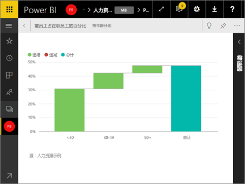

# 以全屏模式显示仪表板磁贴
磁贴必须先在[焦点模式](service-focus-mode.md)下显示，然后才能在全屏模式下显示。

## 什么是全屏模式？
显示你的[仪表板、报表](service-fullscreen-mode.md)和磁贴，而不受菜单和导航按钮的干扰。  你可随时快速获取业务的纯粹而完整的视图。 有时这也称为电视模式。

全屏模式的一些用途包括：

* 在会议中演示你的磁贴
* 在办公室的专用大屏幕或投影仪上显示磁贴
* 在小屏幕上查看你的磁贴
* 在锁定模式下查看磁贴，你可以触摸屏幕或在磁贴上移动鼠标，而不会打开下面的报表

## 打开（或关闭）全屏模式
1. [弹出该磁贴，并将其显示在焦点模式中](service-focus-mode.md)。
   
    
   
    磁贴将填充画布，方便你查看更多详细信息。 对于焦点模式下的仪表板磁贴，可以查看和修改此视觉对象创建时应用的筛选器。
   
    
2. 在顶部菜单栏中，选择此图标    以全屏幕模式显示磁贴。
3. 在全屏模式下，磁贴将填充整个屏幕，并在不受菜单和导航按钮干扰的情况下显示。  你可随时快速获取磁贴的纯粹而完整的视图。 有时这也称为电视模式。
   
   
4. 移动鼠标随即将出现一个菜单。 菜单将保留在右下角，直到退出全屏模式。 如果该菜单消失，只需移动光标或点击屏幕。
   
    
   
   * 使用**返回**按钮导航到浏览器中的前一页面。 如果前一页是 Power BI 服务页面，它将以全屏模式显示。  全屏模式将一直持续，直到关闭全屏。
   * 若要从全屏模式打印磁贴，请选择“打印”图标。
     
   * 若要退出全屏模式，请选择“关闭全屏”图标 

## 后续步骤
[Power BI 中的仪表板](service-dashboards.md)

[仪表板和报表的全屏模式](service-fullscreen-mode.md)

[Power BI 中的焦点模式](service-focus-mode.md)

更多问题？ [尝试参与 Power BI 社区](http://community.powerbi.com/)

