# Power BI 中颜色格式设置的提示和技巧
Power BI 提供了自定义仪表板和报表的多种方法。 本文详细介绍了一些技巧，可以让你的 Power BI 可视化效果更引人注目、生动有趣，并可根据你的需求进行自定义。

本文提供以下技巧。 还有更好的技巧？ 太棒了！ 请将其发送给我们，我们会考虑将其添加到此列表中。

* 更改单个数据点的颜色
* 根据数值设置图表的颜色
* 根据字段值设置数据点的颜色
* 在色阶中自定义使用的颜色
* 使用发散色阶
* 如何在 Power BI 中撤消操作

要进行任何更改都必须编辑报表：从**我的工作区**窗格中选择**报表**，然后从顶部的菜单区域选择**编辑报表**，如下图所示。

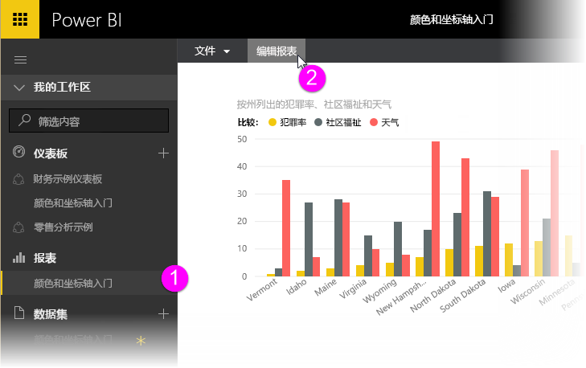

当**可视化效果**窗格出现在**报表**画布的右侧时，即可开始进行自定义操作。

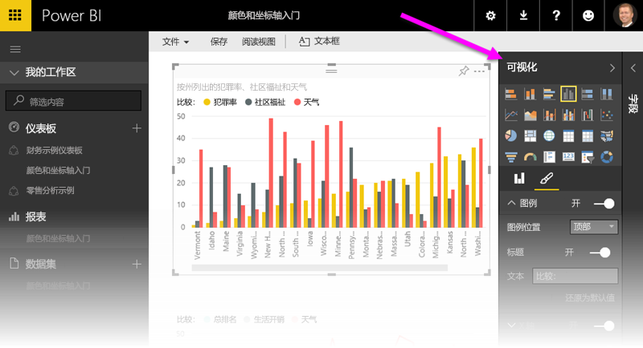

## 更改单个数据点的颜色
有时你想突出显示某个特定的数据点。 该数据点可能是推出的新产品的销售数据，或是推出新计划后增加的质量分数。 使用 Power BI 可以通过更改其颜色来突出显示某个特定的数据点。

以下可视化效果按生活费用对各个州进行了排序。 

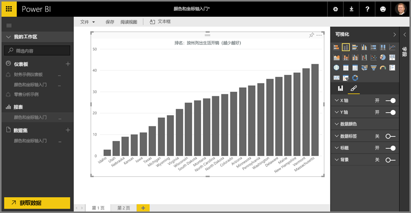

现在假设你想通过使用颜色来快速显示出华盛顿在该排名列表中的位置。 步骤如下：

展开**数据颜色**部分。 将出现以下内容。

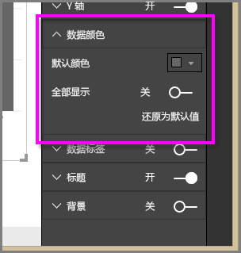

将**显示全部**设置为**开启**。 此操作将显示可视化效果中每个数据元素的颜色。 将鼠标悬停在数据点上时，将启用滚动，此时你可以修改任何数据点。

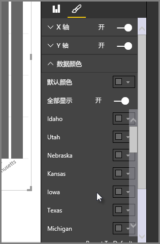

在本案例中，我们将**华盛顿**更改为绿色。 向下滚动到**华盛顿**并选择其颜色框中的向下箭头，之后将出现颜色选择窗口。

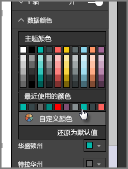

选择颜色后，**华盛顿**数据点将显示为美丽的绿色阴影，自然就很显眼了。

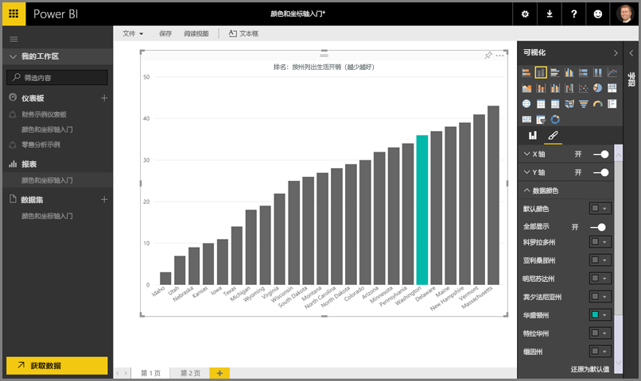

即使更改了可视化效果类型，返回时 Power BI 仍会记住你的选择，并将**华盛顿**保留为绿色。

你也可以更改多个数据元素的数据点的颜色。 在下图中，**亚利桑那**为红色，**华盛顿**仍为绿色。

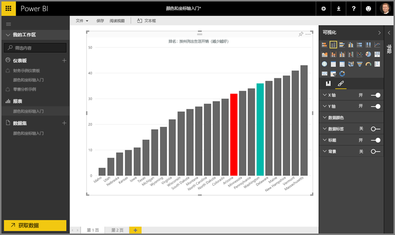

可以使用颜色进行各种操作。 在下一部分中，我们将来了解渐变。

## 根据数值设置图表的颜色
可以根据字段的数值动态设置颜色，这样可以让图表发挥出巨大作用。 通过执行此操作，除了表示条形图大小的数值之外，还能显示其他的值，并且可以在一个图表中显示两个值。 或者可以通过此操作来突出显示高于（或低于）特定值的数据点 - 例如突出显示盈利能力较低的区域。

以下部分演示了根据数值设置颜色的不同方式。

## 根据数值设置数据点的颜色
若要根据数值更改颜色，请将你想设置颜色的字段拖动到**字段**窗格中的**色彩饱和度**区域。 在下图中，已将**税前收益**拖动到**色彩饱和度**区域中。 可以看到，尽管**维络城**具有更高的**总销售额**（该列更高），但**阿马里亚**具有更大的**税前收益**（该列的颜色饱和度更大）。

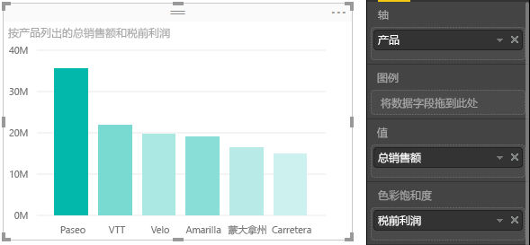

## 在色阶中自定义使用的颜色
你还可以在色阶中自定义使用的颜色。 展开**数据颜色**，你会看到让数据出现可视化效果的颜色渐变。 默认情况下，数据中的最低值对应饱和度最小的颜色，而最高值对应饱和度最大的颜色。

色域通过渐变栏进行显示，显示介于**最小值**和**最大值**的颜色值之间的色谱。**最小值**的颜色位于左侧，**最大值**的颜色位于右侧。

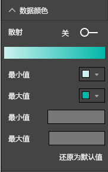

若要更改色阶以使用其他的色域，请选择**最小值**或**最大值**旁边的颜色下拉菜单并选择一种颜色。 下图展示了将“**最大值**”颜色更改为黑色。渐变栏展示了介于“**最小值**”到“**最大值**”之间的新色谱。

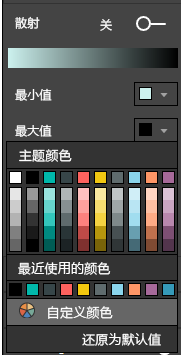

你还可以更改数值对应这些颜色的方式。 在下图中，已分别将**最小值**和**最大值**设置为橙色和绿色。

在第一张图片中，请注意图表中的条形图是如何反映渐变栏中的渐变的；最高的值为绿色，最低的值为橙色，中间的条形图都以介于绿色和橙色之间的色谱着色。

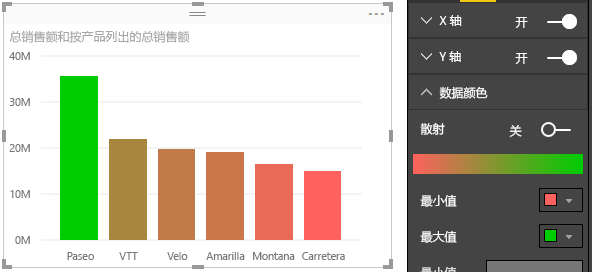

现在我们来看如果在**最小值**和**最大值**框中输入数值将会发生什么。该框位于**最小值**和**最大值**颜色选择器的下方。（如下图所示）） 我们将**最小值**设置为 20,000,000，并将**最大值**设置为 20,000,000。

设置这两个值后，渐变将不再应用于图表上低于**最小值**或高于**最大值**的值；任何高于**最大值**的条形图都会以绿色显示，并且任何低于**最小值**的条形如都会以红色显示。

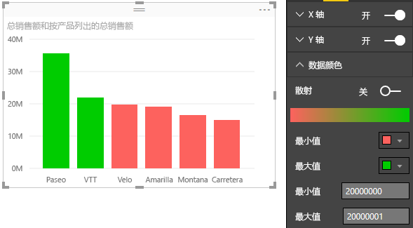

## 使用发散色阶
有时你的数据可能有自然的发散色阶。 例如，温度范围有自然的中间点（冻结点），盈利能力分数有自然的中间点（零）。

若要使用发散色阶，请将**发散**滑块滑动到**开启**的位置。 当**发散**处于开启状态时，将出现另一个颜色选择器和数值框，两者都被称为**中间点**。

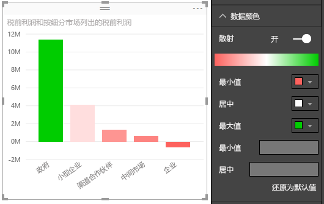

当**发散**处于开启状态时，你可以单独设置**最小值**、**最大值**和**中间点**的颜色。 下图中，**中间点**设置为 1，因此值高于 1 的条形图将显示为渐变的绿色，值低于 1 的条形图则显示为红色。

## 如何在 Power BI 中撤消操作
与许多其他 Microsoft 服务和软件相类似，Power BI 提供了撤消上一项命令的简单方法。 例如，假设你更改了某个数据点或一系列数据点的颜色，但当其出现在可视化效果中时你不喜欢该颜色。 你不记得之前它是什么颜色，但是你知道你想用回之前的颜色！

若要**撤消**上一次操作，或最近几次操作，只需要：

- 按 CTRL+Z

## 反馈
你是否拥有想要共享的技巧？ 请将其发送给我们，我们会考虑将其列在此处。

>[!NOTE]
>这些颜色、轴以及相关的自定义项在选中“格式”图标时可用，在 Power BI Desktop 中也可用。

## 后续步骤
[颜色格式设置和轴属性入门](service-getting-started-with-color-formatting-and-axis-properties.md)

