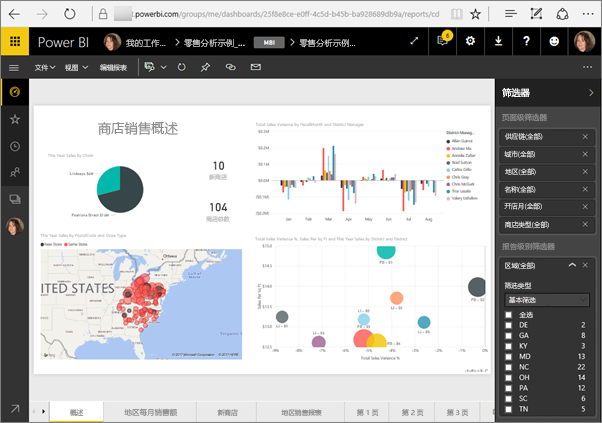
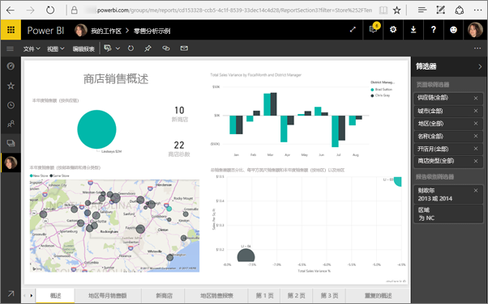

# <a name="filter-a-report-using-query-string-parameters-in-the-url"></a>通过在 URL 中添加查询字符串参数来筛选报表
在 Power BI 服务中打开报表时，报表的每一页都有自己的专属 URL。 若要筛选报表页，可以使用报表画布上的“筛选器”窗格。  也可以向 URL 添加查询字符串参数来预筛选报表。 你可能有一个要向同事展示的报表，你希望为同事预筛选报表。 一种方法是从报表的默认 URL 入手，向 URL 添加筛选参数，然后通过电子邮件向同事发送完整的新 URL。



## <a name="uses-for-query-string-parameters"></a>用于查询字符串参数
假设你正在使用 Power BI Desktop，并且希望创建一个报表，在其中包含指向其他 Power BI 报表的链接 - 但只想显示其他报表中的某些信息。 首先，使用查询字符串参数筛选报表并保存 URL。 接下来，使用这些新的报表 URL 在 Desktop 中创建一个表。  然后发布并共享报表。

查询字符串参数的另一个用途是用于创建高级 Power BI 解决方案。  使用 DAX，可创建一个报表，该报表根据客户在当前报表中所做的选择动态生成已筛选的报表 URL。 当客户选择 URL 时，只会看到预期信息。 

## <a name="query-string-parameter-syntax-for-filtering"></a>用于筛选的查询字符串参数语法
通过参数，可筛选报表中的一个或多个值，即使这些值包含空格或特殊字符。 基本语法相当简单；从报表 URL 入手，然后依次添加问号和筛选语法。

URL?filter=***表***/***字段*** eq '***值***'


* “表”和“字段”名称区分大小写，“值”不区分大小写。
* 报表视图中隐藏的字段仍可供筛选。

### <a name="field-types"></a>字段类型
字段类型可以是数字、日期/时间或字符串，使用的类型必须与数据集中设置的类型匹配。  例如，如果要在设置为日期的数据集列集中查找日期/时间或数值（例如，Table/StringColumn eq 1），则指定类型为“字符串”的表列将不起作用。

* “字符串”必须用单引号括起来 - 'manager name'。
* “数字”无需特殊格式
* “日期和时间”必须用单引号括起来，并以“DateTime”开头。

如果仍感到困惑，请继续阅读，我们将分部分讲解。  

## <a name="filter-on-a-field"></a>筛选一个字段
假设我们的报表 URL 如下。


从上文中的地图可视化效果可以看出，我们在北卡罗来纳州有商店。

>[!NOTE]
>本示例以[“零售分析”示例为依据“](sample-datasets.md)。
> 

若要从报表中筛选出“NC”（北卡罗来纳州）商店的数据，请在 URL 后面追加以下内容：

?filter=Store/Territory eq 'NC'


>[!NOTE]
>NC 是“Store”表的“Territory”字段中存储的值。
> 

我们的报表针对北卡罗来纳州进行了筛选；报表页上的所有可视化效果都只显示北卡罗来纳州的数据。



## <a name="filter-on-multiple-fields"></a>筛选多个字段
还可以通过将其他参数添加到 URL 来筛选多个字段。 让我们回到最初的筛选器参数。

```
?filter=Store/Territory eq 'NC'
```

若要对其他字段进行筛选，请添加 and 以及采用上述同一格式的另一个字段。 示例如下。

```
?filter=Store/Territory eq 'NC' and Store/Chain eq 'Fashions Direct'
```

<iframe width="640" height="360" src="https://www.youtube.com/embed/0sDGKxOaC8w?showinfo=0" frameborder="0" allowfullscreen></iframe>

## <a name="operators"></a>运算符
除了 and 之外，Power BI 还支持许多运算符。 下表列出了这些运算符及其支持的内容类型。

|运算符  | 定义 | 字符串  | 数字 | 日期 |  示例|
|---------|---------|---------|---------|---------|---------|
|**and**     | 并且 |  是      | 是 |  是|  product/price le 200 and price gt 3.5 |
|**eq**     | 等于 |  是      | 是   |  是       | Address/City eq 'Redmond' |
|**ne**     | 不等于 |   是      | 是  | 是        |  Address/City ne 'London' |
|**ge**     |  大于或等于       | 否 | 是 |是 |  product/price ge 10
|**gt**     | 大于        |否 | 是 | 是  | product/price gt 20
|**le**     |   小于或等于      | 否 | 是 | 是  | product/price le 100
|**lt**     |  小于       | 否 | 是 | 是 |  product/price lt 20
|**in****     |  包括       | 否 | 否 |  是 | Student/Age in (27, 29)


\** 使用 in 时，in 右侧的值可以是括在括号中的逗号分隔列表，也可以是返回集合的单个表达式。

### <a name="numeric-data-types"></a>数值数据类型
Power BI URL 筛选器可包含以下格式的数字。

|数字类型  |示例  |
|---------|---------|
|**integer**     |   5      |
|**long**     |   5L 或 5l      |
|**double**     |   5.5、55e-1、0.55e+1、5D、5d、0.5e1D、0.5e1d、5.5D、5.5d、55e-1D 或 55e-1d     |
|**decimal**     |   5M、5m、5.5M 或 5.5m      |
|**float**     | 5F、5f、0.5e1F 或 0.5e-1d        |

### <a name="date-data-types"></a>日期数据类型
Power BI 支持 Date 和 DateTimeOffset 数据类型 OData V3 和 V4。  日期使用 EDM 格式 (2019-02-12T00:00:00) 表示。 这意味着将日期指定为 YYYY-MM-DD 时，Power BI 将其解释为 YYYY-MM-DDT00:00:00。

为什么这种区别很重要？ 假设你创建了一个查询字符串参数 Table/Date gt 2018-08-03。  结果将包括 2018 年 8 月 3 日还是从 2018 年 8 月 4 日开始？ 由于 Power BI 将查询转换为 Table/Date gt 2018-08-03T00:00:00，因此结果包含具有非零时间部分的任何日期，因为这些日期大于 2018-08-03T00:00:00。

## <a name="special-characters-in-url-filters"></a>URL 筛选器中的特殊字符
特殊字符和空格需要一些额外的格式设置。 查询包含空格、短划线或其他非 ASCII 字符时，请使用转义码 (_x) 和 4 位 Unicode 为这些特殊字符添加前缀。 如果 Unicode 少于 4 个字符，则需要用零填充。 下面是一些示例。

|标识符  |Unicode  | Power BI 的编码  |
|---------|---------|---------|
|**表名**     | Space: 0x20        |  Table_x0020_Name       |
|**Column**@**Number**     |   @: 0x40     |  Column_x0040_Number       |
|**[Column]**     |  [:0x005B ]:0x0050       |  _x0058_Column_x0050       |
|**Column+Plus**     | +:0x2B        |  Column_x002B_Plus       |

Table_x0020_Name/Column_x002B_Plus eq 3


Table_x0020_Special/x005B_Column_x0020_Brackets_x005D eq '[C]' 

### <a name="use-dax-to-filter-on-multiple-values"></a>使用 DAX 来对多个值进行筛选
对多个字段进行筛选的另一方法是创建将两个字段合并成一个值的计算列。 然后，便可以筛选此值。

例如，我们有以下两个字段：“Territory”和“Chain”。 在 Power BI Desktop 中，[新建一个计算列](desktop-tutorial-create-calculated-columns.md)（字段），并将其命名为“TerritoryChain”。 请注意，**字段**名称中不能有任何空格。 下面是此计算列的 DAX 公式。

TerritoryChain = [Territory] & " - " & [Chain]

将报表发布到 Power BI 服务，然后使用 URL 查询字符串筛选出 NC 中 Lindseys 商店的数据。

    https://app.powerbi.com/groups/me/reports/8d6e300b-696f-498e-b611-41ae03366851/ReportSection3?filter=Store/TerritoryChain eq 'NC–Lindseys'

## <a name="pin-a-tile-from-a-filtered-report"></a>将筛选后的报表中的可视化效果固定到磁贴中
使用查询字符串参数筛选报表后，便可以将此报表中的可视化效果固定到仪表板中。  仪表板上的磁贴会显示筛选出的数据，选择相应的仪表板磁贴会打开用于创建磁贴的报表。  不过，使用 URL 执行的筛选结果未与报表一起保存，选择仪表板磁贴后打开的报表处于未经筛选的状态。  也就是说，仪表板磁贴中显示的数据与报表可视化效果中显示的数据不一致。

想要查看不同的结果时（仪表板上显示筛选后的数据，报表中显示未筛选的数据），这就会非常有帮助。

> [!NOTE]
> 固定[实时报表页](service-dashboard-pin-live-tile-from-report.md)磁贴尚不支持 URL 筛选器。 

## <a name="considerations-and-troubleshooting"></a>注意事项和疑难解答
使用查询字符串参数时，需要注意两点。

* 使用 in 运算符时，in 右侧的值必须是括在括号中的逗号分隔列表。    
* 在 Power BI 报表服务器中，可以通过将报表参数包含到报表 URL 中来[传递报表参数](https://docs.microsoft.com/sql/reporting-services/pass-a-report-parameter-within-a-url?view=sql-server-2017.md)。 这些 URL 参数不带前缀，因为它们被直接传递到报表处理引擎。    
* 查询字符串筛选不适用于[发布到 Web](service-publish-to-web.md) 或 Power BI Embedded。   
* 由于 Javascript 限制，长数据类型限制为 (2^53-1)。
* 固定“实时报表页”磁贴尚不支持 URL 筛选器。 
 
## <a name="next-steps"></a>后续步骤
[将可视化效果固定到仪表板](service-dashboard-pin-tile-from-report.md)  
[注册免费试用版](https://powerbi.microsoft.com/get-started/)

更多问题？ [尝试咨询 Power BI 社区](http://community.powerbi.com/)

