# 仪表板和报表的使用指标
如果你创建仪表板和报表，使用指标可帮助你了解它们的影响。 运行仪表板使用情况指标或报表使用情况指标时，可查看整个组织使用这些仪表板和报表的情况 - 正在使用的内容、使用人员以及使用目的。  

> [!NOTE]
> 使用情况指标将跟踪 SharePoint Online 中嵌入的报表的使用情况。 它们还通过“用户拥有凭据”和“应用拥有凭据”流来跟踪仪表板和报表的嵌入。 使用情况指标将不跟踪通过[发布到 Web](service-publish-to-web.md) 嵌入的报表的使用情况。
> 
> 

这些使用情况指标报表是只读的。 但是，可以通过使用“另存为”对使用情况指标报表进行个性化处理。 这将创建全新的数据集，并将只读报表转换为功能齐全的可编辑 Power BI 报表。 不仅个性化报表包含所选仪表板或报表的指标，而且通过删除默认筛选器，现在还可以访问所选工作区中所有仪表板或所有报表的使用情况指标。

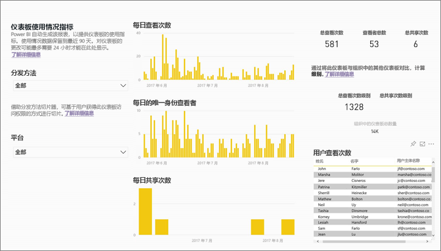

## 为什么使用指标对我而言非常重要？
 了解内容的使用方式有助于说明影响，并划分工作的优先级。 使用指标可能会显示组织的大部分部门每天会使用其中一个报表，还可能会显示根本没人查看你创建的某个仪表板。 这种类型的反馈在指导工作方面极其重要。

仅可在 Power BI 服务中运行使用情况指标报表。  但是，如果保存使用情况指标报表或将其固定到仪表板，则可在移动设备上打开该报表并与其交互。

> 注意：使用情况指标功能可捕获所有用户的使用情况信息，无论用户使用的是 Power BI（免费）还是 Power BI Pro。 不过，必须有 Power BI Pro 许可证才能运行和访问使用情况指标数据。
> 
> 

## 关于使用情况指标报表
所选工作区中的仪表板或报表中提供使用情况指标。 若要访问特定仪表板或报表的使用情况指标数据，则必须：    
•    具有该仪表板或报表的编辑权限   
•    具有 Pro 许可证

选择“使用情况指标”或图标  后，Power BI 会生成包含相应内容在过去 90 天内的使用情况指标的预生成报表。  此报表与已熟悉的 Power BI 报表较为相似，不同之处在于此报表仅供参考，无法进行交互。 基于最终用户接收访问权限的方式以及他们是通过 Web 还是移动应用等方式访问，可以进行切片。仪表板和报表发生更改时，使用情况指标报表也会随之更改（使用情况指标报表每天更新新数据）。  

使用情况指标报表不会显示在“最新动态”、“工作区”、“收藏夹”或其他内容列表中。 不能将使用情况指标报表添加到应用。 如果将使用情况指标报表中的磁贴固定到仪表板，则该仪表板无法添加到应用或内容包中。

若要深入挖掘报表数据，或要根据数据集生成自己的报表，可使用“另存为”（请参阅[将使用情况指标报表另存为功能齐全的 Power BI 报表](#save-the-usage-metrics-report-as-a-full-featured-power-bi-report)）。

## 打开包含使用情况指标的仪表板或报表
1. 首先，转到包含仪表板或报表的工作区。
2. 在“工作区”内容列表或仪表板/报表本身中，选择“使用情况指标”图标 。
   
    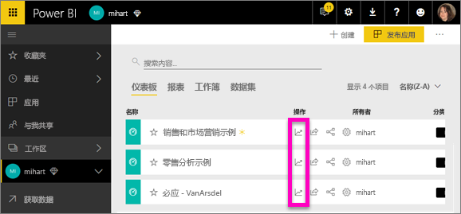
   
    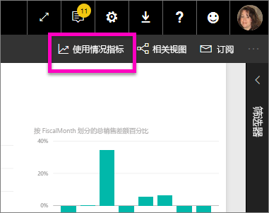
3. 首次执行此操作时，Power BI 会创建使用情况指标报表，并在创建完成后通知你。
   
        
4. 要打开结果，请选择“查看使用情况指标”。
   
    部署或维护 Power BI 仪表板和报表时，使用情况指标将发挥巨大作用。 想知道报表的哪些页面最有用，哪些页面应该逐渐淘汰？ 对报表页面进行切片即可找到答案。想知道是否应为仪表板生成移动布局？ 通过使用情况指标报表，可了解有多少用户正在通过移动应用和 Web 浏览器访问你的内容。
5. 还可以将可视化效果固定到仪表板，以便可以更轻松地对其进行监视或与他人共享。
   
   > 请注意：如果将使用情况指标报表中的磁贴固定到仪表板，则该仪表板无法添加到应用或内容包中。
   > 
   > 

  

## 报表中包含哪些指标？
| 指标 | 仪表板 | 报表 | 说明 |
| --- | --- | --- | --- |
| 分发方法切片器 |是 |是 |用户获取内容访问权限的方式。 用户访问仪表板或报表的方式可能有以下 3 种：成为[应用工作区](service-the-new-power-bi-experience.md)的成员、将内容[与他们共享](service-share-dashboards.md)或安装内容包/应用。  请注意，通过应用的查看数被视为“内容包”。 |
| 平台切片器 |是 |是 |是通过 Power BI 服务 (powerbi.com)，还是通过移动设备访问仪表板或报表？ 移动应用包括所有 iOS、Android 和 Windows 应用。 |
| 报表页切片器 |否 |是 |如果报表有多页，按已查看的一个或多个报表页对报表进行切片。 如果看到列表选项为“空白”，这意味着报表页为最近添加（新页的实际名称将在 24 小时内显示在切片器列表），并且/或者报表页已删除。 “空白”可捕获此类情况。 |
| 每日查看次数 |是 |是 |每日总查看次数 - 查看的定义为用户加载报表页或仪表板。 |
| 每日的唯一身份查看者 |是 |是 |查看了仪表板或报表的唯一身份用户数（以 AAD 用户帐户为依据）。 |
| 每用户查看次数 |是 |是 |过去 90 天内的查看次数，按各用户细分。 |
| 每日共享次数 |是 |否 |仪表板与其他用户或组进行共享的次数。 |
| 总查看次数 |是 |是 |过去 90 天内的查看次数。 |
| 查看者总数 |是 |是 |过去 90 天内的唯一身份查看者人数。 |
| 总共享次数 |是 |否 |仪表板或报表在过去 90 天内的共享次数。 |
| 组织中的总数 |是 |是 |最近 90 天里整个组织中至少被查看过一次的所有仪表板或报表的计数。  用于计算级别。 |
| 级别：总查看次数 |是 |是 |根据过去 90 天内组织中所有仪表板或报表的总查看次数，确定此仪表板或报表的级别。 |
| 级别：总共享次数 |是 |否 |根据过去 90 天内组织中所有仪表板的总共享次数，确定此仪表板或报表的级别。 |

### 仪表板使用情况指标报表

### 报表使用情况指标报表
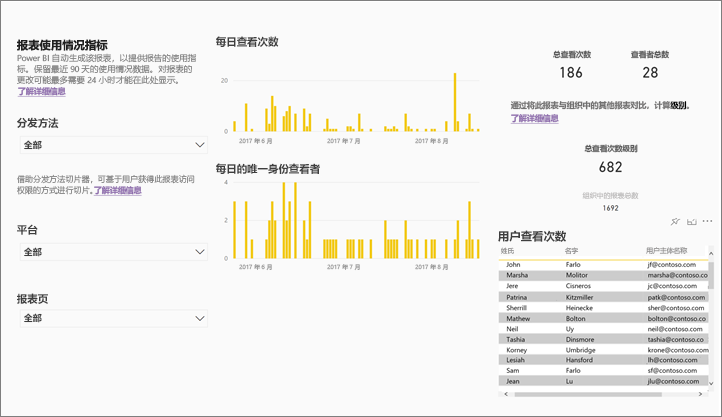

## 将使用情况指标报表另存为功能齐全的 Power BI 报表（个性化）
使用“另存为”可以将使用情况指标报表转换成功能齐全的 Power BI 报表，从而可以进行自定义和共享。 创建个性化副本后，将获得对基础数据集的完全访问权限，可根据特定需求对使用情况指标报表进行完全自定义。 甚至可以通过[实时连接到 Power BI 服务功能](https://powerbi.microsoft.com/blog/connecting-to-datasets-in-the-power-bi-service-from-desktop)，使用 Power BI Desktop 生成自定义使用情况指标报表。

更好的一点是，基础数据集包含工作区中所有仪表板或报表的使用情况详细信息。 这便释放出了许多其他可能性。 例如，可以创建基于使用情况对工作区中的所有仪表板进行对比的报表。 或者，通过聚合 Power BI 应用中所有分发内容的使用情况，为此应用创建使用情况指标仪表板。  请参阅下面的[删除页面级别筛选器](#remove-the-filter-to-see-all-the-usage-metrics-data-in-the-workspace)。

### 使用“另存为”创建的内容是什么？
创建功能齐全的报表时，Power BI 还会新建一个数据集，该数据集包含在过去 90 天里当前工作区中被访问的所有仪表板或所有报表。 例如，假设有一个名为“销售额”的工作区，包含 3 个仪表板和 2 个报表，你在“东北”仪表板上创建了使用情况指标报表。 然后你使用“另存为”进行个性化设置，将其转换为功能完备的报表。 此新报表的数据集不仅包含名为“东北”的仪表板的使用情况指标，还包含“销售额”工作区中所有 3 个仪表板的使用情况指标。 默认情况下，报表将显示“东北”仪表板的数据，需要[删除筛选器](#remove-the-filter-to-see-all-the-usage-metrics-data-in-the-workspace)（单击）才能显示所有 3 个仪表板的数据。

### 使用“另存为”创建使用情况报表的副本
使用“另存为”创建副本（个性化）时，Power BI 会将只读的预生成报表转换为功能齐全的报表。  从表面看，报表看上去完全相同。 但是，现在能在编辑视图中打开报表，添加新的可视化效果、筛选器和页面，以及修改或删除现有可视化效果等。 Power BI 还会创建一个包含该工作区中所有仪表板或所有报表的使用情况指标的全新数据集。

> 提示：若要允许 Power BI 访问工作区中所有仪表板或所有报表的使用情况指标，请[删除页面级别筛选器](#remove-the-filter-to-see-all-the-usage-metrics-data-in-the-workspace)。
> 
> 

1. 在预生成的使用情况指标报表中，依次选择“文件”>“另存为”。 此时，Power BI 会将使用情况指标报表转换成功能齐全的 Power BI 报表。 这称为个性化使用情况指标报表。
   
    
2. 在编辑视图中打开报表，[与报表进行交互，就像与其他任何 Power BI 报表进行交互一样](service-interact-with-a-report-in-editing-view.md)。 例如，添加新页面和生成新的可视化效果、添加筛选器、设置字体和颜色等。
   
    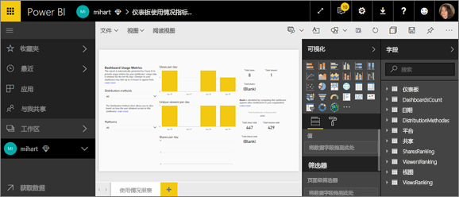
3. 还可以打开新的数据集并从头生成报表。
   
    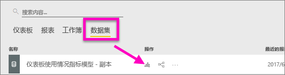
4. 新建的报表会保存到当前工作区中，并还会添加到“最新动态”内容列表中。
   
    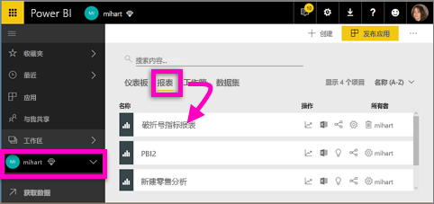

### 删除筛选器，查看工作区中的所有使用情况指标数据
若要查看工作区中所有仪表板或所有报表的指标，必须删除筛选器。 默认情况下，个性化报表会进行筛选，仅显示用于创建它的仪表板或报表的指标。

例如，如果使用名为“欧洲销售额”的仪表板创建此新的个性化报表，则仅显示“欧洲销售额”仪表板中的使用情况数据。 若要删除筛选器，并启用该工作区中所有仪表板中的数据：

1. 在编辑视图中打开个性化报表。
   
    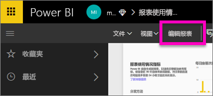
2. 在“筛选器”窗格中，找到“报表级别筛选器”桶，然后选择“x”将筛选器删除。
   
    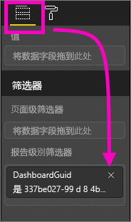
   
    现在个性化报表将显示整个工作区的指标。

## 管理员对使用情况指标的控制 - 适用于 Power BI 管理员
使用情况指标报表是 Power BI 或 Office 365 管理员可以启用或禁用的一项功能。 管理员可以精确控制哪些用户可以访问使用指标；默认情况下，对于组织中的所有用户，它们都处于“启用”状态。

1. 依次选择 Power BI 服务右上角的齿轮图标和“管理门户”，打开“管理门户”。
   
    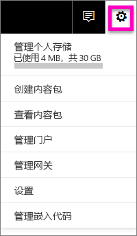
2. 在“管理门户”中，依次选择“租户设置”和“面向内容创建者的使用情况指标”。
   
    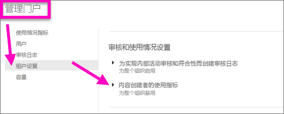
3. 启用（或禁用）使用情况指标，然后选择“应用”。
   
    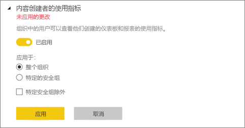

当禁用其整个组织的使用指标时，管理员可以使用“删除所有现有的使用指标内容”选项删除通过使用指标报表和数据集构建的所有现有报表和仪表板磁贴。 此选项可以删除组织中可能已在使用的所有用户对使用指标数据的所有访问内容。 请谨慎操作，因为删除现有的使用指标内容是不可逆转的操作。

## 注意事项和限制
问：我无法在仪表板或报表上运行使用情况指标    
答：你只能看到自己拥有或有权编辑的内容的使用情况指标。

问：使用情况指标会从嵌入的仪表板和报表中捕获视图吗？     
答：使用情况情况指标目前不支持捕获嵌入的仪表板和报表的使用情况，包括[用户拥有数据](developer/integrate-report.md)流，[应用拥有数据](developer/embed-sample-for-customers.md)流和[发布到 Web](service-publish-to-web.md) 流。 在这些情况下，我们建议使用现有的 Web 分析平台来跟踪托管应用或门户的使用情况。

问：我根本无法对任何内容生成使用情况指标。    
A1：管理员可以为组织关闭此功能。  请联系管理员以确定是否属于这种情况。    
A2：使用指标是 Power BI Pro 的一项功能。

问：数据好像不是最新的。 例如，没有显示分发方法、缺少报表页等。   
答：数据更新最长可能需要 24 小时才能完成。

问：工作区中有 4 个报表，但使用情况指标报表只显示 3 个。    
答：使用情况指标报表仅包括在过去 90 天内访问过的报表（或仪表板）。  如果不显示某个报表（或仪表板），很可能此报表已超过 90 天未被使用。

## 后续步骤
[收藏仪表板](service-dashboard-favorite.md)

更多问题？ [尝试参与 Power BI 社区](http://community.powerbi.com/)

