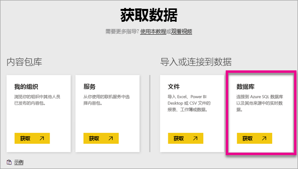
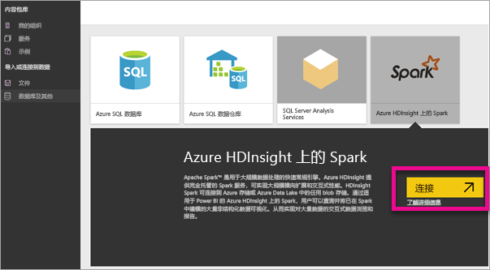
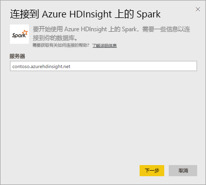
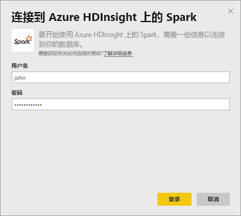
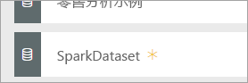
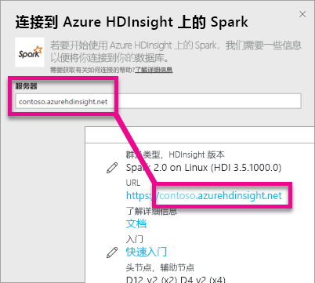
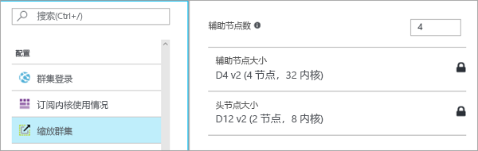

# 使用 DirectQuery 的 HDInsight 上的 Spark
通过使用 DirectQuery 的 Azure HDInsight 上的 Spark 你可以根据 Spark 群集中已有的数据和指标来创建动态报表。 借助 DirectQuery，查询会在你浏览报表视图中的数据时发送回 Azure HDInsight Spark 群集。 对于熟悉自己连接到的实体的用户，建议使用此体验。

> [!WARNING]
> 对于在基于 Spark 的数据集上生成的仪表板磁贴，已禁用自动磁贴刷新。 可以选择“**刷新仪表板磁贴**”手动刷新。 报告不受影响，应持续更新。 
> 
> 

可使用以下步骤并通过 Power BI 服务中的 DirectQuery 的连接到 Azure HDInsight 上的 Spark 数据源。

1. 选择左侧导航窗格底部的**获取数据**。
   
     
2. 选择**数据库和其他**。
   
     
3. 选择**HDInsight 上的 Spark**连接器，然后选择**连接**。
   
     
4. 输入要连接的**服务器**的名称，以及你的**用户名**和**密码**。 服务器始终以 \<群集名\>.azurehdinsight.net 的形式表示，请参阅有关查找下面这些值的更多详细信息。
   
     
   
     
5. 连接后，你将看到命名为“SparkDataset”的新数据集。 你还可以通过创建的占位符磁贴访问该数据集。
   
     
6. 深入查看此数据集，你可以浏览数据库中的所有表和列。 选择某列会将查询发送回源，从而动态创建视觉对象。 这些视觉对象可以保存在新报表中，并重新固定到仪表板。

## 查找 HDInsight 上的 Spark 的参数
服务器始终以 \<群集名\>.azurehdinsight.net 的形式表示，并且可以在 Azure 门户中找到。

此外，还可以在 Azure 门户中找到用户名和密码。

## 限制
随着我们继续改进体验，这些限制和说明可能会发生变化。 可在 [Use BI tools with Apache Spark on Azure HDInsight](https://azure.microsoft.com/documentation/articles/hdinsight-apache-spark-use-bi-tools/)（将 BI 工具与 Azure HDInsight 上的 Apache Spark 配合使用）中找到其他文档

* Power BI 服务仅支持 Spark 2.0 和 HDInsights 3.5 的配置。
* 每个操作（例如选择列或添加筛选器）都会将查询发送回数据库 – 因此在选择非常大的字段之前，请考虑选择适当的视觉对象类型。
* 问答不可用于 DirectQuery 数据集。
* 不会自动选取架构更改。
* Power BI 支持数据集中**跨所有表**的 16,000 列。 Power BI 还包括每个表中的内部行号列。 这意味着，如果数据集中有 100 个表，可用的列数将为 15,900。 具体取决于你正在从 Spark 数据源使用的数据量，可能会受此限制。

## 故障排除
如果在对群集执行查询时遇到问题，请验证应用程序是否仍在运行，并且在必要时重新启动。

还可以依次转到“**配置**” > “**缩放群集**”下，分配 Azure 门户内的其他资源：

## 后续步骤
[入门：使用 Spark SQL 在 HDInsight Linux 上创建 Apache Spark 群集并运行交互式查询](https://azure.microsoft.com/documentation/articles/hdinsight-apache-spark-jupyter-spark-sql)  
[Power BI 入门](service-get-started.md)  
[获取 Power BI 的数据](service-get-data.md)  
更多问题？ [尝试参与 Power BI 社区](http://community.powerbi.com/)

