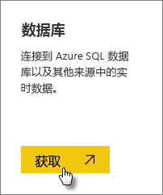
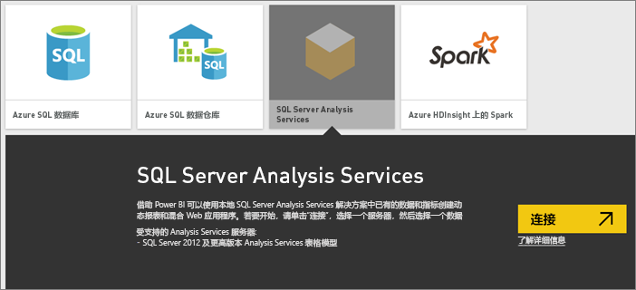
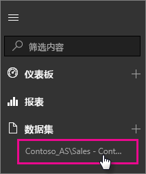

# Power BI 中的 SQL Server Analysis Services 实时数据
在 Power BI 中，有两种方法可以连接到实时的 SQL Server Analysis Services 服务器。 获取数据时，可以连接到 SQL Server Analysis Services 服务器，或者可以连接到已连接到 Analysis Services 服务器的 [Power BI Desktop 文件](service-desktop-files.md)或 [Excel 工作簿](service-excel-workbook-files.md)。 根据最佳做法，Microsoft 强烈建议使用 Power BI Desktop，因为它提供丰富的工具集，并且能够在本地维护 Power BI Desktop 文件的备份副本。

 >[!IMPORTANT]
 >* 若要连接到实时的 Analysis Services 服务器，管理员必须安装并配置本地数据网关。 有关详细信息，请参阅[本地数据网关](service-gateway-onprem.md)。
 >* 当使用网关时，你的数据将保留在本地。  你基于数据创建的报表保存在 Power BI 服务中。 
 >* [问答自然语言查询](service-q-and-a-direct-query.md)对 Analysis Services 实时连接以预览提供。

## 要在获取数据时连接到一个模型
1. 在“我的工作区”中，选择“获取数据”。 你还可以切换到组工作区中，如果有的话。
   
   
2. 选择**数据库和其他**。
   
   
3. 选择 **SQL Server Analysis Services** > **连接**。 
   
   
4. 选择一个服务器。 如果你未看见此处列出任何服务器，则表示未配置网关和数据源，或者在网关中的数据源的**用户**选项卡中未列出你的帐户。 请与你的管理员确认。
5. 选择想要连接到的模型。 该模型可以是表格或多维模型。

连接到模型后，该模型将在 Power BI 站点的**我的工作区/数据集**中显示。 如果切换到组工作区，那么数据集将在组中显示。

## 仪表板磁贴
如果将视觉对象从报表固定到仪表板，那么将每 10 分钟自动刷新固定的磁贴。 如果更新了本地 Analysis Services 服务器中的数据，那么 10 分钟后会自动更新磁贴。

## 后续步骤
[本地数据网关](service-gateway-onprem.md)  
[管理 Analysis Services 数据源](service-gateway-enterprise-manage-ssas.md)  
[本地数据网关故障排除](service-gateway-onprem-tshoot.md)  
更多问题？ [尝试参与 Power BI 社区](http://community.powerbi.com/)

